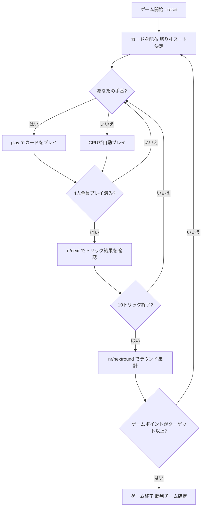

# スエカ（CUI版）遊び方

## ゲーム概要

Sueca（スエカ）はポルトガル・ブラジルで広く親しまれているトリックテイキングゲームです。40枚のラテンデッキを4人（2チーム制、席0&2 対 席1&3）でプレイします。切り札スートは配布時に決まり、マスト・フォロー制で10トリックを争います。ラウンドで獲得したカード点数に応じてゲームポイントが加算され、先にターゲット（デフォルト4ゲームポイント）に達したチームが勝ちます。

## 起動方法

```sh
go run ./cmd/trumpcards sueca
go run ./cmd/trumpcards --lang en sueca  # 英語モード
```

## ルール

### デッキと配布

- **デッキ**: 40枚（A, 2〜7, Sota（J相当）, Caballo（Q相当）, Rei（K相当）× 4スート）
- **プレイヤー**: 4人（プレイヤー0 = あなた、プレイヤー1〜3 = CPU）
- **チーム**: 席0&2（あなたのチーム）対 席1&3
- **配布**: 各プレイヤー10枚
- **切り札**: 最後に配られたカードのスートが切り札スートとなる

### カードの強さ（トリック内）

同スート内の強さ（強い順）:

| 強さ順 | カード |
|--------|--------|
| 1 | A（エース） |
| 2 | 7 |
| 3 | Rei（K / 王） |
| 4 | Valete/Sota（J / 従者） |
| 5 | Dama/Caballo（Q / 騎士） |
| 6 | 6 |
| 7 | 5 |
| 8 | 4 |
| 9 | 3 |
| 10 | 2 |

### トリックの勝敗

- 切り札が1枚でも出ている場合 → 最も強い切り札が勝ち
- 切り札が出ていない場合 → リードスートの最も強いカードが勝ち

### カード点数

| カード | 点数 |
|--------|------|
| A | 11点 |
| 7 | 10点 |
| Rei（K） | 4点 |
| Valete/Sota（J） | 3点 |
| Dama/Caballo（Q） | 2点 |
| その他 | 0点 |

1スートの合計 = 30点 × 4スート = **合計120点**。

### マスト・フォロー

リードされたスートが手札にある場合は必ずそのスートを出さなければなりません。持っていない場合は任意のカードを出せます。

### 得点計算とゲームポイント

ラウンド終了時に各チームのカード点数を集計し、ゲームポイントを付与します:

| 獲得点数 | ゲームポイント |
|----------|----------------|
| 61〜90点 | 1ゲームポイント |
| 91〜119点 | 2ゲームポイント |
| 120点（全取り） | 4ゲームポイント |
| 60〜60点（引き分け） | 0ゲームポイント |

ゲームポイントはラウンドをまたいで累積されます。先にターゲット（デフォルト **4** ゲームポイント）に達したチームがマッチ勝利となります。

## ゲームの流れ



## コマンド一覧

| コマンド | 短縮形 | 説明 |
|----------|--------|------|
| `play <idx>` | — | 手札のidx番目のカードを出す |
| `next` | `n` | 次のトリックへ進む（トリック終了後） |
| `nextround` | `nr` | 次のラウンドへ進む（10トリック終了後） |
| `setdifficulty <0-2>` | `sd <0-2>` | CPU難易度設定（0=Easy, 1=Normal, 2=Hard） |
| `log` | `l` | アクションログを表示 |
| `reset` | `r` | 新しいゲームを開始（設定保持） |
| `quit` | `q` | ゲーム終了 |
| `help` | `?` | コマンド一覧を表示 |

## 画面の見方

```
==========
Sueca (スエカ)
==========
ラウンド: 1  トリック: 1
チームゲームポイント: あなた=0 相手=0
切り札: ♥
You: 10枚 0トリック [チームA]
[0]A♠ [1]7♠ [2]Rei♥ [3]Sota♠ [4]Caballo♣ [5]6♦ [6]5♦ [7]4♦ [8]3♦ [9]2♣
CPU 1: 10枚  CPU 2: 10枚  CPU 3: 10枚
----------
カード獲得点 — チームA: 47点 / チームB: 33点（勝利ライン 61点）
フェーズ: PLAY
あなたの手番です。カードを出してください。
play <idx>
```

- **切り札行**: 現在の切り札スート
- **チームゲームポイント行**: 各チームの累積ゲームポイント
- **カード獲得点行**: 現ラウンドで両チームが取ったカード点と、ラウンドを取るのに必要な 61 点
- **`[n]`付き行**: あなたの手札（インデックス付き）
- **トリック表示**: 現在場に出ているカードと出したプレイヤー
- **フェーズ表示**: 現在のフェーズ（PLAY）

## 遊び方のコツ

- **切り札の温存**: 切り札（特にAと7）は序盤から使い過ぎず、高得点トリックを奪取するために温存しましょう。
- **7の価値**: Suecaではカード強さが A > 7 > K > J > Q の順で、7が2番目に強い特徴があります。7はトリックを勝ち取る強力な切り礼です。
- **A（11点）と7（10点）が最重要**: この2枚で合計21点あります。これらを含むトリックをいかに取るかが勝敗の鍵です。
- **チームプレイ**: 席0&2が同じチームです。パートナーが高得点のトリックを取りそうな場合は、弱いカードでサポートしましょう。
- **ゲームポイントの計算**: 61点以上でゲームポイントを獲得できます。91点以上で2ポイント、120点（全取り）で4ポイントと大差勝利が狙えます。
- **引き分け回避**: 60点対60点では誰もゲームポイントを得られません。1点でも追加で取ることで相手に0点を与えられます。
- **マスト・フォローの活用**: 相手の手札を枯らしてスートが持てない状況を作ると、切り札を温存できます。
- **ラウンド点数管理**: 切り札が無い状態でリードされると不利になります。特にリードスートが無い場合は切り札で対応しましょう。
