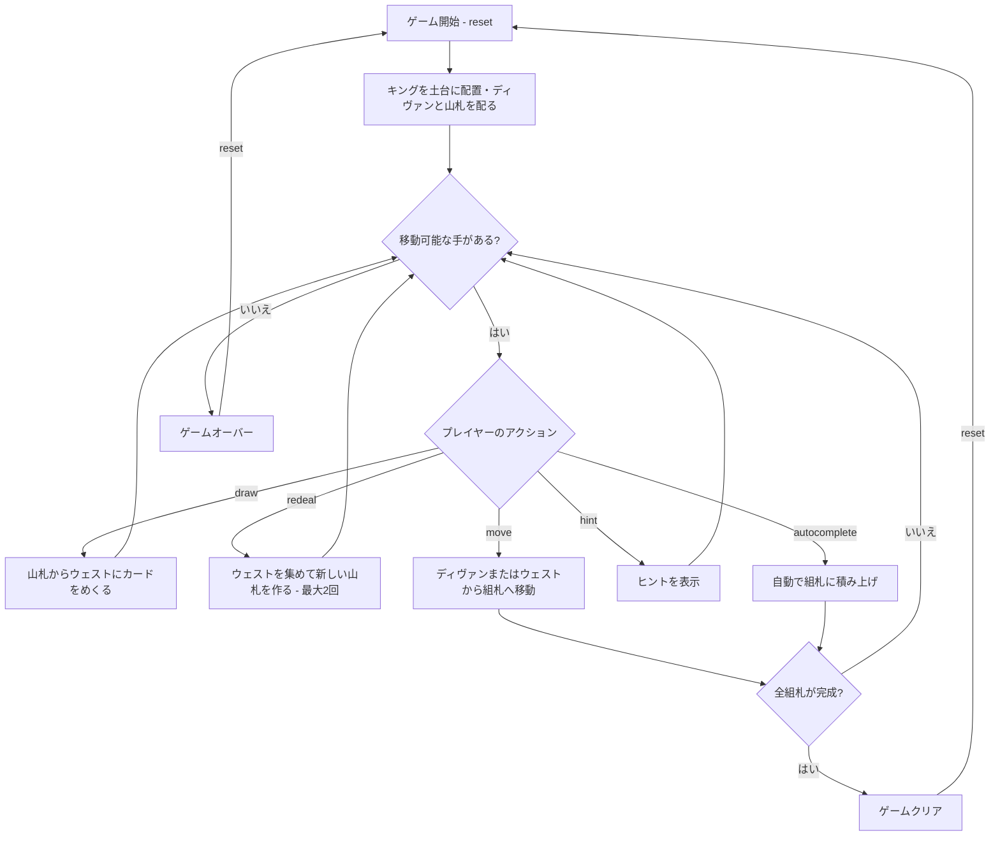

# スルタン（CUI版）遊び方

## ゲーム概要

1人用のソリティアカードゲームです。2デッキ（104枚）を使い、8枚のキングを土台とした8つの組札、8スロットのディヴァン（リザーブ）、山札、ウェストで構成されます。各組札にキングの上から同スートで A→2→…→10→J→Q の順に積み上げ、すべての組札をクイーンで完成させればクリアです。山札を使い切った後、ウェストを最大2回まで集めて新しい山札を作れる（リディール）のが特徴です。

## 起動方法

```sh
go run ./cmd/trumpcards sultan
go run ./cmd/trumpcards --lang en sultan  # 英語モード
```

## ルール

### 基本ルール

- 2デッキ（104枚、ジョーカーなし）を使用
- 8枚のキング（各スート2枚）を組札の土台として最初に配置
- 残り96枚のうち8枚を表向きでディヴァン（8スロットのリザーブ）に配る
- 残り88枚は山札（ストック）に裏向きで置く
- 組札はキングの上から同スートで A→2→…→10→J→Q の順に積み上げる
- ディヴァンのカードはいつでも組札へ移せる。移したスロットは山札の一番上から自動補充される（山札が空ならスロットは空のまま）
- 山札から1枚ずつウェストにめくり、ウェストの一番上のカードを組札へ移せる

### リディール（再構築）

- 山札を使い切った後、ウェストを集めて新しい山札を作れます（`rd` コマンド）
- リディールはゲーム全体で **最大2回**（合計3パス）

### ゲームクリア

- 8つの組札すべてをクイーンまで完成させる（各13枚 = キング+A〜Q）とゲームクリア

### ゲームオーバー

- これ以上移動可能な手がなく、リディールもできない場合はゲームオーバー

## ゲームの流れ



## コマンド一覧

| コマンド | 短縮形 | 説明 |
|----------|--------|------|
| `reset` | `r` | 新しいゲームを開始 |
| `draw` | `d` | 山札からウェストにカードをめくる |
| `redeal` | `rd` | ウェストを集めて新しい山札を作る（最大2回） |
| `move` | `m` | カードを移動する（`m d <idx>`＝ディヴァン→組札、`m w`＝ウェスト→組札） |
| `undo` | `u` | 直前の操作を元に戻す |
| `giveup` | `g` | ギブアップしてゲームを終了 |
| `hint` | `h` | 次の一手のヒントを表示 |
| `autocomplete` | `ac` | 自動的に組札へ積み上げ可能なカードを移動 |
| `log` | `l` | アクションログ（棋譜）を表示 |
| `quit` | `q` | ゲーム終了 |
| `help` | `?` | コマンド一覧を表示 |

### コマンド例

- `d` → 山札からカードをめくる
- `rd` → ウェストを集めて新しい山札を作る
- `m d 0` → ディヴァンのスロット0のカードを組札へ移動
- `m 0` → 省略形（ディヴァンのスロット0を組札へ移動）
- `m w` → ウェストの一番上のカードを組札へ移動
- `u` → 直前の操作を元に戻す
- `h` → ヒントを表示
- `ac` → オートコンプリート

## 画面の見方

```
==========
Sultan of Turkey (スルタン)
==========
Foundation: ♠K | ♠K | ♣K | ♣K | ♥K | ♥K | ♦K | ♦K
Divan: [0]♠5 [1]♥A [2]♣9 [3]♦7 [4]♠Q [5]♥3 [6]♣6 [7]♦2
Stock: 80枚 | Waste: ♠5 | リディール残: 2回
----------
手数: 0
操作: m で移動 (例 m d 0 / m w), d=ドロー, rd=リディール, u=アンドゥ, h=ヒント
==========
```

- `Foundation`: 8つの組札の一番上のカード（土台はキング）
- `Divan`: 8スロットのリザーブ（`--`は補充されていない空スロット）
- `Stock: N枚`: 山札の残りカード数
- `Waste: ♠5`: ウェストの一番上のカード
- `リディール残: N回`: 残りのリディール回数
- `手数: N`: 現在の手数
- 手詰まりになると赤い警告が出て、そこから戻れる局面があれば  と**必要なアンドゥ回数**も併記されます（Web の脱出ボタンと同じ値）。戻れる局面が無いときは回数の行は出ません

## 遊び方のコツ

- まず各スートのエース（A）を組札へ。エースが出ないと積み上げが始まりません
- ディヴァンは移すたびに山札から補充されるので、積極的に消化して新しいカードを呼び込みましょう
- 山札はウェストにめくって組札の候補を探します。リディールは最大2回なので、無駄打ちに注意
- 同じスートの組札は2つあるので、ランクが合うほうへ柔軟に振り分けられます
- ヒントコマンドで詰まった時のアドバイスを得られます
