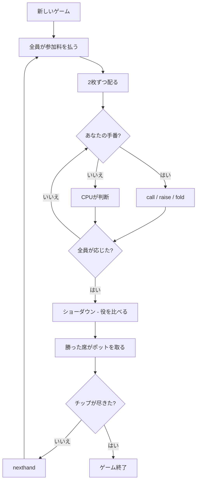

# ソッタ（CUI版）遊び方

## ゲーム概要

ソッタ（섯다）は韓国のベッティング型カードゲームです。花札から作った **20 枚（1〜10 月が 2 枚ずつ）**を使い、手札はたった **2 枚**。その 2 枚が作る役に賭けて勝負します。

あなたは席 0 で、CPU と卓を囲みます（既定 3 人、2〜5 人）。

## 起動方法

```sh
go run ./cmd/trumpcards sutda
# または
go run ./cmd/trumpcards --lang en sutda
```

## ルール

### 光札があるのは 1・3・8 月だけ

花札の光札は 1・3・8・11・12 月ですが、**11 月と 12 月は 20 枚デッキに入りません**。だから光札は 1・3・8 月の 3 枚しかなく、**光ッタンは 38・18・13 の 3 通りしか存在しません**。

同じ月の 2 枚のうち片方だけが光なので、月だけでは役が決まりません。画面では光札に「光」の印が付きます。

### 役の強さ（強い順）

| 位 | 役 | 中身 |
|----|----|------|
| 1 | 38光ッタン | 3 月の光 + 8 月の光 |
| 2 | 18光ッタン | 1 月の光 + 8 月の光 |
| 3 | 13光ッタン | 1 月の光 + 3 月の光 |
| 4 | ッタン | 同じ月の 2 枚。チャンタン（10）が最強、1ッタンが最弱 |
| 5 | 特殊役 | アリ(1+2) > トクサ(1+4) > クピン(1+9) > チャンピン(1+10) > チャンサ(4+10) > セリュク(4+6) |
| 6 | ット | 2 枚の合計の下 1 桁。カポ（9）が最強、マントン（0）が最弱 |

**一番弱い特殊役（セリュク）でも、一番強いット（カポ）に勝ちます。** ここがこの役体系の要です。

### ベッティング

毎ハンド全員が参加料を払い、2 枚ずつ配ったあとに 1 巡のベッティングを行います。

- **コール**: 現在のベット額に合わせます。差額が 0 ならチェックです。
- **レイズ**: 1 単位上げます。**1 ハンドで 3 回まで**（無制限だと際限なく上がり続けます）。
- **フォールド**: 降ります。以降このハンドでは手番が回りません。

誰かがレイズすると、他の席は**もう一度**応じるかどうかを選び直します。

### 勝敗

残った席で役を比べ、最も強い席がポットを取ります。**同じ役なら山分け**です（席順では決めません）。あなたのチップが尽きるか、CPU 全員のチップが尽きた時点でゲーム終了です。

なお 4+9 の「クサ」による配り直しは実装していません。出典によって条件が食い違い、卓全体を巻き戻す規則は 1 人プレイの卓には馴染まないためです。

## ゲームの流れ



## コマンド一覧

| コマンド | 短縮形 | 説明 |
|----------|--------|------|
| `call` | `c` | コール（差額 0 ならチェック） |
| `raise` | `b` | レイズ（1 単位上げる） |
| `fold` | `f` | フォールド（降りる） |
| `nexthand` | `nh` | 次のハンドへ進む |
| `setdifficulty <0-2>` | `sd` | CPU難易度（0=Easy, 1=Normal, 2=Hard） |
| `setseats <2-5>` | `ss` | 席数 |
| `hint` | `h` | 推奨アクションを表示 |
| `log` | `l` | アクションログを表示 |
| `reset` | `r` | 新しいゲームを開始（設定保持） |
| `quit` | `q` | 終了 |
| `help` | `?` | コマンド一覧を表示 |

## 画面の見方

```
==========
ソッタ
==========
ハンド 4
ポット: 70　現在のベット: 30
あなた （子）: チップ 950　ベット 30
  3月光 8月光 — 38光ッタン
CPU 1 （子）: チップ 970　ベット 10 （降り）
CPU 2 （親）: チップ 980　ベット 30
----------
手番: あなた
追加は不要です（チェックできます）。
レイズは 20 単位（あと 2 回）。
call / raise / fold
==========
```

自分の 2 枚と役は常に見えています。相手の札は**ショーダウンまで伏せられたまま**です。「（降り）」が付いた席はこのハンドから抜けています。
