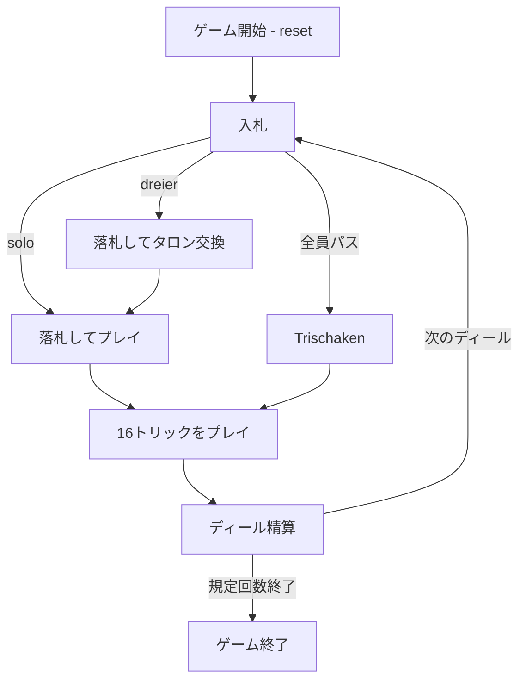

# タップ・タロック（CUI版）遊び方

## ゲーム概要

タップ・タロック（Tapp Tarock）は、オーストリアの伝統的な3人用タロック系トリックテイキングです。54枚のタロックデッキを使い、最高入札者が落札者となって残り2人と1対2で戦い、契約達成を目指します。

## 起動方法

```sh
go run ./cmd/trumpcards tapptarock
go run ./cmd/trumpcards --lang en tapptarock  # 英語モード
```

## ルール

### デッキと配布

- **デッキ**: Königrufen / Zwanzigerrufen と同じ54枚のタロックデッキ。
- **プレイヤー**: 3人（あなた1人 + CPU2人）。4人用の Zwanzigerrufen と違い、3人固定です。
- **配布**: 各人に16枚、残り6枚を伏せたタロン（tapp）にします。

### 入札と契約

- `dreier` はタロン6枚を受け取り、手札から6枚を伏せる契約です。
- `solo` はタロンを交換せずに戦う、より高い契約です。
- 最高入札者が落札者（デクレアラー）になります。相棒を呼ぶことはなく、落札時点から1対2が確定します。
- 全員がパスすると `trischaken` になります。これは宣言する入札ではありません。

### プレイ

- 16トリックを行います。リードされたスートに従い、持っていなければタロックを出し、どちらもなければ自由です。
- タロックは常時切り札です。各トリックの勝者が次をリードします。

### 得点（本リポジトリのハウスルール）

- カード点は同じ54枚デッキを使う Königrufen の点数表を使います。Pagat、Mond、Skus の3枚を取る Trull には、このリポジトリ独自の **+3点ボーナス**があります。
- Dreier は「10点 + デクレアラー側のカード点と半分の基準点との差」の絶対値を基本点とし、達成ならデクレアラーが得て、失敗なら支払います。
- Solo はその基本点を2倍して精算します。
- Trischaken は最も多くカード点を取った席が **-3点**、他の2席が **+1点**です。
- 契約表と精算方法は**本リポジトリのハウスルール**です。史実の細部を断定するものではありません。
- 既定4ディール（1〜12ディールに設定可能）後、通算得点が最も高い席が勝者です。

## ゲームの流れ



## コマンド一覧

| コマンド | 短縮形 | 説明 |
|----------|--------|------|
| `bid dreier` | - | タロン交換ありで入札 |
| `bid solo` | - | ソロで入札 |
| `pass` | - | 入札でパス |
| `discard <i0> ... <i5>` | - | タロン交換で6枚を伏せる |
| `play <idx>` | - | カードを出す |
| `next` | `n` | トリック結果から進む |
| `nextround` | `nr` | 次のディールへ進む |
| `setdifficulty <0-2>` | `sd` | CPU難易度を設定 |
| `setdeals <1-12>` | `st` | ディール数を設定 |
| `hint` | `h` | ヒントを表示 |
| `log` | `l` | 棋譜を表示 |
| `reset` | `r` | ゲームをリセット |
| `quit` | `q` | ゲーム終了 |
| `help` | `?` | コマンド一覧を表示 |

## 画面の見方

```
==========
タップ・タロック
==========
ディール: 1/4  トリック: 3  契約: Dreier
あなた (落札者): 手札13枚  今局25点  通算10
タロン: 6枚（落札後に交換）
[0]T21  [1]Skus  [2]♠K  [3]♥7  ...
CPU 1: 手札13枚  今局0点  通算-5
----------
手番: あなた  (リードスートに従う。無ければタロック)
```

- `T21` や `Skus` はタロックの切り札です。カードの前の番号は手札インデックスです。
- `今局` はそのディールで取ったカード点、`通算` は累計得点です。
- タロン交換後は伏せた6枚も落札者側の点に加わります。

## 遊び方のコツ

- タロックの枚数と Trull の札を見て、Dreier と Solo を使い分けます。
- タロン交換では、カード点の高い札や切り札を不用意に伏せないようにします。
- Trischaken では高いカード点を取らないことが目的です。
