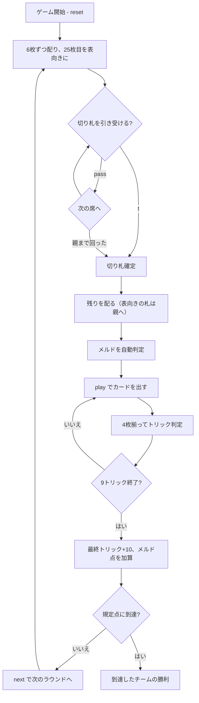

# タラビッシュ（CUI版）遊び方

## ゲーム概要

カナダ・ケープブレトン島のレバノン系移民の間で育った**ジャス系**トリックテイキング。36枚を4人に9枚ずつ配る**2対2のパートナー戦**で、向かい合う席が味方。**切り札のJ（Jass）と9（Menel）がAより強い**のがこの系統の特徴。手札のラン（連続3枚以上）とベラ（切り札のK+Q）が申告点になる。

## 起動方法

```sh
go run ./cmd/trumpcards tarabish
go run ./cmd/trumpcards --lang en tarabish  # 英語モード
```

## ルール

### 配り方（2段構え）

**9枚 × 4人 = 36枚はデッキ全部**なので、先に配り切ると切り札を決める札が残りません。本場の手順どおり2段構えです。

1. 各プレイヤーに**6枚**配る（24枚）
2. **25枚目を表向き**にして切り札候補とする
3. 順に「引き受ける／見送る」を選ぶ
4. 切り札が決まったら残りを配る。**表向きの札は親の手札に入る**

親は表向きの1枚＋2枚、他は3枚ずつ。24 + 1 + 2 + 9 = 36 で、全員ちょうど9枚。

### 切り札の選択

親の左隣から順に選び、**親で終わります**。

- `t` … 表向きの札のスートを切り札として引き受ける
- `pass` … 見送る

**親は見送れません（dealer is stuck）。** 全員が見送ると誰も切り札を決めないまま進めなくなるためです。

### 札の強さと点数

**切り札**（強い順）:

| 札 | 点 |
|----|----|
| **J（Jass）** | **20** |
| **9（Menel）** | **14** |
| A | 11 |
| 10 | 10 |
| K | 4 |
| Q | 3 |
| 8, 7, 6 | 0 |

**非切り札**（強い順）: A(11) > K(4) > Q(3) > J(2) > 10(10) > 9 > 8 > 7 > 6(0)

カード点の合計は **152点**（切り札62 + 非切り札30×3）。これに**最終トリックの10点**が乗って1ラウンド162点。

### メルド（申告）

配り札から**自動で判定**されます。

| メルド | 条件 | 点 |
|--------|------|----|
| ラン（3枚） | 同スートで連続3枚 | 20 |
| ラン（4枚以上） | 同スートで連続4枚以上 | 50 |
| ベラ | **切り札の**K+Q | 20 |

**連続の判定は札の並び（A,K,Q,J,10,9,8,7,6）で行います。** 切り札のJ/9が強い序列はトリックの勝敗にだけ効き、ランの連続性には関係しません。

### 勝敗

全9トリック終了後、カード点＋最終トリック＋メルド点をチームごとに集計。**規定点（既定500点）に先に達したチームの勝ち**。

## ゲームの流れ



## コマンド一覧

| コマンド | 短縮形 | 説明 |
|----------|--------|------|
| `take` | `t` | 表向きの札のスートを切り札として引き受ける |
| `pass` |  | 切り札を見送る（親は不可） |
| `play <idx>` | `p` | 手札の `<idx>` 番目のカードを出す |
| `next` | `n` | 次のラウンドを開始する |
| `hint` | `h` | 引き受け可否、または打つべき札を提示する |
| `giveup` | `g` | 投了する |
| `log` | `l` | 棋譜（アクションログ）を表示する |
| `reset` | `r` | 最初からやり直す |
| `quit` | `q` | 終了する |
| `help` | `?` | コマンド一覧を表示 |

## 画面の見方

```
==========
Tarabish (タラビッシュ)
==========
ラウンド: 1  トリック: 1/9  (500点先取)
得点: あなたのチーム=0  相手=0
切り札: J(Jass)=20 > 9(Menel)=14 > A=11 > 10 > K=4 > Q=3。非切り札は A=11 > 10 > K=4 > Q=3 > J=2。
切り札候補: ♥9
あなた[T0]: ラン3枚=20点 獲得0 手札6枚
  [0]♠6 [1]♠7 [2]♠8 [3]♣K [4]♥A [5]♦10
CPU1[T1]: メルドなし 獲得0 手札6枚
CPU2[T0]: メルドなし 獲得0 手札6枚
CPU3[T1]: メルドなし 獲得0 手札6枚
----------
この札のスートを切り札として引き受けますか？
t・・・引き受ける / pass・・・見送る
```

- **序列行**: 切り札のJ/9がAより強いこと。盤面からは読み取れません
- **`[T0]` / `[T1]`**: チーム番号。**T0 があなたの味方**（向かい合う席）
- **メルド欄**: ランの枚数とベラ、その合計点
- **`[n]`**: `play <n>` で指定する手札の番号

## 遊び方のコツ

- **切り札のJと9を数える。** この2枚で34点、1ラウンドの2割強が動きます
- **引き受けるかは「そのスートにJ・9・Aがあるか」で決める。** 弱ければ見送って構いません
- **自分が親なら見送れない。** 弱い手でも受けることになるので、覚悟しておきます
- **味方が勝っているトリックには点を乗せる。** A(11)や10(10)を投げ込むのが定石
- **ランは配り札で決まる。** 手札を並べ替えて連続を確認しましょう。4枚で50点は大きい
- **ベラは切り札のK+Qだけ。** 他スートのK+Qでは付きません
