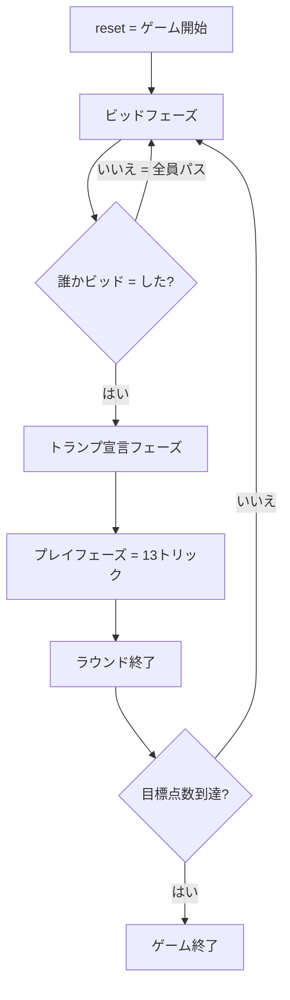

# ターニーブ（CUI版）遊び方

## ゲーム概要

中東発祥の 2vs2 パートナーシップ・トリックテイキングゲーム。4 人 (人間 1 + CPU 3) で対戦し、ビッド勝者がトランプスートを選び、宣言したトリック数を取れるかチームで競います。

## 起動方法

```sh
go run ./cmd/trumpcards tarneeb
go run ./cmd/trumpcards --lang en tarneeb  # 英語モード
```

## ルール

### 基本ルール

- 52 枚デッキを 4 人に 13 枚ずつ配ります。
- パートナーシップ: idx 0 + 2 vs idx 1 + 3（向かい合わせ）。
- ビッドはディーラーの左隣から 1 人 1 回。**7〜13 の数字、または 0=パス**。
- 2 人目以降のビッドは現在の最高ビッドより厳密に大きくする必要があります。
- 全員パスならカードを再配布してビッドラウンドをやり直します。

### トランプ宣言

- 最高ビッド者が、自分の手札を見て **♠/♣/♥/♦ から好きなスートをトランプに指定**します。

### プレイ

- 最高ビッド者がリードプレイヤーとなり、最初のトリックを開始します。
- 各プレイヤーは **リードスートに従ってカードを出す**必要があります。
- リードスートを持っていない場合は、**トランプで切るか、捨て札を出す**かを自由に選べます。
- トリック勝者: トランプが出ていればその中で最高値、出ていなければリードスート最高値。

### 得点

- ビッドチームの合計トリック数 ≥ ビッド数 → **+ 実トリック数**
- ビッドチームの合計トリック数 < ビッド数 → **− ビッド数**
- 防衛チーム → 常に **+ 実トリック数**

### ゲーム終了

先に目標点数 (デフォルト 31 点) に到達したチームの勝利。同点ならビッドチームの勝ち。

### CPU 難易度

| 難易度 | 挙動 |
|--------|------|
| Easy   | ランダム寄りのビッド／プレイ |
| Normal | 高札・スートカウントを使った標準戦略 |
| Hard   | パートナーの勝ち状況を考慮した戦略 |

## ゲームの流れ



## コマンド一覧

| コマンド | 短縮形 | 説明 |
|----------|--------|------|
| `reset` | `r` | 新しいゲームを開始 |
| `quit` | `q` | ゲーム終了 |
| `help` | `?` | コマンド一覧を表示 |
| `bid <n>` | `b` | ビッドを宣言 (0=パス、7-13=ビッド) |
| `trump <s>` | `t` | トランプスートを宣言 (1=♠ 2=♣ 3=♥ 4=♦) |
| `play <i>` | `p` | カードをプレイ (インデックス指定) |
| `next` | `n` | 次のトリックへ |
| `nextround` | `nr` | ラウンドをスコアリングして次のラウンドへ |
| `setdifficulty <0-2>` | `sd` | CPU 難易度設定 (0=Easy, 1=Normal, 2=Hard) |
| `setlimit <n>` | `sl` | 目標点数の設定 |
| `setminbid <n>` | `sm` | 最低ビッドの設定 (1-13) |
| `hint` | `h` | ヒント表示 |
| `log` | `l` | 棋譜表示 |

## 画面の見方

```
==========
Tarneeb (ターニーブ)
==========
Round 1  Trick 1
Trump: ♠
Team 0: 0  Team 1: 0
Bid winner: You (8)
...
You (T0) bid=8 tricks=0 cards=13
[0]♠2 [1]♠5 [2]♣3 [3]♣K [4]♥A ...
CPU 1 (T1) bid=Pass tricks=0 cards=13
...
----------
> play 4
```

- 1 行目: 現在のラウンド・トリック番号。
- 2 行目: 宣言されたトランプスート (未宣言なら "not yet declared")。
- 3 行目: 両チームの累計スコア。
- プレイヤー行: チーム番号、ビッド、獲得トリック数、手札枚数。
- 人間の手札のみインデックス付きで表示されます。

## 遊び方のコツ

- **ビッドはチーム戦** — 自分のトリックだけで判断せず、パートナーが取れそうな分も考えて 7〜13 を宣言しましょう。
- **トランプスートは最長スートが基本** — 一番長く持っているスートをトランプにすると、勝てるトリックが増えます。
- **A・K は早めにキャッシュ** — トランプで切られる前に高札を出すと確実なトリックになります。
- **パートナーが勝っているなら低い札で逃げる** — 二重に勝ちに行く必要はありません。
