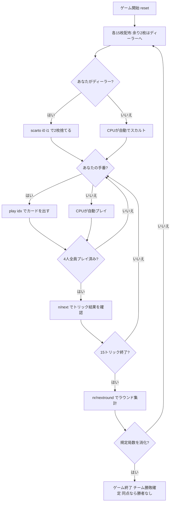

# タロッキーニ（CUI版）遊び方

## ゲーム概要

Tarocchini（タロッキーニ、別名オットチェント）はイタリア・ボローニャの62枚タロット札「タロッコ・ボロニェーゼ」を使う4人用トリックテイキングゲームです。**対面同士が固定パートナー**となる2対2のチーム戦で、あなたは席0でプレイします。

このゲームを他のトリックテイカーと分けているのは **同格の「パパ」4枚は、後から出した方が勝つ** という点です。本作の他のゲームはすべて「より強い札が出たときだけ勝者を更新する」という判定で書けますが、その判定をここに持ち込むと**先にパパを出した側が勝ってしまいます**。

## 起動方法

```sh
go run ./cmd/trumpcards tarocchini
go run ./cmd/trumpcards --lang en tarocchini  # 英語モード
```

## ルール

### デッキ（62枚）

| 種別 | 枚数 | 内訳 |
|------|------|------|
| スート札 | 40 | 4スート × 10枚（**2〜5のピップは抜かれています**）: 1, 6, 7, 8, 9, 10, F, C, R, Re |
| 切札（タロッコ） | 21 | 1〜21 |
| マット（Matto / 愚者） | 1 | — |

コート札は F（ファンテ）・C（カヴァッロ）・R（レジーナ）・Re（レ）の4枚です。52枚デッキの感覚で1〜10を並べると枚数が合わないので注意してください。

### 配札とスカルト

- 各プレイヤーに **15枚**ずつ配ります。
- **62は4で割り切りません。**余った **2枚**はディーラーが受け取り（一時的に17枚）、同じ2枚を伏せて捨てます（**スカルト**）。
- 伏せた2枚は**ディーラー側チームの獲得札として得点になります**。そのため **切札とマットは捨てられません** —— 高い切札を確実に手に入れられてしまうと、トリックで competing する意味が薄れるためです。

### パパ（同格の4枚）

- 切札のうち4枚は**互いに順位が等しい「パパ」**として扱われます。
- 同じトリックに複数のパパが出た場合、**後から出した方が勝ちます**。
- パパは**中位の同格札であって最強札ではありません**。より上位の通常の切札には負けます。

> **この4枚の同定について**: タロッコ・ボロニェーゼの切札は「ベガート → 同格のパパ4枚 → 番号付きの中位 → 最上位4枚（アンジェロ／モンド／ソーレ／ルーナ）」という構成で、"同格4枚" と "最上位4枚" は別のグループです。本実装ではベガートの直上4枚をパパとして扱っています（issue #4409 参照）。

### トリック・テイキング

- **マストフォロー**: リードされたスートを持っていれば必ず従います。
- **持っていなければ切札を出す義務**があります（タロー系の共通ルール）。
- **マットは例外**で、いつでも出せます。ただしトリックは取れません。
- **勝敗**: 切札が出ていれば最強の切札、なければリードスートの最強札が勝ちます。パパ同士は上記のとおり後出し優先です。

### 得点計算と勝利条件

| 項目 | 得点 |
|------|------|
| トリック | 1トリックにつき1点（席の属するチームへ） |
| 最終トリックボーナス | 最後のトリックを取ったチームへ2点 |
| スカルト | 伏せた2枚がディーラー側チームへ2点 |

**マッチ勝利**: 規定局数（デフォルト **4局**、ディーラーが一巡するよう**プレイヤー数の倍数**に限られます）を終えた時点で、合計点の多いチームが勝ちです。**同点なら勝者なし**となります。

## ゲームの流れ



## コマンド一覧

| コマンド | 短縮形 | 説明 |
|----------|--------|------|
| `scarto <i0> <i1>` | `discard` | 余剰2枚を捨てる（ディーラーのみ・切札とマットは不可） |
| `play <idx>` | — | 手札のidx番目のカードを出す |
| `next` | `n` | 次のトリックへ進む |
| `nextround` | `nr` | 次のラウンドへ進む（15トリック終了後） |
| `setdifficulty <0-2>` | `sd <0-2>` | CPU難易度設定（0=Easy, 1=Normal, 2=Hard・ゲームはリセットされます） |
| `hint` | `h` | ヒントを表示 |
| `log` | `l` | アクションログを表示 |
| `reset` | `r` | 新しいゲームを開始（設定保持） |
| `quit` | `q` | ゲーム終了 |
| `help` | `?` | コマンド一覧を表示 |

入札は存在しないため、`bid` / `pass` コマンドはありません。

## 画面の見方

```
==========
タロッキーニ コマンド一覧
==========
ラウンド: 1  トリック: 1
得点  チーム0: 0  チーム1: 0
パパ4枚は同格 —— 同じトリックに複数出たら、後から出した方が勝ちます
You (チーム0): 15枚  トリック: 0 [親]
[0]SPADE 1  [1]SPADE 7  [2]切札 12  [3]パパ  [4]マット  ...
CPU1 (チーム1): 15枚  トリック: 0
CPU2 (チーム0): 15枚  トリック: 0
CPU3 (チーム1): 15枚  トリック: 0
----------
手番: You
play <idx>・・・カードを出す（リードスートにマストフォロー／持たなければ切札を出す義務。マットはいつでも可）
```

- **得点行**: チーム単位の累計点。個人ではなくチームで競います。
- **パパの行**: 後出し優先のルールを毎フレーム表示します。**これを知らないとパパ4枚の使いどころが判断できません。**
- **プレイヤー行**: 所属チーム・手札枚数・このラウンドで取ったトリック数。`[親]` はディーラーです。
- **`[n]`付き行**: あなたの手札。パパは**番号ではなく「パパ」と表示されます** —— 番号で出すと「2が3より弱い」と誤読されるためです。

## 遊び方のコツ

- **パパは最後に出す**: 同格4枚は後出し優先なので、パートナーや相手が先にパパを切っていれば、こちらのパパで上書きできます。逆に自分から先に出すと上書きされます。
- **パパは万能札ではない**: 中位の同格札なので、上位の通常切札には負けます。「パパ＝最強」と思い込むと高い切札に刈り取られます。
- **味方のトリックは奪わない**: 対面が既に勝っているトリックに強い札を重ねるのは無駄です。CPUも同じ判断をするので、対面が強い札を出した後は低い札を捨てましょう。
- **ディーラーのスカルトは得点になる**: 伏せた2枚はそのままディーラー側チームの点です。捨てられるのは切札とマット以外なので、スート札の中で最も使いにくいものを選びます。
- **マットは逃げ札**: トリックは取れませんが、フォロー義務と切札義務の両方を免れます。出したくない切札を抱えているときの逃げ道になります。
- **最終トリックは2点**: 通常のトリックの倍の価値があります。終盤に切札を1枚残しておくと、最後の1トリックを確実に取れます。
