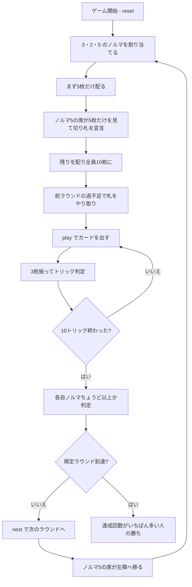

# 3-2-5（CUI版）遊び方

## ゲーム概要

インド北部で遊ばれる**3人専用**のトリックテイキング。30枚を10枚ずつ配り、10トリックを打ちます。**ノルマは宣言するものではなく、最初から割り当てられています**——3人がそれぞれ **3・2・5** という別々のトリック数を負い、役割はラウンドごとに回ります。ちょうど以上取れば達成、届かなければ未達成。**多く取っても得点は増えません。**

## 起動方法

```sh
go run ./cmd/trumpcards teendopaanch
go run ./cmd/trumpcards --lang en teendopaanch  # 英語モード
```

## ルール

### デッキ（30枚）

8・9・10・J・Q・K・A の7ランク × 4スート = **28枚**に、**7♠ と 7♥ の2枚**を足した **30枚**を使います。3人 × 10枚でちょうど配り切れます（28枚では2枚足りません）。強さは **A > K > Q > J > 10 > 9 > 8 > 7**。

### ノルマの割り当て

| 役割 | ノルマ |
|------|-------|
| 切り札を決める席 | **5トリック** |
| その左隣 | **3トリック** |
| さらに左隣 | **2トリック** |

3 + 2 + 5 = 10 で、トリックが余りも不足もしません。**ノルマ5の席はラウンドごとに移り**、3ラウンドで全員が3種類を一度ずつ引き受けます。

### 配りと切り札

1. まず**5枚だけ**配る
2. **ノルマ5の席が、その5枚だけを見て**切り札スートを宣言する
3. 残りを配って全員10枚にそろえる

10枚揃ってから決めるのではないのが、このゲームの賭けどころです。

### 札のやり取り（未達成のペナルティ）

ラウンドが終わると、**ノルマを超えた人が、届かなかった人の良い札を召し上げます**。超過ぶんだけ相手の最強札を取り、代わりに自分の最弱札を渡します。**多く取ることに意味が生まれるのはここだけ**で、そのラウンドの得点にはなりません。

### 勝敗

規定ラウンド（既定3）を終えた時点で、**ノルマ達成回数がいちばん多い人の勝ち**です。同点なら引き分け。

## ゲームの流れ



## コマンド一覧

| コマンド | 短縮形 | 説明 |
|----------|--------|------|
| `trump <suit>` | `t` | 切り札スートを宣言する（1:♠ 2:♣ 3:♥ 4:♦、ノルマ5の席のみ） |
| `play <idx>` | `p` | 手札の `<idx>` 番目のカードを出す |
| `next` | `n` | 次のラウンドを開始する |
| `hint` | `h` | 宣言すべきスート、または打つべき札を提示する |
| `giveup` | `g` | 投了する |
| `log` | `l` | 棋譜（アクションログ）を表示する |
| `reset` | `r` | 最初からやり直す |
| `quit` | `q` | 終了する |
| `help` | `?` | コマンド一覧を表示 |

**ノルマを宣言するコマンドはありません。** 3・2・5 は割り当てで、選ぶ余地がありません。

## 画面の見方

```
==========
3-2-5 (ティーン・ドー・パーンチ)
==========
ラウンド: 2/3  トリック: 4/10
ノルマは宣言ではなく割り当てです。3人が 3・2・5 という別々のノルマを負い、ちょうど以上を取れば達成。多く取っても得点は増えず、超過ぶんは次のラウンドで相手の良い札を召し上げる権利になります。
切り札: ハート（CPU1 が宣言）
前ラウンドの過不足で 2 枚を移しました。
 あなた: ノルマ3 獲得1 達成1回 手札7枚
  [0]♠8 [1]♠K [2]♣9 [3]♥A [4]♥10 [5]♦7 [6]♦Q
>CPU1[切り札決定/ノルマ5]: ノルマ5 獲得2 達成0回 手札7枚
 CPU2: ノルマ2 獲得1 達成1回 手札7枚
----------
手番: CPU1
play <idx>・・・カードを出す
```

- **ノルマ行**: 自分に割り当てられた数と、いま取った数。**あと何トリック要るか**がここで読めます
- **`[切り札決定/ノルマ5]`**: 切り札を決めた席。ノルマ5を負っています
- **やり取り行**: 前ラウンドの過不足で動いた枚数。**盤面には痕跡が残らない**ので明示します
- **達成n回**: これまでにノルマを達成したラウンド数。**勝敗はこれで決まります**
- **`[n]`**: `play <n>` で指定する手札の番号

## 遊び方のコツ

- **ノルマ2はいちばん楽に見えて、いちばん「取りすぎ」が起きやすい。** 強い札を持たされたラウンドこそ注意です
- **ノルマ5を引いたら切り札は長いスートから。** 5枚しか見えないので、枚数がいちばん確かな情報です
- **届いたら降りる。** 6トリック目以降は1つも得になりません。安い札で流しましょう
- **ただし、あと1トリックで届く相手には取らせない。** 相手を未達成にすれば、次のラウンドで良い札を召し上げられます
- **召し上げられる側になったら、強い札を先に使い切る。** ラウンド終了時に手札は無いので、実際に取られるのは次の配りの札です
- **達成回数だけが得点。** トリックを多く取った回数ではないので、派手に勝つ必要はありません
