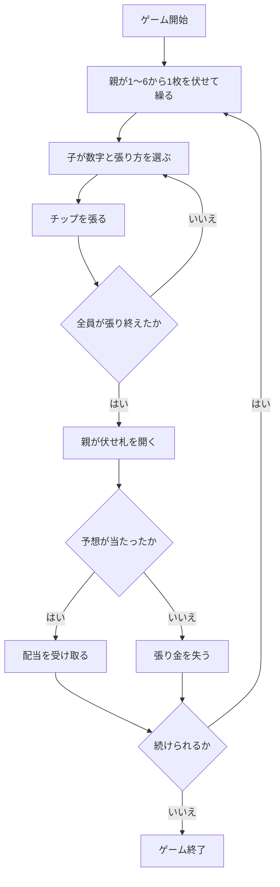

# 手本引き（CUI版）遊び方

## ゲーム概要

手本引きは、日本（関西）の伝統的な賭博遊戯です。親が伏せて選んだ株札の数字を子が予想し、張り方に応じた配当を受けます。親1人と子（人間1人＋CPU）で遊ぶ、トリックテイキングでもラミーでもない予想と配当のゲームです。

## 起動方法

```sh
go run ./cmd/trumpcards tehonbiki
go run ./cmd/trumpcards --lang en tehonbiki  # 英語モード
```

## ルール

- 株札の1〜6を使います。各勝負で親が1〜6から1枚を伏せて選びます。これを「繰る」といいます。
- 子は伏せ札がどの数字かを予想し、張り方とチップの額を決めます。
- 全員が張り終えたら親が伏せ札を開き、予想に含まれていた張りに配当を払います。外れた張りは没収です。

| 張り方 | 覆う数字 | 配当（勝ち分） |
|--------|----------|----------------|
| 単張り | 1個 | 4.5倍 |
| 二丁掛け | 2個 | 1.8倍 |
| 三丁掛け | 3個 | 0.9倍 |
| 片山 | 決められた3個の組 | 0.9倍 |

この配当表は本リポジトリで採用したハウスルールであり、史実の配当ではありません。覆う数字を `k` 個とした公正オッズ `(6-k)/k` から、勝ち分の1割を引いて決めています。片山で選べる組は `1,2,3` または `4,5,6` のどちらかです。

## ゲームの流れ



## コマンド一覧

| コマンド | 短縮形 | 説明 |
|----------|--------|------|
| `bet <張り方> <数字...> <チップ>` | `b` | 張り方（`single` / `double` / `triple` / `half`）、覆う数字、張り金を指定 |
| `next` | - | 決着後に次の勝負へ進む |
| `hint` | - | 数字を選ぶためのヒントを表示 |
| `reset` | `r` | 新しいゲームを開始 |
| `log` | `l` | 行動ログを表示 |
| `help` | `?` | コマンド一覧を表示 |
| `quit` | `q` | ゲーム終了 |

## 画面の見方

```
手本引き
フェーズ: BET
チップ: 1000
張り方と数字、張り金を入力してください
例: bet single 3 50
```

- `BET` では数字と張り方を選んで張ります。
- `RESULT` では親の札、的中・外れ、配当を確認できます。
- チップが最低張り金に届かなくなると `GAME END` になります。

## 遊び方のコツ

- 単張りは配当が大きい代わりに覆う数字が1個だけ、三丁掛けと片山は配当が小さい代わりに3個を覆います。
- 親の札は開くまで分からないため、確実に当たる数字はありません。張り金を分散するか、配当との釣り合いを考えて選びます。
