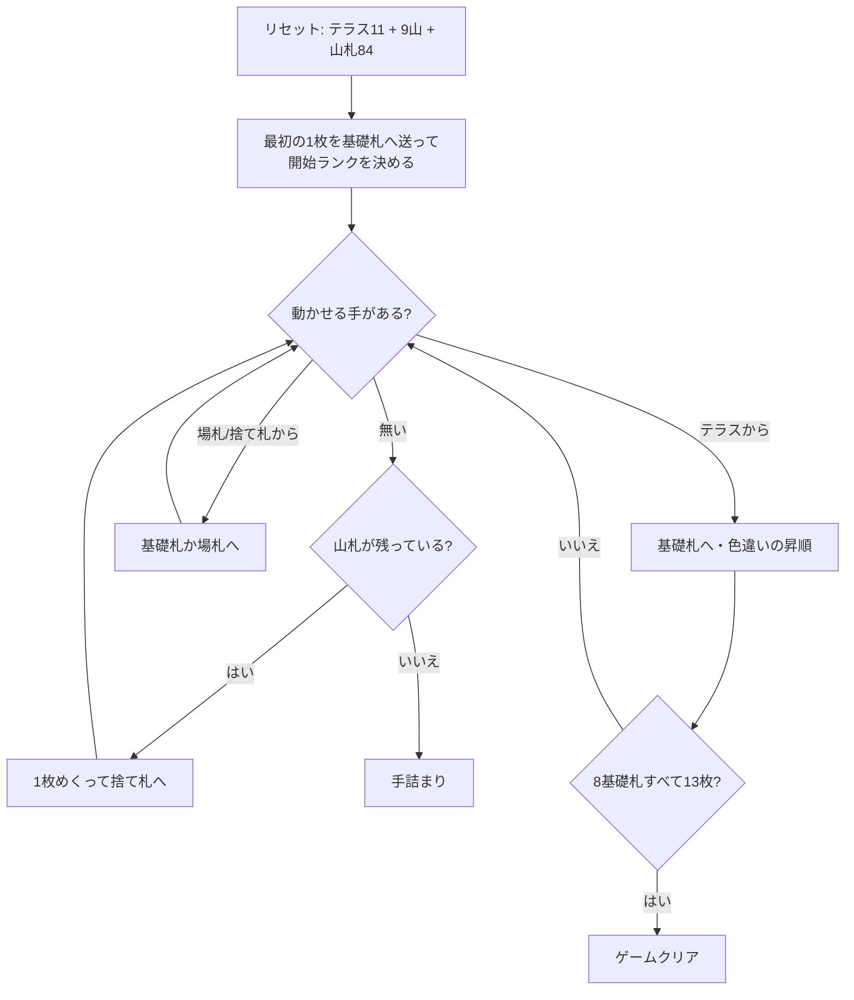

# テラス (Terrace) — CUI マニュアル

## ゲーム概要

52 枚 2 組（104 枚）で遊ぶソリティア。別名 **クイーン・オブ・イタリー (Queen of Italy)**。**11 枚のテラス**（リザーブ）を表向きに並べ、**9 つのタブロー山**に 1 枚ずつ配り、残り 84 枚が山札になる。

このゲームの特徴は 2 つ:

1. **基礎札は「色違い」で積む。同スートではない。** 開始ランクはプレイヤーが決める
2. **テラスの一番上は基礎札にしか出せない。** タブローへは動かせず、補充もされない

## 起動方法

```sh
go run ./cmd/trumpcards terrace
go run ./cmd/trumpcards --lang en terrace   # 英語
```

## ルール

- 52 枚 2 組（104 枚）。テラス 11 枚、タブロー 9 山に 1 枚ずつ、残り 84 枚が山札
- **基礎札**: 8 つ。**色違いで 1 つずつ昇順**、K の次は A に折り返して 13 枚。8×13 = 104 枚でクリア
- **開始ランク**: 最初に基礎札へ送った札のランクが、8 つすべての開始ランクになる
- **テラス**: 一番上の 1 枚だけが使え、**行き先は基礎札のみ**。タブローへは動かせない。**補充されないので減る一方**
- **タブロー**: **色違いの降順**。A の下には K を置ける。**1 枚ずつしか動かせない**
- **空き山**: 捨て札（無ければ山札）から**自動的に**埋まる。手で埋める操作は無い
- 山札は 1 枚ずつ捨て札へ。**めくり直しは無い（1 巡のみ）**

> 補足: issue #4381 の仕様案とは 4 点異なるが、いずれも実際の規則に合わせた。
> (1) 基礎札は「同スートで昇順」ではなく **色違いで昇順**。ここを同スートにすると別のゲームになる。
> (2) **テラスの札はタブローへ動かせない**（issue は「テラスとタブローの最上段カードのみ移動可能」とだけ書いており、テラス→タブローを許してしまう）。
> (3) 補充されるのはテラスではなく**タブローの空き**で、しかも捨て札か山札から自動。テラスは補充されない。
> (4) タブローは 9 山（issue は数に触れていない）。

## ゲームの流れ



## コマンド一覧

| コマンド | 説明 |
|---------|------|
| `d`, `draw` | 山札を 1 枚めくって捨て札へ送る（めくり直しなし） |
| `m r f` | テラスの一番上を基礎札へ（テラスの唯一の行き先） |
| `m w f` | 捨て札から基礎札へ |
| `m w t <pile>` | 捨て札からタブローへ |
| `m t <pile> f` | タブローから基礎札へ |
| `m t <from> t <to>` | タブロー間で 1 枚移動 |
| `h`, `hint` | ヒントを表示する |
| `ac`, `autocomplete` | 基礎札へ送れる札がなくなるまで自動で送る |
| `u`, `undo` | 1 手戻す |
| `g`, `giveup` | ギブアップ |
| `l` | 棋譜（アクションログ）を表示する |
| `r`, `reset` | 最初からやり直す |
| `q`, `quit` | 終了する |

## 画面の見方

```
開始ランク: 5
基礎札: SPADE 5 | HEART 6 | [空] | [空] | [空] | [空] | [空] | [空]
テラス: CLOVER 3 (残り9枚・基礎札専用)
山札: 80枚 捨て札: HEART 9 (4枚)
----------
山0: [0]SPADE 9 [1]HEART 8
山1: [0]CLOVER 4
...
山8: [0]DIAMOND 11
----------
手数: 12
```

- 開始ランクが未決定のうちは 1 行目が黄色の案内文に変わる
- テラスの行には残り枚数と「基礎札専用」が併記される
- 各山の `[n]` は山内のインデックス。動かせるのは常に一番上の 1 枚だけ

## 遊び方のコツ

- **テラスを詰まらせたら負け。** 補充されず、行き先も基礎札しかないので、テラスの一番上が上がる形を常に優先して考える
- **開始ランクの選択がゲーム全体を決める。** テラスの上の方に固まっているランクを基準にすると、序盤からテラスを削れる
- 基礎札は**色違い**なので、同じランクでも赤黒どちらが要るかが変わる。「次に欲しいのは赤の 7」という見方をする
- 場札は 1 枚ずつしか動かせない。深い山を掘るには何手もかかると見積もる
- 山札は 1 巡だけ。捨て札に送る前に置き場所を考える
- 詰まったら `undo` で分岐をやり直す
