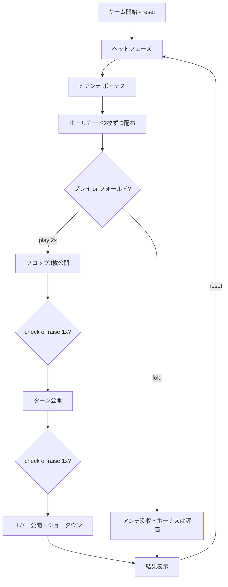

# テキサスホールデムボーナスポーカー（CUI版）遊び方

## ゲーム概要

ディーラーと1対1で対戦するカジノ版テキサスホールデムです。プレイヤーとディーラーは2枚のホールカードを受け取り、5枚のコミュニティカードを使って最良の5枚役を作ります。プリフロップ・フロップ・ターンの各ストリートでベットを上乗せでき、ディーラーは「クオリファイ」せず常に勝負します。

## 起動方法

```sh
go run ./cmd/trumpcards texasholdembonus
go run ./cmd/trumpcards thb                       # 短縮形エイリアス
go run ./cmd/trumpcards --lang en texasholdembonus  # 英語モード
```

## ルール

### 基本ルール

- 52枚のトランプ（ジョーカーなし）を使用
- プレイヤーとディーラーにそれぞれ2枚のホールカード、共有のコミュニティカード5枚を配る
- アンテベット必須＋ボーナスサイドベット任意
- プリフロップ：「フロップベット（アンテの2倍）」または「フォールド」
- フロップ／ターン後：「チェック」または「レイズ（アンテの1倍）」
- リバー後にショーダウン（ディーラーは常に勝負＝クオリファイ判定なし）

### 手札ランキング（強い順）

| ランク | 説明 |
|--------|------|
| ロイヤルフラッシュ | 同じスートのA-K-Q-J-10 |
| ストレートフラッシュ | 同じスートの連続5枚 |
| フォーカード | 同じランク4枚 |
| フルハウス | スリーカード+ペア |
| フラッシュ | 同じスートの5枚 |
| ストレート | 連続する5枚 |
| スリーカード | 同じランク3枚 |
| ツーペア | ペア2組 |
| ワンペア | 同じランク2枚 |
| ハイカード | 上記以外 |

### ベットと配当

**アンテ／プレイベット（フロップ＋ターン＋リバー）：**

| 結果 | 配当 |
|------|------|
| プレイヤー勝ち | アンテ・各プレイベット 1:1 |
| 引き分け | プッシュ（返却） |
| ディーラー勝ち | アンテ・各プレイベット没収 |

**アンテボーナス（プレイヤーがストレート以上の役を作ったとき、勝敗に関係なく追加で支払い）:**

| 役 | 配当 |
|----|------|
| ロイヤルフラッシュ | 1000:1 |
| ストレートフラッシュ | 200:1 |
| フォーカード | 25:1 |
| フルハウス | 5:1 |
| フラッシュ | 4:1 |
| ストレート | 1:1 |

**ボーナスサイドベット（プレイヤー2枚のホールカード、勝敗に関係なく支払い）:**

| ホールカード | 配当 |
|--------------|------|
| AA | 30:1 |
| AKスーテッド | 25:1 |
| AQ／AJスーテッド | 20:1 |
| AKオフスート | 15:1 |
| KK／QQ／JJ | 10:1 |
| AQ／AJオフスート | 5:1 |
| 22〜TT（ペア） | 3:1 |

## ゲームの流れ



## コマンド一覧

| コマンド | 短縮形 | 説明 |
|----------|--------|------|
| `reset` | `r` | 新しいゲームを開始 |
| `bet <amount> [bonus]` | `b <amount> [bonus]` | アンテベット（金額と任意のボーナス額を指定） |
| `play` | `p` | プリフロップでフロップベット（2×アンテ）を置く |
| `fold` | `f` | フォールド（アンテを放棄） |
| `check` | `c` | チェック（フロップ／ターン） |
| `raise` | `ra` | レイズ（フロップ／ターンで1×アンテ） |
| `log` | `l` | アクションログ（棋譜）を表示 |
| `quit` | `q` | ゲーム終了 |
| `help` | `?` | コマンド一覧を表示 |

### コマンド例

- `r` → ゲームリセット
- `b 100` → 100チップをアンテベット（ボーナスなし）
- `b 100 10` → 100チップをアンテ、10チップをボーナス
- `p` → プリフロップでフロップベット（2×アンテ）
- `f` → プリフロップでフォールド
- `c` → チェック
- `ra` → レイズ（1×アンテ）
- `l` → 棋譜を表示

## 画面の見方

```
----------
chips: 700
phase: FLOP
--- BOARD ---
SPADE 11,SPADE 12,SPADE 10
--- PLAYER ---
SPADE 1,SPADE 13
--- DEALER ---
??,??
----------
```

- **chips**: 現在の所持チップ数
- **phase**: 現在のフェーズ（BET / PRE-FLOP / FLOP / TURN / END）
- **BOARD**: コミュニティカード（フェーズに応じて 0／3／4／5 枚）
- **PLAYER**: プレイヤーのホールカード（ENDフェーズでは役名も表示）
- **DEALER**: ディーラーのホールカード（ENDフェーズまで伏せ）

ENDフェーズでは下記のような結果表示が追加されます。

```
ante: 100
bonus: 10
play bets: 200
Player wins!
total payout: 700
```

## 遊び方のコツ

- ポケットペアやAを含む2枚は基本プリフロップでプレイし、相手の弱手を取りに行きましょう
- フロップでペア以上が完成したらレイズして勝ち額を最大化、それ以下はチェックでベット額を抑えるのが基本
- アンテボーナスはストレート以上で支払われるため、強い役の可能性があるドローでは積極的にベットしてもよいでしょう
- ボーナスサイドベットはハウスエッジが高め。ポケットエースやAKスーテッドの夢を買うつもりで小額にとどめるのが無難です
