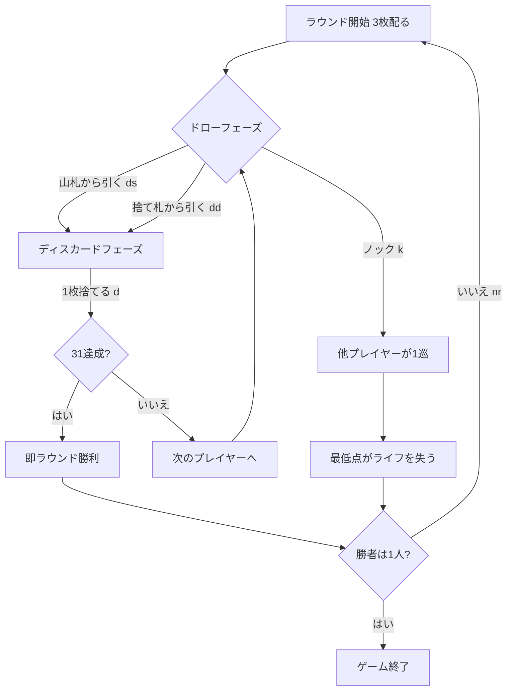

# サーティワン (Thirty-One / Scat) — CUI マニュアル

## ゲーム概要

サーティワン (Thirty-One、別名 Scat) は、欧米のパブやカジノで親しまれてきたドロー＆ディスカードのサバイバルゲームです。各プレイヤーは手札3枚の「同じスートの合計点」をできるだけ31点に近づけ、誰かがノックした時点で最も点数の低いプレイヤーがライフを1つ失います。ライフを失い切ったプレイヤーから脱落し、最後まで生き残ったプレイヤーが勝者です。

- プレイ人数: 4人 (あなた + CPU 3人)
- 使用カード: 52枚 (A=11点、J/Q/K=10点、2〜10=額面)
- 初期ライフ: 3 (設定で変更可能)

## 起動方法

```sh
go run ./cmd/trumpcards thirtyone
# 英語表示で起動する場合
go run ./cmd/trumpcards --lang en thirtyone
```

## ルール

1. 各プレイヤーに3枚配り、1枚を捨て札の山の先頭に置きます。
2. 自分の番では「山札から引く (ds)」または「捨て札から引く (dd)」を選び、手札から1枚を捨て (d) ます。
3. 引かずに勝負したい場合は「ノック (k)」を宣言できます。ノック後は他のプレイヤーが1ターンずつプレイしてラウンドが終了します。
4. 手札の「同じスートの合計点」が最も低いプレイヤーがライフを1つ失います (同点なら全員)。
5. 合計がちょうど31点になった場合は、その時点で即ラウンド勝利となり、他の全員がライフを1つ失います。
6. ライフが尽きたプレイヤーは脱落します。最後の1人、またはあなたが脱落した時点でゲーム終了です。

## ゲームの流れ



## コマンド一覧

| コマンド | 別名 | 説明 |
|----------|------|------|
| `ds` | `drawstock` | 山札からカードを引く |
| `dd` | `drawdiscard` | 捨て札からカードを引く |
| `d <idx>` | `discard <idx>` | 手札のカードを捨てる |
| `k` | `knock` | ノックして勝負する |
| `nr` | `nextround` | 次のラウンドへ進む |
| `h` | `hint` | 推奨する手を表示（ドロー先／捨てる札／ノック） |
| `sd <0-2>` | `setdifficulty` | CPU難易度を変更 (0=易, 1=普通, 2=難) |
| `sv <n>` | `setlives` | 初期ライフを変更 (1〜10) |
| `l` | `log` | 棋譜 (アクションログ) を表示 |
| `r` | `reset` | ゲームをリセット |
| `q` | `quit` | 終了 |

## ヒント

`hint` は CPU と同じ材料で判断した推奨手を返します。

- ドローフェーズ: ノックできる点数に届いていれば「ノックする」、捨て札を取ると最高スートの点が上がるなら「捨て札から引く」、どちらでもなければ「山札から引く」
- ディスカードフェーズ: 捨てたあとの点が最大になる札を、インデックス付きで指します

## 画面の見方

- 先頭行に現在のラウンド番号と山札の残り枚数が表示されます。
- 「捨て札」行に捨て札の一番上のカードが表示されます。
- 各プレイヤー行には「ライフ」「最高スート得点」「手札枚数」が表示されます。CPU の得点はラウンド終了まで `?` で伏せられます。脱落者は `OUT` と表示されます。
- あなたの手札はインデックス付き (`[0] SPADE 1` など) で表示され、`d <idx>` の `<idx>` に対応します。

## 遊び方のコツ

- 1つのスートに絞って集めるのが基本です。複数スートに分散させると合計点が伸びません。
- A(11) と絵札(10) は強力です。これらを同じスートで揃えると一気に31へ近づきます。
- 手札が27点前後になったら、相手が伸びる前にノックするのが有効です。
- 自分の点が低いと感じたら、捨て札を見て改善できるカードを取り込みましょう。
