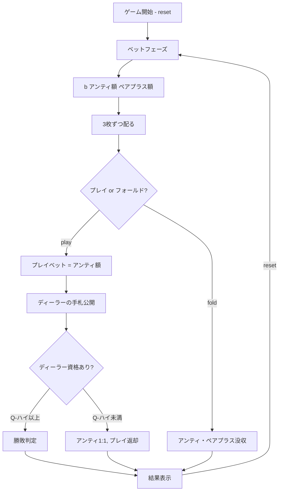

# スリーカードポーカー（CUI版）遊び方

## ゲーム概要

カジノの人気カードゲームです。3枚のカードでディーラーと勝負します。アンティベットとオプションのペアプラスサイドベットを組み合わせてプレイします。

## 起動方法

```sh
go run ./cmd/trumpcards threecard
go run ./cmd/trumpcards --lang en threecard  # 英語モード
```

## ルール

### 基本ルール

- 52枚のトランプ（ジョーカーなし）を使用
- プレイヤーとディーラーにそれぞれ3枚ずつ配る
- プレイヤーはアンティベット後、自分の手札を見てプレイまたはフォールドを決定
- ディーラーはQ-ハイ以上で「クオリファイ（資格あり）」

### 手札ランキング（強い順）

| ランク | 説明 |
|--------|------|
| ストレートフラッシュ | 同じスートの連続3枚 |
| スリーオブアカインド | 同じランク3枚 |
| ストレート | 連続する3枚（スート不問） |
| フラッシュ | 同じスートの3枚（連続でない） |
| ペア | 同じランク2枚 |
| ハイカード | 上記以外 |

### ベットタイプと配当

**アンティ/プレイベット:**

| 条件 | アンティ配当 | プレイ配当 |
|------|-------------|-----------|
| ディーラー不資格 | 1:1 | プッシュ（返却） |
| プレイヤー勝ち | 1:1 | 1:1 |
| ディーラー勝ち | 没収 | 没収 |
| 引き分け | プッシュ | プッシュ |

**アンティボーナス（プレイヤーの手札に対して自動支払い）:**

| 役 | 配当 |
|----|------|
| ストレートフラッシュ | 5:1 |
| スリーオブアカインド | 4:1 |
| ストレート | 1:1 |

**ペアプラス（サイドベット、勝敗に関係なく支払い）:**

| 役 | 配当 |
|----|------|
| ストレートフラッシュ | 40:1 |
| スリーオブアカインド | 30:1 |
| ストレート | 6:1 |
| フラッシュ | 3:1 |
| ペア | 1:1 |

## ゲームの流れ



## コマンド一覧

| コマンド | 短縮形 | 説明 |
|----------|--------|------|
| `reset` | `r` | 新しいゲームを開始 |
| `bet <amount> [pairPlus]` | `b <amount> [pairPlus]` | アンティベット（金額と任意のペアプラス額を指定） |
| `rebet` | `rb` | 直前のラウンドと同じ額でアンテ/ペアプラスを賭け直す |
| `play` | `p` | プレイベットを置いてディーラーと勝負 |
| `fold` | `f` | フォールド（アンティを放棄） |
| `log` | `l` | アクションログ（棋譜）を表示 |
| `quit` | `q` | ゲーム終了 |
| `help` | `?` | コマンド一覧を表示 |

### コマンド例

- `r` → ゲームリセット
- `b 100` → 100チップをアンティベット（ペアプラスなし）
- `b 100 50` → 100チップをアンティベット、50チップをペアプラスベット
- `p` → プレイ（アンティと同額のプレイベットを置く）
- `f` → フォールド
- `l` → 棋譜を表示

## 画面の見方

```
==========
スリーカードポーカー
==========
チップ: 1000
----------
ベットフェーズ
b・・・ベット  l・・・棋譜
==========

> b 100 50

==========
スリーカードポーカー
==========
チップ: 850
アンティ: 100  ペアプラス: 50
----------
あなたの手札: ♠K ♥K ♦9  (ペア)
----------
アクションフェーズ
p・・・プレイ  f・・・フォールド
==========

> p

==========
スリーカードポーカー
==========
チップ: 1150
----------
あなたの手札: ♠K ♥K ♦9  (ペア)
ディーラー: ♣J ♦8 ♠5  (ハイカード)
----------
ディーラー不資格！
アンティ配当: 200  プレイ返却: 100
ペアプラス配当: 100
合計配当: 400
----------
r・・・リセット  l・・・棋譜
==========
```

- `チップ: N`: 所持チップ数
- `アンティ: N`: アンティベット額
- `ペアプラス: N`: ペアプラスベット額
- `あなたの手札`: プレイヤーの3枚の手札と役名
- `ディーラー`: ディーラーの3枚の手札と役名

## 遊び方のコツ

- Q-6-4以上の手札でプレイするのが最適戦略です
- ペアプラスはハウスエッジが高め（約7.3%）ですが、高配当のチャンスがあります
- アンティ/プレイのハウスエッジは約3.4%で比較的低めです
- アンティボーナスはプレイヤーに有利な追加配当なので、良い手はプレイしましょう
