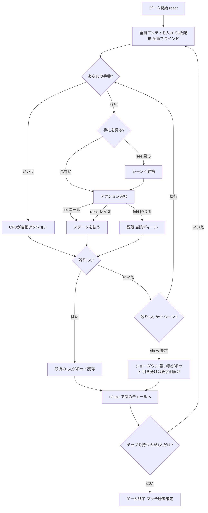

# スリーカード・ブラグ（CUI版）遊び方

## ゲーム概要

Three Card Brag（スリーカード・ブラグ）は4人用のイギリスの賭けゲーム（vying game）で、ポーカーの祖先のひとつです。**52枚のデッキ**を使い、各自3枚の手札とチップ・ポットで勝負します。全員がアンティ（参加料）をポットに入れて3枚ずつ配られ、各プレイヤーは手札を見ない**ブラインド（Blind）**か、見た**シーン（Seen）**かの状態を持ちます。ブラインドはシーンの半額（本実装: Blind=ステーク／Seen=2×ステーク）で賭けられ、いつでも手札を見てシーンへ昇格できます。手番では **ベット（コール）／レイズ／フォールド** を選び、最後の1人になればポットを獲得します。残り2人になるとシーンのプレイヤーは **ショー（Show）** でショーダウンを要求でき、強い手がポットを取ります（引き分けはショー要求側の負け）。チップが尽きたプレイヤーは脱落し、最後にチップを持つプレイヤーがマッチの勝者です。手役の強さは Prial（スリーカード）＞ Running Flush（ストレートフラッシュ）＞ Run（ストレート）＞ Flush（フラッシュ）＞ Pair（ペア）＞ High Card（ハイカード）の順です。

## 起動方法

```sh
go run ./cmd/trumpcards threecardbrag
go run ./cmd/trumpcards --lang en threecardbrag  # 英語モード
```

## ルール

### デッキと配布

- **デッキ**: 52枚（標準デッキ）
- **プレイヤー**: 4人（あなた + CPU3人）
- **アンティ**: 全員が既定額のチップをポットに入れます。
- **配布**: 各プレイヤー3枚。配られた直後は全員が**ブラインド（手札未確認）**の状態です。

### ブラインドとシーン

- **ブラインド（Blind）**: 手札を見ていない状態。賭け額は**ステーク（Blind = stake）**。
- **シーン（Seen）**: 手札を見た状態。賭け額は**ステークの2倍（Seen = 2 × stake）**。
- `see` でいつでも手札を見て、ブラインドからシーンへ昇格できます（一度見たら戻れません）。

### 手役の強さ

強い順。同じ役どうしはカードのランクで比較します。

| 強さ順 | 手役 | 説明 |
|--------|------|------|
| 1位 | Prial（スリーカード） | 同じランク3枚。**3-3-3** が最強の Prial |
| 2位 | Running Flush（ストレートフラッシュ） | 同スートの連続3枚 |
| 3位 | Run（ストレート） | 連続3枚（スート不問）。**A-2-3** が最強の Run |
| 4位 | Flush（フラッシュ） | 同スート3枚 |
| 5位 | Pair（ペア） | 同じランク2枚 |
| 6位 | High Card（ハイカード） | 上記いずれでもない |

### ベッティングフェーズ

手番では次のいずれかを選びます。

- `bet`（ベット）: 現在のステークにコールしてポットに払います（ブラインドはステーク、シーンは2×ステーク）。
- `raise <n>`（レイズ）: ステークを引き上げてからコールします。
- `fold`（フォールド）: 降ります。それまでの掛け金は戻りません。
- 自分以外の全員がフォールドすると、**最後に残った1人がポットを獲得**します（ショーダウンなし）。

### ショー（ショーダウン）

- 残りが**2人**になると、**シーンのプレイヤー**は **2 × ステーク** を払って `show` を要求できます。
- 互いの手役を比べ、**強い手がポットを獲得**します。
- **引き分けの場合は、ショーを要求した側の負け**になります。

### チップと勝利条件

- ディールの勝者がポットを総取りします。
- チップが尽きたプレイヤーは**脱落**します。
- 最後までチップを持って残った1人が**マッチの勝者**です。

### CPU難易度

- **Easy（0）**: ランダムな合法手。
- **Normal（1）**: 基本戦略。
- **Hard（2）**: 高度なヒューリスティック。

## ゲームの流れ



## コマンド一覧

| コマンド | 短縮形 | 説明 |
|----------|--------|------|
| `see` | `s` | 手札を見てシーンへ昇格する（ブラインド時） |
| `bet` | `b` | 現在のステークにコールする |
| `raise <n>` | `rs` | ステークを引き上げてコールする |
| `fold` | `f` | 降りる（このディールから抜ける） |
| `show` | `sh` | ショーダウンを要求する（残り2人・シーン時） |
| `next` | `n` / `nextround` | 次のディールへ進む |
| `setdifficulty <0-2>` | `sd` | CPU難易度設定（0=Easy, 1=Normal, 2=Hard） |
| `setante <n>` | `sa` | アンティ額設定 |
| `setchips <n>` | `sc` | 初期チップ数設定 |
| `hint` | `h` | ヒント表示 |
| `log` | `l` | アクションログを表示 |
| `reset` | `r` | 新しいゲームを開始（設定保持） |
| `quit` | `q` | ゲーム終了 |
| `help` | `?` | コマンド一覧を表示 |

## 画面の見方

```
==========
Three Card Brag (スリーカード・ブラグ)
==========
ラウンド 1  ポット: 4  賭け単位: 1
あなた: チップ33 賭け金1 [ブラインド]
[0]HEART 9  [1]HEART 11  [2]SPADE 11
CPU 1: チップ29 賭け金1 [降参]
CPU 2: チップ29 賭け金1 [降参]
CPU 3: チップ29 賭け金1 [降参] ←手番
----------
ラウンド終了。プレイヤーあなた が勝ちました。
n=次のディールへ
==========
```

- **1 行目**: `ラウンド N  ポット: 4  賭け単位: 1` — ラウンド・ポット総額・
  1 回あたりの賭け単位が同じ行に並びます (`ステーク:` ではありません)。
- **プレイヤー行**: `あなた: チップ33 賭け金1 [ブラインド]` — 残りチップ・
  現在の賭け金・状態。状態は `[ブラインド]` / `[シーン]` / `[降参]` など。
  `フェーズ: BETTING` のような独立した行は出ません。
- **`←手番`**: 手番の席は行末にこの印が付きます。
- **手札表示**: ブラインドのうちは伏せられ、シーンになると 3 枚が出ます。

## 遊び方のコツ

- **ブラインドの価値**: ブラインドはシーンの半額で賭けられます。チップが少ないときや序盤は、あえて見ずにブラインドで安く粘るのも有効です。
- **シーン昇格のタイミング**: 強い手なら `see` でシーンになり、強気にレイズしてポットを膨らませましょう。弱ければ早めの `fold` で損失を抑えます。
- **ショーの引き分けリスク**: `show` は要求側が引き分けで負けます。同等の手では迂闊にショーを要求せず、明確に勝てる確信があるときだけ要求しましょう。
- **手役の特例を覚える**: **3-3-3** が最強の Prial、**A-2-3** が最強の Run です。これらは見た目以上に強いので過小評価しないこと。
- **チップ管理**: チップが尽きれば脱落です。1ディールに賭けすぎず、残りチップとポットのバランスを見て降り際を判断しましょう。
