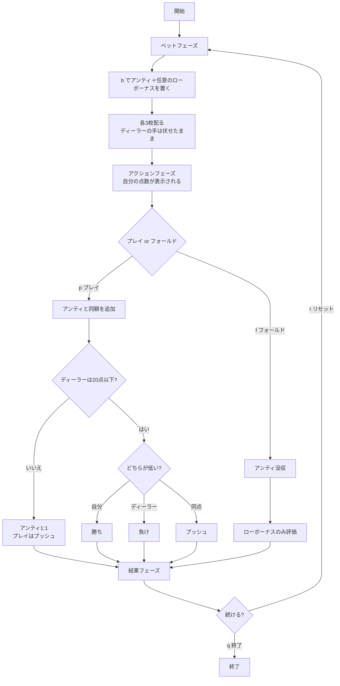

# スリーカード・ラミー（CUI版）遊び方

## ゲーム概要

3枚のカードでディーラーと勝負するカジノゲームです。**このゲームだけは点数が低いほど強く、0点が最強**——ポーカー系の直感がそのまま裏返ります。絵札は10点、Aは1点、それ以外は数字どおり。ただし同ランク3枚、または同スートの連番3枚（「役」）は合計ではなく**0点**として数えます。

アンティベットと、任意のローボーナスサイドベットを組み合わせてプレイします。

## 起動方法

```sh
go run ./cmd/trumpcards threecardrummy
go run ./cmd/trumpcards --lang en threecardrummy  # 英語モード
```

## ルール

### 基本ルール

- 52枚のトランプ（ジョーカーなし）を使用
- プレイヤーとディーラーにそれぞれ3枚ずつ配る。**ディーラーの3枚は勝負するまで伏せたまま**
- プレイヤーはアンティベット後、自分の手札を見てプレイまたはフォールドを決定
- **ディーラーは合計20点以下で「クオリファイ（資格あり）」**

### 点数の数え方

| カード | 点数 |
|--------|------|
| A | 1（**11にはならない**） |
| 2〜10 | 数字どおり |
| J / Q / K | 10 |

**役（0点）:**

| 役 | 説明 | 例 |
|----|------|-----|
| 同ランク3枚 | 同じランクが3枚 | K♠ K♥ K♦（素点30 → 0点） |
| 同スート連番3枚 | 同じスートで連続する3枚 | Q♠ K♠ A♠（素点21 → 0点） |

Aは並びの**下端にも上端にも**付きます（A-2-3 も Q-K-A も役）。ただし K-A-2 のように跨ぐ並びは役になりません。

### 勝敗

| 条件 | 結果 |
|------|------|
| ディーラーがクオリファイせず | アンティ1:1、プレイベットはプッシュ（勝敗に関係なく） |
| 自分の点数 < ディーラーの点数 | 勝ち（アンティ・プレイとも1:1） |
| 自分の点数 > ディーラーの点数 | 負け（アンティ・プレイとも没収） |
| 同点 | プッシュ（両方返却） |

### ボーナス配当

**アンティボーナス**（プレイした場合のみ、ディーラーの結果に関係なく）:

| 自分の点数 | 配当 |
|-----------|------|
| 0点（役） | 9:1 |
| 1〜5点 | 3:1 |
| 6〜10点 | 1:1 |

**ローボーナス**（サイドベット、ディーラーと完全に無関係）:

| 自分の点数 | 配当 |
|-----------|------|
| 0点（役） | 100:1 |
| 1〜5点 | 20:1 |
| 6〜10点 | 4:1 |

**フォールドしてもローボーナスは評価されます。** 降りたのは勝負であって、この賭けではありません。

## ゲームの流れ



## コマンド一覧

| コマンド | 短縮形 | 説明 |
|---------|--------|------|
| `bet <アンティ> [ローボーナス]` | `b` | ベットしてカードを配る（アンティは10以上の10の倍数、ローボーナスは任意） |
| `rebet` | `rb` | 直前のラウンドと同じ額でベット |
| `play` | `p` | プレイ（アンティと同額を追加して勝負） |
| `fold` | `f` | フォールド（アンティを失う。ローボーナスは評価される） |
| `hint` | `h` | 助言を表示 |
| `log` | `l` | 棋譜（アクションログ）を表示 |
| `reset` | `r` | ゲームをリセット |
| `help` | `?` | ヘルプを表示 |
| `quit` | `q` | 終了 |

## 画面の見方

```
----------
チップ: 1000
フェーズ: ベット
3枚の合計が低いほど強く、0点が最強。絵札=10、A=1。同ランク3枚か同スート連番3枚は0点。
ディーラーは合計20点以下でクオリファイします。
----------
```

ベットフェーズでは点数の数え方とクオリファイ条件が毎回表示されます。

```
----------
チップ: 980
フェーズ: プレイ / フォールド
--- あなた ---
点数: 14
♠3,♥5,♦6
----------
```

カードが配られると**自分の点数がすぐ表示されます**。これがプレイかフォールドかを決める唯一の材料です。ディーラーの手札はこの時点では表示されません。

```
----------
チップ: 970
フェーズ: 結果
--- あなた ---
点数: 0点（役 = 最強）
♠K,♥K,♦K
--- ディーラー ---
点数: 18
ディーラー: クオリファイ
♠10,♥7,♦A
----------
アンテ: 10
プレイ: 10
あなたの勝ちです
アンテボーナス: 90
配当合計: 130
----------
```

結果フェーズでディーラーの手札・点数・クオリファイ有無が開示され、配当の内訳が続きます。0点は「0点（役 = 最強）」と表示され、ただの0と取り違えないようになっています。
