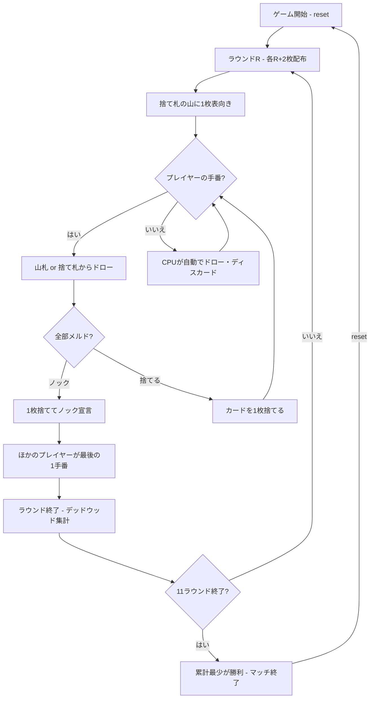

# スリー・サーティーン（CUI版）遊び方

## ゲーム概要

スリー・サーティーン（Three Thirteen / 3-13）は、104枚（標準52枚デッキ2組）を使うラミー系カードゲームです。2〜4人（プレイヤー1人 + CPU 1〜3人）で遊びます。全11ラウンドで構成され、ラウンドごとに配られる手札の枚数が増え（ラウンド1は3枚、ラウンド11は13枚）、そのラウンドのワイルドランクも変化します（ラウンドRではランクR+2がワイルド）。手札からカードを引き、捨て、すべてがメルドになったらノックします。各ラウンドのデッドウッド（メルドに含まれないカードの合計点）が累積され、11ラウンド終了時に累計点が最も少ないプレイヤーが勝者です。

## 起動方法

```sh
go run ./cmd/trumpcards threethirteen
go run ./cmd/trumpcards --lang en threethirteen  # 英語モード
```

## ルール

### 基本ルール

- 標準52枚デッキ2組（104枚）を使用、2〜4人プレイ
- 全11ラウンド。ラウンドR（1〜11）では各プレイヤーにR+2枚配る（3枚→13枚）
- 1枚を表向きにして捨て札の山を開始、残りは山札（ストック）
- 手番ではまず山札または捨て札の山からカードを1枚ドローする
- その後、手札からカードを1枚捨てる。手札がすべてメルドになっていれば、捨てると同時にノックできる

### ワイルドランク

- ラウンドRでは、ランク R+2 がそのラウンドのワイルドカードとして扱われる
- ラウンド1=3、ラウンド2=4、…、ラウンド9=J、ラウンド10=Q、ラウンド11=K がワイルド
- ワイルドカードはメルドの中で任意のカードの代わりに使える

### メルドとデッドウッド

- **メルド**: セット（同ランク3枚以上）またはラン（同スート3枚以上の連番）
- **デッドウッド**: メルドに含まれない手札の合計点（A=1点、2〜10=額面、J/Q/K=10点）

### ノック

- **ノック**: 1枚を捨てたあと、残りの手札がすべてメルドになっている（デッドウッド0）ときにノックできる
- ノック後、ほかのプレイヤーはそれぞれ最後の1手番を取る
- そのラウンドはノック後の最終手番で終了し、各プレイヤーのデッドウッドが集計される

### 得点とゲーム終了

- 各ラウンドの終了時、各プレイヤーのデッドウッド点が累積得点に加算される
- 11ラウンドすべてを終えたとき、累積得点が最も少ないプレイヤーがマッチの勝者

### CPU難易度

- **Easy** (0): ランダムにカードを出す
- **Normal** (1): 基本的なメルド戦略（デフォルト）
- **Hard** (2): 戦略的なプレイ（相手の捨て札を分析等）

## ゲームの流れ



## コマンド一覧

| コマンド | 短縮形 | 説明 |
|----------|--------|------|
| `reset` | `r` | ゲームリセット（設定保持） |
| `drawstock` | `ds` | 山札から1枚ドロー |
| `drawdiscard` | `dd` | 捨て札の山から1枚ドロー |
| `discard <idx>` | `d <idx>` | カードを捨てる（インデックス指定） |
| `knock <idx>` | `k <idx>` | 指定カードを捨ててノック（残りが全メルドの時） |
| `nextround` | `nr` | ラウンドをスコアリングして次のラウンドへ |
| `setdifficulty <0-2>` | `sd <0-2>` | CPU難易度設定（0=Easy, 1=Normal, 2=Hard） |
| `setplayers <2-4>` | `sp <2-4>` | プレイヤー人数設定 |
| `log` | `l` | 棋譜表示 |
| `quit` | `q` | ゲーム終了 |
| `help` | `?` | ヘルプ表示 |

### コマンド例

- `ds` → 山札から1枚ドロー
- `dd` → 捨て札の山からトップカードをドロー
- `d 3` → インデックス3のカードを捨てる
- `k 3` → インデックス3のカードを捨ててノック（残りが全メルドの時）

## 画面の見方

```
==========
Three Thirteen (スリー・サーティーン)
==========
ラウンド 2/11
ワイルド: 4
手札枚数: 4
----------
[You]: total=0 round=0 dead=11 cards=4
[0]SPADE A  [1]SPADE 4  [2]HEART J  [3]CLOVER 2
  捨てた後のデッドウッド: [0]10  [1]7  [2]1  [3]9
CPU 1: total=10 round=3 dead=5 cards=4
----------
捨て札トップ: HEART 7
山札残り: 30枚
手番: あなた
==========
```

- `ラウンド N/11`: 現在のラウンド番号
- `ワイルド: N`: そのラウンドのワイルドランク
- `手札枚数: N`: そのラウンドの配り枚数
- `[You]: total=N`: プレイヤーの累計得点（round=今ラウンドの得点, dead=デッドウッド, cards=手札枚数）
- `[0]SPADE A`...: インデックス付きの手札カード
- `捨てた後のデッドウッド: [i]N`: その札を捨てた場合に残るデッドウッド点。自分のディスカードフェーズの手番だけに出ます（ワイルドを残すと 20 点なので、ワイルドを捨てる手が有利になることがあります）
- `捨て札トップ`: 捨て札の山の一番上のカード
- `山札残り`: 山札の残り枚数

## 遊び方のコツ

- そのラウンドのワイルドランクを最大限活用してメルドを素早く完成させましょう
- デッドウッドの高いカード（J/Q/K=10点）は早めに処理するのが有効です
- 序盤の小さなラウンドは少ない手札で済むので、ミスのないプレイを心がけましょう
- ラウンドが進むほど手札が増えて難しくなるため、毎ラウンドのデッドウッドを抑えることが大切です
- 累計点が最少の人が勝つので、たとえ最終ラウンドで負けても全体で守りきれば勝てます
