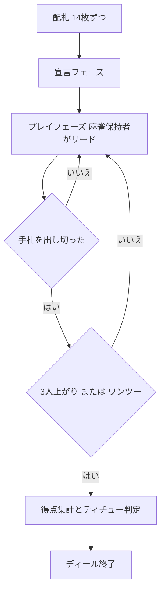

# ティチュー (Tichu) — CUIマニュアル

## ゲーム概要

ティチューは4人制・2対2のパートナーシップ型「大富豪系」カードゲームです。向かい合うプレイヤー (P0とP2、P1とP3) が味方チームになります。標準52枚に4枚の特殊カード (龍・鳳凰・犬・麻雀) を加えた56枚を使い、手札を早く出し切ることとカードの得点を集めることを競います。チームの合計得点で勝敗が決まります (本実装は1ディール単位)。

> **原作クレジット**: 『Tichu（ティチュー）』は Urs Hostettler 氏が1991年に発表し、Fata Morgana Spiele が発行しているカードゲームです。本実装は非公式・非営利のファン実装であり、権利者とは関係がありません。ルールのみを独自に実装しており、原版のカードデザインやルールブック本文は使用していません。

## 起動方法

```sh
go run ./cmd/trumpcards tichu
# 英語表示
go run ./cmd/trumpcards --lang en tichu
```

## ルール

- 4人 (あなた=P0 と CPU 3人)、チームは {P0, P2} 対 {P1, P3}。
- 56枚を各自14枚ずつ配ります (場札・余りなし)。
- プレイ前に各プレイヤーは「ティチュー (±100)」または「グランドティチュー (±200)」を宣言できます。宣言して最初に上がればボーナス、上がれなければペナルティです。
- 役: シングル / ペア / スリーカード / フルハウス / 連続 (5枚以上のストレート) / 連続ペア / ボム (4枚同ランク) / ストレートフラッシュ (同スート連続5枚以上)。
- 場の役と同じ種類・枚数で、より強い役のみ出せます。ボムは役種を問わず上回り、ストレートフラッシュは4枚ボムより強い。
- 特殊カード:
  - 麻雀: 最弱の単体。保持者が最初のトリックをリードします。
  - 犬: パートナーにリードを譲ります (得点0)。
  - 鳳凰: ワイルド。単体では場の単体の0.5上 (龍は超えられない)。得点 -25。
  - 龍: 最強の単体。獲得したトリックは相手チームに渡ります。得点 +25。
- 得点カード: 5=5点、10とK=10点、龍=+25、鳳凰=-25 (合計100点)。
- 終了処理: 3人が上がるとディール終了。最後の1人の手札は相手チームへ、取ったトリックは最初に上がった人へ渡します。同チームが1位2位を独占 (ワンツー) すると+200で他は無効。

## ゲームの流れ



## コマンド一覧

| コマンド | 説明 |
|----------|------|
| `p [idx...]` | 指定インデックスのカードを出す (空 = パス) |
| `d [0-2]` | 宣言 (0=なし, 1=ティチュー, 2=グランド) |
| `sd [0-2]` | CPU難易度設定 (0=通常, 1=簡単, 2=難しい) |
| `r` | 新しいゲーム |
| `log` / `l` | 棋譜を表示 |
| `q` | 終了 |

## 画面の見方

- 各プレイヤー行にチーム番号、宣言、手札枚数 (または上がり順位) が表示されます。
- あなた (P0) の手札はインデックス付きで表示され、`p` コマンドの番号に対応します。
- `場:` 行に現在テーブルを支配している役が表示されます。`---` はリード可能 (誰でも好きな役を出せる) 状態です。

## 遊び方のコツ

- パートナーが場を支配しているときは無理に上回らず、パスして味方に上がらせましょう。
- ボムは温存し、相手の高得点トリックや龍を奪うときに使うと効果的です。
- 鳳凰は単体の競り合いを制したり、足りない1枚を補ってストレートやフルハウスを完成させたりと用途が広いカードです。
- ティチュー宣言は確実に最初に上がれる強い手のときだけ行いましょう。失敗するとチームに-100/-200の痛手です。
