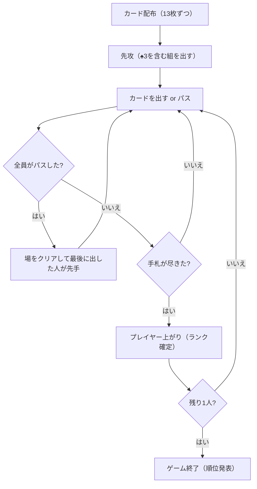

# ティエンレン（CUI版）遊び方

## ゲーム概要

Tien Len (ティエンレン) は、ベトナムの国民的トランプゲームで、欧米では "Vietnamese Poker" や "Thirteen" とも呼ばれる手札消化 (シェディング) ゲームです。4人で遊び、手札を最も早く出し切ったプレイヤーが勝者です。

## 起動方法

```sh
go run ./cmd/trumpcards tienlen
go run ./cmd/trumpcards --lang en tienlen  # 英語モード
```

## ルール

- **デッキ**: 52枚（ジョーカーなし）を4人に13枚ずつ配ります。
- **カードの強さ**: 数字 `3 < 4 < ... < K < A < 2`、同数ならスート `♠ < ♣ < ♦ < ♥`（例: ♠2 より ♥2 の方が強い）。
- **先攻**: 最弱の ♠3 を持つプレイヤーが先攻。最初のプレイに ♠3 を含める必要があります。
- **役（コンビネーション）**: シングル / ペア / スリーカード / ストレート（3枚以上の連続、スート混在可）。
- **チョップ役（爆弾）**: 「連続する3つのペア（例: 44-55-66）」は単体の「2」を切れます。「フォーカード」は単体の「2」と連続3ペアを切れます。
- **出し方**: 場と同じ役・同じ枚数で、より強いカードを出すかパス。
- **場のリセット**: 全員がパスすると場がクリアされ、最後に出したプレイヤーが自由に出せます。
- **勝利条件**: 手札を最初に出し切ったプレイヤーが1位。

## ゲームの流れ



## コマンド一覧

| コマンド | 短縮形 | 説明 |
|----------|--------|------|
| `play <idx...>` | `p` | 指定インデックスのカードを出す（例: `p 0 2 4`） |
| `play` | `p` | パス（場が空でない場合） |
| `reset` | `r` | ゲームリセット |
| `setdifficulty <0-2>` | `sd` | CPU難易度変更 (0=Normal, 1=Easy, 2=Hard) |
| `hint` | `h` | 推奨手を表示（出す札のインデックス付き。返せる手が無ければパスを勧める） |
| `log` | `l` | 棋譜表示 |
| `quit` | `q` | 終了 |
| `help` | `?` | コマンド一覧を表示 |

## 画面の見方

```
=== Tien Len (ティエンレン) ===
あなた: 13枚
  [0]♠3 [1]♣4 [2]♦5 ...
CPU 1: 13枚
CPU 2: 13枚
CPU 3: 13枚
----------
場: なし (自由に出せます)
あなたのターンです
```

## 遊び方のコツ

- 弱いカードから順に出し、2やAは温存しましょう。
- ペアやストレートでまとめて出すと相手が対応しにくくなります。
- 相手が出した単体の「2」は、連続3ペアやフォーカード（チョップ役）で撃ち落とせます。
- 相手の残り枚数に注意し、上がり間際の相手には強いカードで蓋をしましょう。
