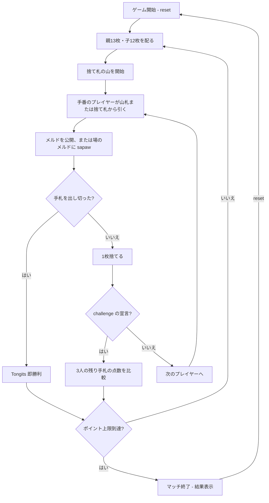

# トンギッツ（CUI版）遊び方

## ゲーム概要

トンギッツは、52枚のトランプで遊ぶ3人固定のフィリピン発祥ラミーです。子（後手の2人）には12枚、親（先手のプレイヤー0）には13枚を配ります。手札からメルドを場に公開し、他家のメルドにも sapaw（札の付け足し）を行いながら手札をなくすことを目指します。手札を出し切ると即勝利です。

## 起動方法

```sh
go run ./cmd/trumpcards tongits
go run ./cmd/trumpcards --lang en tongits  # 英語モード
```

## ルール

### 基本ルール

- 52枚のトランプを使い、プレイヤー3人で遊びます。
- 親（プレイヤー0）には13枚、子（プレイヤー1・2）には12枚を配り、残りから捨て札の山を始めます。
- 手番では山札または捨て札の山から1枚引き、手札からメルドを公開したり、公開済みのメルドへ sapaw したりして、最後に1枚捨てます。
- メルドは、同じランクを3枚以上集めたセット、または同じスートの連続した3枚以上のランです。
- 自分の手札をすべて場に出し切ったプレイヤーは、その時点で Tongits の即勝利です。

### 公開メルドと sapaw

- 公開したメルドは場に残り、全員が確認できます。
- 自分のメルドだけでなく、他家の公開メルドにも条件を満たす札を付け足せます。これが sapaw です。
- メルドや sapaw に使わなかった札は手札に残り、次の手番に整理します。

### challenge（ドロー宣言）

- 誰かがドローを宣言したら、そのラウンドを終了して3人の残り手札の点数を比較します。
- Aは1点、2〜10は数字どおり、J・Q・Kは10点として数えます。
- 残り手札の合計点が最も少ないプレイヤーがそのラウンドの勝者です。
- 手札を出し切った即勝利と、challenge の点数比較のどちらでもラウンドは終了します。

### ゲーム終了

- ラウンド結果を累積し、設定したポイント上限に達したときにマッチを終了します。

### CPU難易度

- **Easy** (0): ランダムに札を選びます。
- **Normal** (1): 基本的なメルド戦略でプレイします（デフォルト）。
- **Hard** (2): より戦略的にプレイします。

## ゲームの流れ



## コマンド一覧

| コマンド | 短縮形 | 説明 |
|----------|--------|------|
| `reset` | `r` | ゲームリセット（設定保持） |
| `drawstock` | `ds` | 山札から1枚引く |
| `drawdiscard` | `dd` | 捨て札の山から1枚引く |
| `discard <idx>` | `d <idx>` | インデックス指定の札を捨てる（0始まり） |
| `nextround` | `nr` | 次のラウンドへ |
| `setdifficulty <0-2>` | `sd <0-2>` | CPU難易度を設定 |
| `setlimit <n>` | `sl <n>` | ポイント上限を設定 |
| `log` | `l` | 棋譜を表示 |
| `quit` | `q` | ゲーム終了 |
| `help` | `?` | ヘルプを表示 |

### コマンド例

- `ds` → 山札から引く
- `dd` → 捨て札の山のトップを引く
- `d 3` → 手札のインデックス3の札を捨てる

## 画面の見方

次は `go run ./cmd/trumpcards tongits` を実行したときの実際の初期表示です。手札の番号は0始まりです。

```
==========
Tongits (トンギッツ)
==========
ラウンド: 1  山札: 14枚
捨て札: HEART 1
あなた: 累積0点 ラウンド0点 13枚
[0]SPADE 1  [1]SPADE 3  [2]SPADE 4  [3]SPADE 8  [4]CLOVER 1  [5]CLOVER 5  [6]CLOVER 7  [7]CLOVER 11  [8]HEART 12  [9]DIAMOND 1  [10]DIAMOND 9  [11]DIAMOND 12  [12]DIAMOND 13
CPU 1: 累積0点 ラウンド0点 12枚
CPU 2: 累積0点 ラウンド0点 12枚
----------
手番: あなた (ドローフェーズ)
ds・・・山札から引く
dd・・・捨て札から引く
==========
```

- `ラウンド` と `山札` は現在のラウンド番号と山札の残り枚数です。
- `あなた`、`CPU 1`、`CPU 2` の行には累積点、ラウンド点、残り手札枚数が表示されます。
- あなたの手札には0始まりのインデックスが付きます。`d 0` のように指定してください。
- `手番` の表示で、現在のプレイヤーと引く・出す段階を確認できます。

## 遊び方のコツ

- 序盤からメルドを公開し、sapaw で場の組み合わせを広げると手札を減らせます。
- 他家のメルドにも付け足せる札を残しておくと、出し切りまでの手数を短くできます。
- challenge に備え、残り手札の点数が3人の中で最少になるように高い札から整理します。
