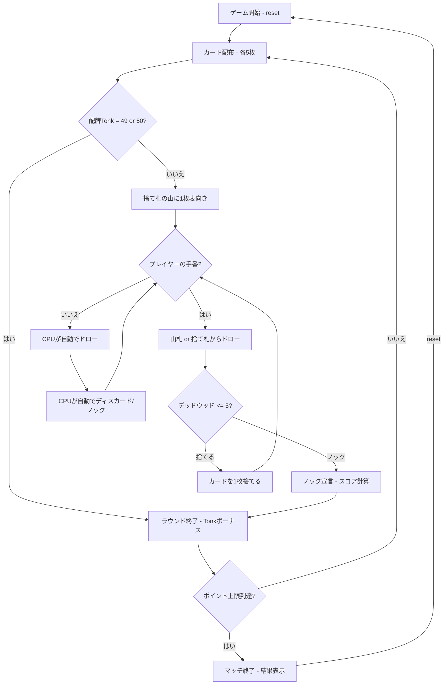

# トンク（CUI版）遊び方

## ゲーム概要

2人（プレイヤー1人 + CPU 1人）で遊ぶ短時間ラミー系カードゲームです。手札5枚でメルド（セットやラン）を作り、デッドウッドの少なさを競います。配牌時に49点・50点なら「Tonk」即勝利。先にポイント上限（デフォルト50点）に達したプレイヤーが勝利します。

## 起動方法

```sh
go run ./cmd/trumpcards tonk
go run ./cmd/trumpcards --lang en tonk  # 英語モード
```

## ルール

### 基本ルール

- 52枚のトランプを使用、2人プレイ
- 各プレイヤーに5枚ずつ配り、1枚を表向きにして捨て札の山を開始、残りは山札（ストック）
- 配布直後、いずれかの手札合計が49点または50点なら「Tonk」即勝利（手札合計 + 50点ボーナス）
- 手番ではまず山札または捨て札の山からカードを1枚ドローする
- その後、手札からカードを1枚捨てるか、ノックする

### メルドとデッドウッド

- **メルド**: セット（同ランク3〜4枚）またはラン（同スート3枚以上の連番）
- **デッドウッド**: メルドに含まれない手札の合計点（J/Q/K=10点、A=1点、その他=額面）

### ノック・アンダーカット

- **ノック**: デッドウッド合計が**5点以下**の時にノック可能（ジンラミーよりタイト）
- ノック直後にラウンド終了、デッドウッド差を計算
- **アンダーカット**: 相手のデッドウッドがノッカーより低い場合、相手にデッドウッド差 + 5点ペナルティが加算

### 配牌Tonk（即勝利）

- 配布5枚の合計点が49点または50点なら、Tonkを宣言して即ラウンド勝利
- スコア = 50点ボーナス + 手札合計（49点なら99点、50点なら100点）

### ゲーム終了

- ポイント上限（デフォルト50点）に達したプレイヤーが出たらマッチ終了

### CPU難易度

- **Easy** (0): ランダムにカードを出す
- **Normal** (1): 基本的なメルド戦略（デフォルト）
- **Hard** (2): 戦略的なプレイ

## ゲームの流れ



## コマンド一覧

| コマンド | 短縮形 | 説明 |
|----------|--------|------|
| `reset` | `r` | ゲームリセット（設定保持） |
| `drawstock` | `ds` | 山札から1枚ドロー |
| `drawdiscard` | `dd` | 捨て札の山から1枚ドロー |
| `discard <idx>` | `d <idx>` | カードを捨てる（インデックス指定） |
| `knock <idx>` | `k <idx>` | カードを捨ててノック（デッドウッド≤5の時） |
| `nextround` | `nr` | 次のラウンドへ |
| `setdifficulty <0-2>` | `sd <0-2>` | CPU難易度設定（0=Easy, 1=Normal, 2=Hard） |
| `setlimit <n>` | `sl <n>` | ポイント上限設定 |
| `log` | `l` | 棋譜表示 |
| `quit` | `q` | ゲーム終了 |
| `help` | `?` | ヘルプ表示 |

### コマンド例

- `ds` → 山札から1枚ドロー
- `dd` → 捨て札の山からトップカードをドロー
- `d 3` → インデックス3のカードを捨てる
- `k 4` → インデックス4のカードを捨ててノック宣言

## 画面の見方

```
==========
Tonk (トンク)
==========
ラウンド: 1  山札: 41枚
捨て札: HEART 7
あなた: 累積0点 ラウンド0点 5枚
[0]SPADE 5  [1]HEART 5  [2]DIAMOND 5  [3]CLOVER A  [4]SPADE 2
CPU 1: 累積0点 ラウンド0点 5枚
----------
手番: あなた (ドローフェーズ)
ds・・・山札から引く
dd・・・捨て札から引く
==========
```

- `ラウンド: N`: 現在のラウンド番号
- `山札: N枚`: 山札の残り枚数
- `捨て札`: 捨て札の山の一番上のカード
- `あなた: 累積N点 ラウンドN点 N枚`: スコアと手札枚数
- `[0]SPADE 5`...: インデックス付きの手札カード
- `手番`: 現在の手番プレイヤーとフェーズ

## 遊び方のコツ

- 5枚という少ない手札なので、配布直後の判定（Tonk可能性、メルド形成）が重要
- 高得点カード（10/J/Q/K = 10点）が多いとデッドウッドが高くなりやすい
- 序盤は捨て札からドローしてメルドを素早く作りましょう
- 相手のノックに備えて、自分のデッドウッドを5点以下にしておく
- アンダーカット（相手のノックを返す）は5点ペナルティ獲得のチャンス
