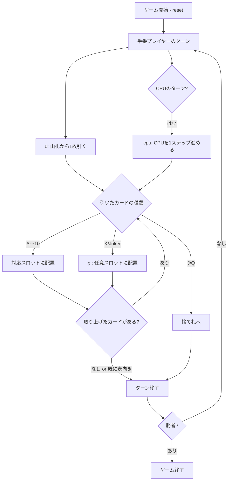

# Trash（CUI版）遊び方

## ゲーム概要

「Trash（トラッシュ / ガベージ）」は、山札から引いたカードを自分の前に並んだ10枚のスロットと交換しながら、1〜10のカードを先にすべて表向きに揃えることを目指す対戦型カードゲームです。本実装では人間1人 対 CPU1人の2人対戦を採用しています。

## 起動方法

```sh
go run ./cmd/trumpcards trash
go run ./cmd/trumpcards --lang en trash  # 英語モード
```

## ルール

### 基本ルール

- 52枚の標準デッキ＋ジョーカー2枚＝計54枚を使用。
- 各プレイヤーの前に10枚のカードを裏向きで並べる（ポジション1〜10）。
- 手番プレイヤーは山札から1枚引く。
  - カードがA〜10 → 対応するポジション（A=1, 2=2, …, 10=10）に配置し、そこにあった裏向きカードを取り上げる。取り上げたカードも同様に処理を続ける。
  - カードがK（キング）またはジョーカー → **ワイルド**として任意の裏向きスロットに配置できる。
  - カードがJ（ジャック）またはQ（クイーン） → 配置できず、捨て札へ。ターン終了。
  - 対応するポジションが既に表向きの場合も、引いたカードは捨て札に送られターン終了。
- 山札が尽きた場合は、捨て札の一番上を残して残りをシャッフルし山札に戻す。

### ゲーム終了

- 10スロットすべてを表向きに揃えたプレイヤーの勝利。

### CPU

- CPUは単純なヒューリスティックに従う。ワイルドを置く際は最も大きい番号の裏向きスロットを選ぶ（完成を加速）。

## ゲームの流れ



## コマンド一覧

| コマンド | 短縮形 | 説明 |
|----------|--------|------|
| `reset` | `r` | 新しいゲームを開始 |
| `quit` | `q` | ゲーム終了 |
| `help` | `?` | コマンド一覧を表示 |
| `draw` | `d` | 山札から1枚引く |
| `place <pos>` | `p <pos>` | ワイルドを位置 `<pos>` (1〜10) に配置 |
| `cpu` | - | CPUのターンを1ステップ進める |
| `log` | `l` | 棋譜を表示（ゲーム終了後） |

## 画面の見方

```
==========
Trash (トラッシュ)
==========
CPU:
  [01  ? ] [02  ? ] [03  ? ] [04  ? ] [05  ? ]
  [06  ? ] [07  ? ] [08  ? ] [09  ? ] [10  ? ]
あなた (ターン中):
  [01  ? ] [02 3♥] [03  ? ] [04  ? ] [05  ? ]
  [06  ? ] [07  ? ] [08  ? ] [09  ? ] [10  ? ]
----------
山札: 31   捨て札: 2 (top: J♠)
ペンディング: K♠ → ワイルド: 空きスロット 1, 3, 4, 5, 6, 7, 8, 9, 10 のどこへでも
----------
手数: 3
==========
```

- `? ` は裏向きのスロット。表向きになるとカード表記（例: `3♥`）に置き換わる。
- 「山札」は残り枚数、「捨て札」は捨てられたカード枚数とその一番上のカード。
- 「手数」は両プレイヤー合算のドロー回数。
- ワイルド配置待ち (`AwaitWild`) の間は `ペンディング: <card>` が表示される。行き先も併記され、ワイルドなら選べる空きスロット、数札ならその位置番号、置き場所が無ければ `置き場所なし: 捨て札行き` になる。

## 遊び方のコツ

- ワイルドは狙って置く場所を選べるので、既に同じランクが表向きになっている位置を埋めるよりも、全く情報の無い残りスロットを潰すほうがチェーンで多くのカードを捲りやすい。
- 引く前に手数と捨て札をチェックすれば、相手の進捗がおおよそ分かる。
- CPUは常に最大index (10) 側のワイルドを優先して置くため、終盤で低indexが残るケースが多い。
