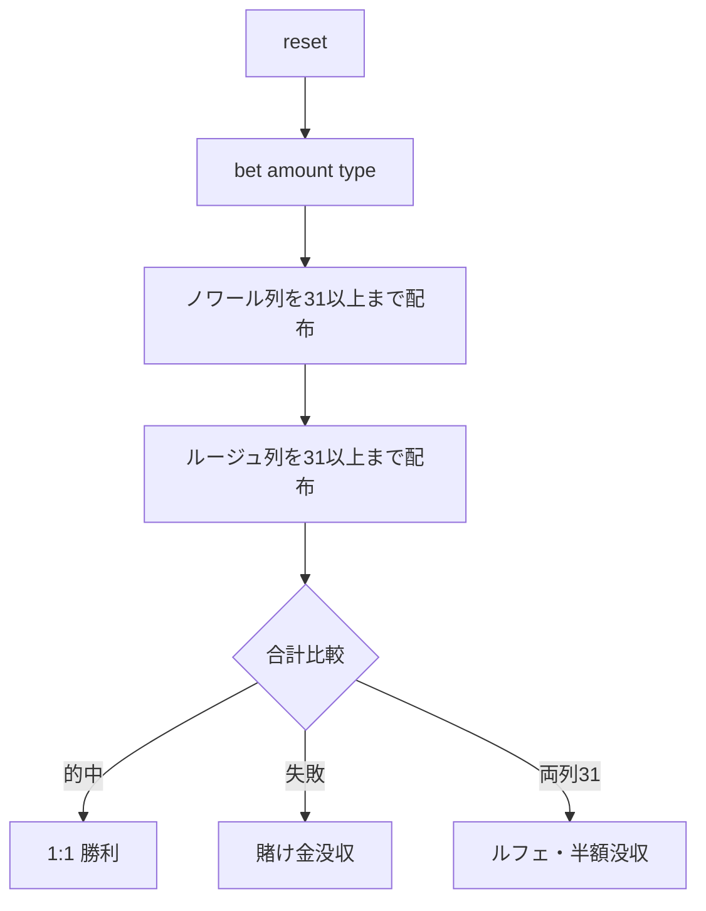

# トラント・エ・カラント（CUI版）遊び方

## ゲーム概要

トラント・エ・カラント（Trente et Quarante、別名 ルージュ・エ・ノワール＝赤と黒）は、モンテカルロで生まれた古典的なバンキングゲームです。プレイヤーはカードの操作を一切行わず、4種類の等倍ベットから1つと賭け金を選ぶだけ。ディーラーが2列のカードを配り、合計が小さい列が勝ちます。

## 起動方法

```sh
go run ./cmd/trumpcards trenteetquarante
go run ./cmd/trumpcards --lang en trenteetquarante
```

## ルール

### 基本ルール

1. 4種類のベットから1つと賭け金を選びます。
   - **ノワール（Noir）**: 黒の列が勝つ（合計が小さい）方に賭ける。
   - **ルージュ（Rouge）**: 赤の列が勝つ方に賭ける。
   - **クルール（Couleur）**: 最初に配られたカードの色が勝ち色と一致する方に賭ける。
   - **アンヴェルス（Inverse）**: 最初のカードの色が勝ち色と一致しない方に賭ける。
2. ディーラーが **ノワール（黒）→ ルージュ（赤）** の順に、各列の合計が **31 以上** になるまでカードを配ります（絵札=10、A=1）。
3. 合計が **31 に近い（＝小さい）列が勝ち**。
4. ベットが的中すれば **等倍（1:1）** の配当、外れれば賭け金を没収されます。
5. 両列がちょうど **31 で並ぶ** と **ルフェ（Refait）** となり、賭け金の **半分** を失います。

### 配当一覧

| 結果 | 配当 |
|------|------|
| ベット的中 | 賭け金に対して 1:1 |
| ベット失敗 | 賭け金を没収 |
| ルフェ（両列 31 で引き分け） | 賭け金の半分を没収 |

## ゲームの流れ



## コマンド一覧

| コマンド | 短縮形 | 説明 |
|----------|--------|------|
| `reset` | `r` | 新しいラウンドを開始 |
| `bet <amount> <bet>` | `b <amount> <bet>` | 賭け金とベット種別を指定して配る（bet: noir/rouge/couleur/inverse または 0-3） |
| `log` | `l` | 棋譜を表示 |
| `quit` | `q` | ゲーム終了 |
| `help` | `?` | コマンド一覧を表示 |

## 画面の見方

```
----------
chips: 1000
phase: END
stake: 100  bet: NOIR
Noir (31): S10, CK, S8
Rouge (39): H9, DK, H10
winner: NOIR
result: WIN  payout: 100
----------
```

- `chips` — 手持ちチップ
- `phase` — 現在のフェーズ（BET / DEALT / END）
- `stake` / `bet` — 現在の賭け金とベット種別
- `Noir` / `Rouge` — 各列に配られたカードと合計値
- `winner` — 勝ち列（ルフェ時は表示なし）
- `result` / `payout` — 勝敗と収支
- ルフェ成立時は、結果行の下に「32〜40 の同点は全額返却だが 31 だけ半額を胴元が取る」という理由の 1 行が出ます（Web の「ルフェとは？」パネルと同じ趣旨）。

## 遊び方のコツ

- 4種類のベットはすべて等倍で、ハウスエッジも同一です。数学的にはどれを選んでも同じなので、伝統的に人気の **ノワール** が無難な選択です。
- ハウスエッジはルフェ由来のみで、カジノゲームの中でも屈指の低さ（約 1.1%、インシュランス込み）です。
- ルフェは約 2 ラウンドに 1 回程度発生するため、賭け金の管理に注意しましょう。
