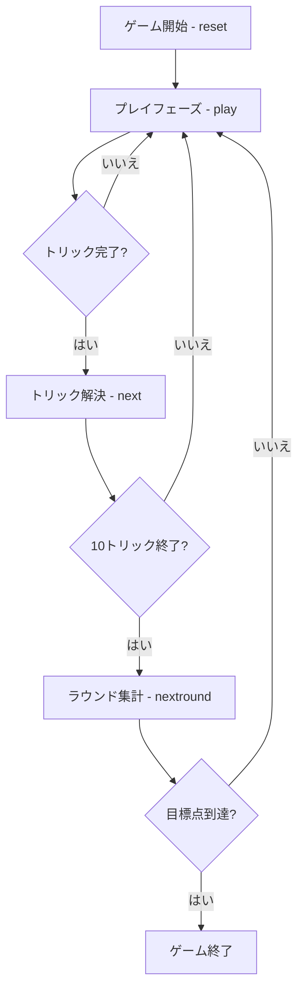

# トレセッテ（CUI版）遊び方

## ゲーム概要

Tressette（トレセッテ）はイタリアの3大国民的カードゲーム（Briscola・Scopa・Tressette）の一つで、切り札（トランプ）が存在しない純粋なトリックテイキングゲームです。40枚デッキ（8・9・10を除く）を4人（2対2のチーム戦）に10枚ずつ配り切り、マストフォローの制約の中でパートナーと連携して得点札を奪い合います。カードの強さが「3 > 2 > A > K > Q > J > 7 > 6 > 5 > 4」と独特で、得点は1/3点刻みで数えるのが特徴です。先に目標点（既定21点）へ到達したチームの勝利です。

## 起動方法

```sh
go run ./cmd/trumpcards tressette
go run ./cmd/trumpcards --lang en tressette  # 英語モード
```

## ルール

### チーム

- プレイヤー0（あなた）とプレイヤー2がチームA、プレイヤー1とプレイヤー3がチームB。
- 向かい合うプレイヤー同士が味方です。

### カードの強さ（トリックの勝敗）

切り札はありません。リードスートに従う義務（マストフォロー）があり、リードスートの最強札を出したプレイヤーがそのトリックを獲得します。

強い順: **3 > 2 > A > K > Q > J > 7 > 6 > 5 > 4**

### 得点（1/3点単位）

| カード | 得点 |
|--------|------|
| A | 1点（=3/3） |
| 2・3・K・Q・J | 各 1/3点 |
| 7・6・5・4 | 0点 |
| 最終トリックの勝者 | +1/3点（ボーナス） |

1ラウンドの合計は 11点（=33/3）。ラウンド終了時に各チームの「1/3点」を3で割り（端数切り捨て）、累積点へ加算します。

### ゲーム終了

いずれかのチームの累積点が目標点（既定21点）以上に達し、かつ相手チームを上回ったらゲーム終了。上回ったチームが勝者です。

## ゲームの流れ



## コマンド一覧

| コマンド | 短縮形 | 説明 |
|----------|--------|------|
| `reset` | `r` | 新しいゲームを開始（設定保持） |
| `play <i>` | `p` | 手札のi番目のカードを出す |
| `next` | `n` | 次のトリックへ |
| `nextround` | `nr` | ラウンドを集計して次のラウンドへ |
| `setdifficulty <0-2>` | `sd` | CPU難易度設定（0=Easy, 1=Normal, 2=Hard） |
| `settarget <n>` | `st` | 目標点設定（既定21） |
| `hint` | `h` | ヒントを表示 |
| `log` | `l` | 棋譜を表示 |
| `quit` | `q` | ゲーム終了 |
| `help` | `?` | コマンド一覧を表示 |

## 画面の見方

```
==========
Tressette (トレセッテ)
==========
ラウンド: 1  トリック: 1
チームA: 0点 (今R 0/3)   チームB: 0点 (今R 0/3)
You [チームA]: 10枚 0トリック
[0]♠3* [1]♠A* [2]♦K [3]♥7 ...
CPU 1 [チームB]: 10枚 0トリック
...
----------
手番: You
play <idx>・・・カードを出す（リードスートに従う義務あり）
```

- 1行目: ラウンド・トリック番号
- 2行目: 各チームの累積点と現ラウンドの1/3点
- 各プレイヤー行: 所属チーム・手札枚数・獲得トリック数
- `[n]` 付きの行: あなたの手札（インデックス付き）
- **末尾に `*` が付くカード**: いま出せるカード（マストフォローを満たすもの）。あなたの手番でのみ表示されます。CallBreak / 29 / シュナプセンと同じ表記です

## 遊び方のコツ

- 3・2・A は強いカードですが、A・2・3 は得点札でもあります。取られないよう注意しつつ、勝てるトリックで活用しましょう。
- 味方（向かいのプレイヤー）がそのトリックで勝っているときは、A や絵札などの得点札を出して味方に点を渡すのが定石です。
- 相手が勝っていて得点札が場に出ているなら、勝てる札で取りに行きましょう。取れないなら低い札でダックして温存します。
- 最終トリックには +1/3点 のボーナスがあります。終盤の勝敗にも気を配りましょう。
