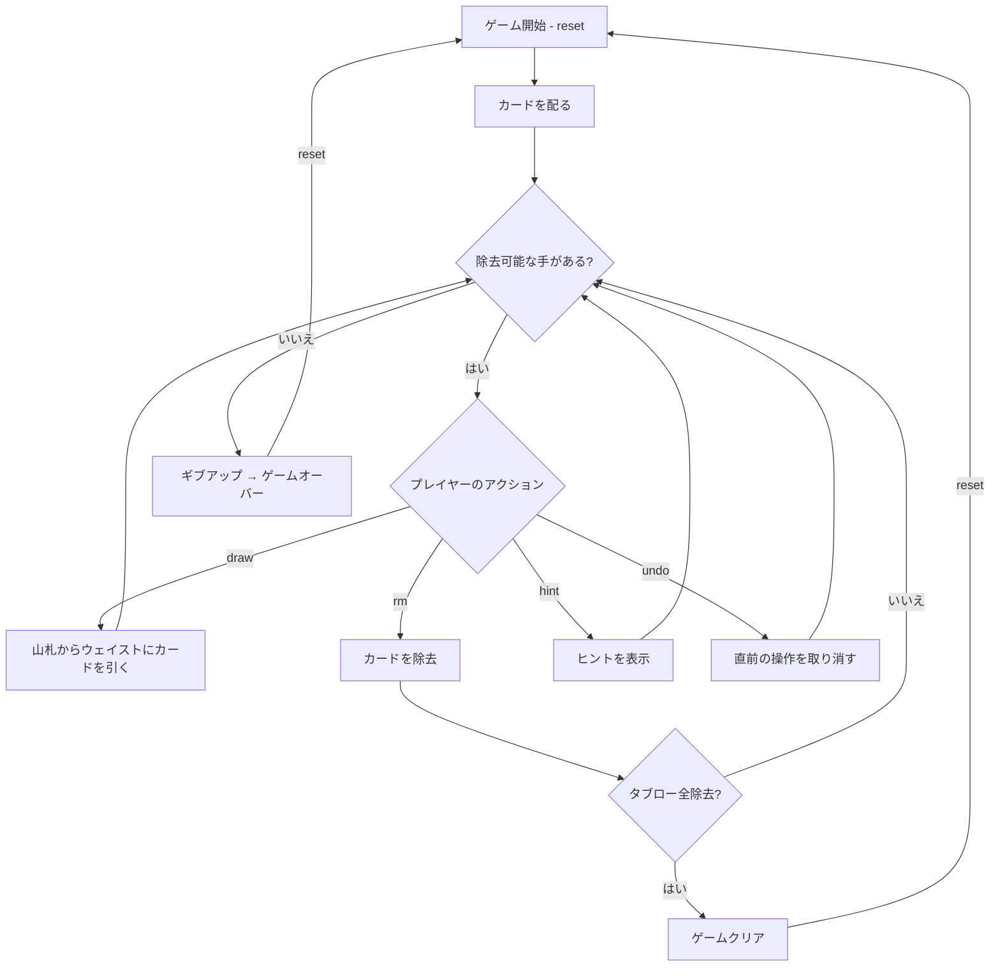

# トリピークス（CUI版）遊び方

## ゲーム概要

1人用のソリティアカードゲームです。52枚のカードを使い、3つの重なり合うピラミッド（ピークス）に並べた28枚のカードから、ウェイストのトップカードと±1のランクのカードを除去していきます。タブローのカードをすべて除去すればクリアです。

## 起動方法

```sh
go run ./cmd/trumpcards tripeaks
go run ./cmd/trumpcards --lang en tripeaks  # 英語モード
```

## ルール

### 基本ルール

- 52枚のトランプ（ジョーカーなし）を使用
- 3つの重なり合うピラミッド型に28枚を配る
- 残りの24枚のうち1枚をウェイストに、23枚を山札（ストック）に置く
- 「露出カード」（下の段のカードが除去済み）のみ選択可能

### 除去ルール

- ウェイストのトップカードと±1のランクのカードを除去できる
- K-Aは繋がる（ラップアラウンド）：KからAへ、AからKへ除去可能
- 例：ウェイストが5なら、4または6を除去できる

### ゲームクリア

- タブローの28枚すべてを除去するとゲームクリア

### ゲームオーバー

- これ以上除去可能な手がない場合はギブアップでゲームオーバー

### 手詰まり検出

- ヒントが存在せず、かつ山札が空の場合に「手詰まりです」と表示します
- 手詰まり状態では「元に戻す」またはギブアップを選択できます

## ゲームの流れ



## コマンド一覧

| コマンド | 短縮形 | 説明 |
|----------|--------|------|
| `reset` | `r` | 新しいゲームを開始 |
| `draw` | `d` | 山札からウェイストにカードを引く |
| `remove <row> <col>` | `rm` | タブローのカードを除去（ウェイストトップ±1） |
| `giveup` | `g` | ギブアップしてゲームを終了 |
| `hint` | `h` | 次の一手のヒントを表示 |
| `undo` | `u` | 直前の操作を元に戻す |
| `log` | `l` | アクションログ（棋譜）を表示 |
| `quit` | `q` | ゲーム終了 |
| `help` | `?` | コマンド一覧を表示 |

### コマンド例

- `d` → 山札からカードを引く
- `rm 3 0` → 4段目の左端のカードを除去
- `rm 0 1` → 1段目の2番目のカードを除去
- `u` → 直前の操作を元に戻す
- `h` → ヒントを表示

## 画面の見方

```
==========
TriPeaks (トリピークス)
==========
      [--]SPADE 5  [--]SPADE 2  [--]CLOVER 4
    [--]SPADE 1  [--]DIAMOND 2  [--]CLOVER 11  [--]HEART 2  [--]CLOVER 12  [--]HEART 4
  [--]HEART 13  [--]CLOVER 10  [--]SPADE 3  [--]CLOVER 1  [--]CLOVER 7  ...
(3,0)DIAMOND 11  (3,1)CLOVER 13  (3,2)SPADE 11  (3,3)HEART 5  (3,4)HEART 9  (3,5)SPADE 4  (3,6)DIAMOND 6  (3,7)DIAMOND 3*  ...
----------
Stock: 23枚 | Waste: CLOVER 2
今出せるカード: 1枚
----------
手数: 0 （戻せる手はありません）
スコア: 0
==========
```

- 山は 3 つ、4 段。**見出し行は付きません**
- `[--]SPADE 5`: まだ露出していないカード（`[--]` は操作できない印）
- `(3,0)DIAMOND 11`: 露出しているカード。`(段,位置)` がそのまま `rm` の
  引数になります。**末尾の `*` は「いまウェイストに出せる札」**の印
- `Stock: N枚 | Waste: X`: 山札の残り枚数とウェイストの一番上
- `今出せるカード: N枚`: いま除去できる札が何枚あるか。**0 なら山札を
  引くしかありません**
- `手数: N`: 現在の手数
- `スコア: N`: 連鎖ボーナス込みの得点。連続して除去するほど 1 手あたりの点が上がり (n 手目 = n×100)、山を 1 つ出し切るごとに +500。山札を引くかアンドゥすると連鎖は切れますが、稼いだ点は残ります

## 遊び方のコツ

- ウェイストのトップカードから連続して除去できるチェーンを狙いましょう
- K-Aのラップアラウンドを活用して長いチェーンを作りましょう
- 上段のカードを露出させるために、下段のカードを優先的に除去します
- 山札を引く前に、タブロー内で除去できるカードがないか確認しましょう
- ヒントコマンドで詰まった時のアドバイスを得られます
- アンドゥを活用して、異なる戦略を試しましょう
