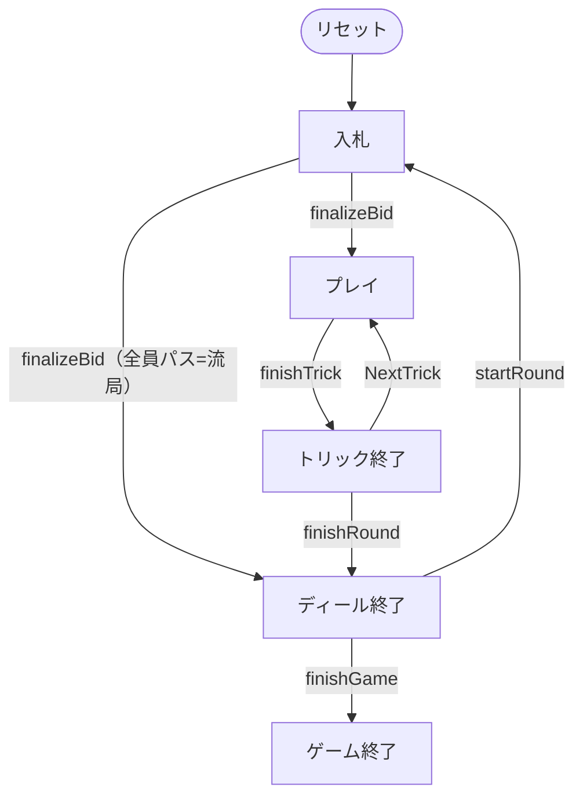

# トロッグ（CUI版）遊び方

## ゲーム概要

トロッグ（Troggu）はスイス・ヴァレー州に伝わるタロー系トリックテイキングです（4人：あなた + CPU3人）。タロー78枚を使い、**契約ごとに「勝ち」の意味が変わる**のがこのゲームの骨格です ── ソロは点数の過半、トロワは3トリック、ピッコロは**ちょうど1トリック**、ミゼールは**1つも取らないこと**。同じ卓で目標が正負どちらにも振れます。

## 起動方法

```sh
go run ./cmd/trumpcards troggu
go run ./cmd/trumpcards --lang en troggu  # 英語モード
```

## ルール

### デッキと配布

- **デッキ**: タロー78枚（スート札56枚 + アトゥ21枚 + エクスキューズ1枚）。
- **プレイヤー**: 4人（席0 = あなた、席1〜3 = CPU）。
- **配布**: 各席に **18枚**、残り **6枚**が場札（タロン）。落札者の得点に加わります。

### 契約

| 契約 | 目標 | 倍率 |
|------|------|------|
| トロワ | 3トリック以上 | ×1 |
| ソロ | カードポイントの過半 | ×2 |
| ピッコロ | **ちょうど1トリック**（多くても失敗） | ×3 |
| ミゼール | 1トリックも取らない | ×4 |

- 高い契約が優先します（トロワ < ソロ < ピッコロ < ミゼール）。
- どの契約も**単独で3人と戦い**、成功すれば3人ぶんを受け取り、失敗すれば3人ぶんを払います。
- **全員がパスすると流局**です。契約が無いと勝ち方そのものが決まらないので、トリックを打たずに次のディールへ進みます（得点も動きません）。

### プレイ

1. リードスートに従います。持っていなければ**アトゥを出す義務**があります。
2. **エクスキューズはいつでも出せます**。序列の外にある札なので、先頭に出してもリードスートを決めません（次の札が決めます）。
3. 18トリックを戦います。

### 精算

- 契約の成否で、デクレアラーが ±3×基本点、他の3席が ∓基本点。精算はゼロサムです。
- 規定ディール（1〜12、既定4）後に通算最多の席が勝ちです。

## ゲームの流れ

ゲームの進行は `internal/domain/Troggu.go` のフェーズ機械そのものです。各ノードは同ファイルの `TrogguPhase` 定数、矢印ラベルはその遷移を行うメソッド名です。



## コマンド一覧

| コマンド | 短縮形 | 説明 |
|----------|--------|------|
| `bid trois` | - | 3トリックを宣言する |
| `bid solo` | - | 過半の点を宣言する |
| `bid piccolo` | - | ちょうど1トリックを宣言する |
| `bid misere` | - | 1つも取らないことを宣言する |
| `pass` | - | 入札でパスする（全員パスで流局） |
| `play <idx>` | - | カードを出す |
| `next` | `n` | 次のトリックへ |
| `nextround` | `nr` | 次のディールへ |
| `setdifficulty <0-2>` | `sd` | CPU難易度設定 |
| `setdeals <1-12>` | `st` | ディール数設定 |
| `hint` | `h` | ヒントを表示 |
| `log` | `l` | 棋譜を表示 |
| `reset` | `r` | ゲームをリセット |
| `quit` | `q` | 終了 |
| `help` | `?` | コマンド一覧を表示 |

## 画面の見方

```
==========
トロッグ
==========
ディール: 1/4  トリック: 5  契約: ミゼール（0トリック）
あなた (デクレアラー): 手札14枚  トリック0  今局0点  通算0
[0]♠K  [1]T21  [2]Excuse  [3]♥5  ...
CPU 1 (対戦側): 手札14枚  トリック2  今局18点  通算0
----------
手番: あなた  (リードスートに従う。ボイド時はアトゥ。エクスキューズはいつでも出せる)
```

- `T21` はアトゥの21番、`Excuse` はエクスキューズ、`♠K` はスペードのロワです。
- `今局` はそのディールで取ったカードポイント、`通算` は精算の合計です。
- **ミゼール／ピッコロでは「今局0点・トリック0」が良い状態**です。他の契約と読み方が逆になります。

## 遊び方のコツ

- **ミゼールは「絵札もアトゥも無い手」でこそ宣言する。** 強い札があると取らされます。倍率は最も高い（×4）ので、成立すれば大きく動きます。
- **ピッコロは0でも失敗。** ちょうど1トリックなので、取らなさすぎても負けます。どこで1つ取るかを決めてから入札します。
- **ソロは高いアトゥの枚数で決める。** 過半の点を1人で取るには、リードを握り続けられる枚数が要ります。
- 迷ったらパス。全員パスなら流局で、誰も失点しません。
