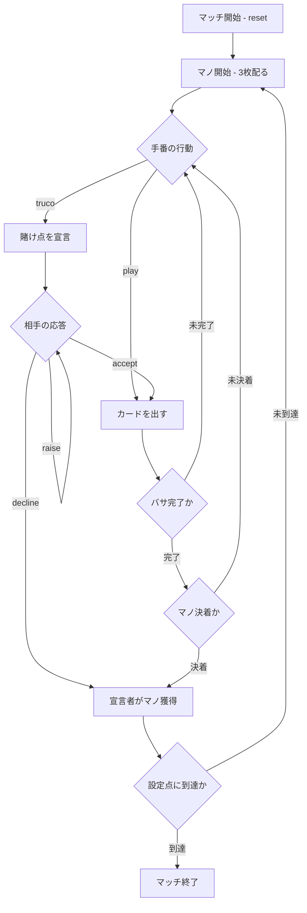

# トゥルコ（CUI版）遊び方

## ゲーム概要

Truco（トゥルコ）は南米・スペインで人気の 2 人対戦（あなた vs CPU）トリックテイキング＋ブラフゲームです。40 枚デッキ（8・9・10 を除く）を使い、3 枚配って 3 バサ（トリック）を行い、2 バサ先取でそのマノ（ハンド）に勝利します。プレイ中に「Truco」を宣言して賭け点を釣り上げる心理戦が最大の特徴で、設定点（既定 15 点）に先に到達したプレイヤーがマッチに勝利します。

## 起動方法

```sh
go run ./cmd/trumpcards truco
go run ./cmd/trumpcards --lang en truco  # 英語モード
```

## ルール

### カードの強さ（matadores）

Truco 固有の順位で、上位 4 枚はスート固有です（強い順）。

1. ♠1（espadas のエース）
2. ♣1（bastos のエース）
3. ♠7（espadas の 7）
4. ♦7（oros の 7）
5. 全ての 3 → 2 → 1（偽エース）→ K → Q → J → 7（偽の 7）→ 6 → 5 → 4

同じ強さのカード同士は「パルダ（引き分け）」になります。

### マノ（ハンド）の勝敗

- 2 バサ先取でマノに勝利します（マストフォローなし）。
- 1 バサ目がパルダなら 2 バサ目の勝者がマノを取ります。
- 1 バサ目を取り 2 バサ目がパルダなら 1 バサ目の勝者がマノを取ります。
- 全てパルダの場合は親（非ディーラー）が勝ちます。

### Truco（賭け点の釣り上げ）

自分の手番で `truco` を宣言すると賭け点を引き上げられます。相手は受諾（Quiero）・拒否（No Quiero）・さらに引き上げ（Retruco → Vale Cuatro）を選べます。

| 宣言 | 受諾時の賭け点 |
|------|----------------|
| なし | 1 点 |
| Truco | 2 点 |
| Retruco | 3 点 |
| Vale Cuatro | 4 点 |

拒否（No Quiero）すると、宣言者が直前の確定点でそのマノを獲得します。

### ゲーム終了

マノの勝者に賭け点が加算され、設定点（既定 15 点）に先に到達したプレイヤーがマッチに勝利します。

## ゲームの流れ



## コマンド一覧

| コマンド | 短縮形 | 説明 |
|----------|--------|------|
| `reset` | `r` | 新しいマッチを開始 |
| `play <idx>` | `p <idx>` | 手札のカードを出す |
| `truco` | `t` | Truco を宣言（または Retruco / Vale Cuatro へ引き上げ） |
| `accept` | `a` | 宣言を受諾（Quiero） |
| `decline` | `d` | 宣言を拒否（No Quiero） |
| `next` | `n` | 次のバサ / マノへ進む |
| `hint` | `h` | ヒントを表示 |
| `log` | `l` | 棋譜を表示 |
| `quit` | `q` | ゲーム終了 |
| `help` | `?` | コマンド一覧を表示 |

## 画面の見方

```
==========
Truco (トゥルコ)
==========
マノ: 1  バサ: 1  目標: 15点
マッチ得点: あなた=0  CPU=0
賭け点: 1  (通常)
あなた: 獲得0バサ 3枚
[0]♠1  [1]♥5  [2]♦11
CPU 1: 獲得0バサ 3枚
----------
手番: あなた
play <idx>・・・カードを出す
truco・・・賭け点を引き上げる
```

- 1 行目: 現在のマノ番号・バサ番号・マッチ目標点。
- 2 行目: マッチ累積得点。
- 3 行目: 現在の賭け点と宣言レベル。
- 各プレイヤー行: 獲得バサ数と手札枚数（あなたの手札のみ番号付きで表示）。

## 遊び方のコツ

- 強い手（♠1・♣1・♠7・♦7 や 3・2）があるときは Truco を宣言して点を釣り上げましょう。
- 弱い手で宣言されたら、無理せず拒否（No Quiero）して被害を 1 点に抑えるのも有効です。
- ブラフも武器です。弱い手でも強気に宣言すると相手が降りることがあります。
- 1 バサ目を捨てて 2・3 バサ目で勝つ「温存」も有効な戦術です。
