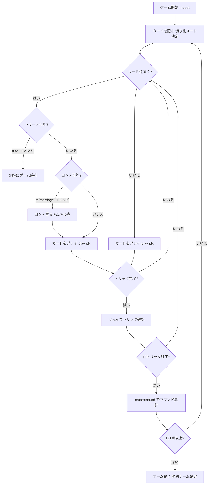

# トゥーテ（CUI版）遊び方

## ゲーム概要

Tute（トゥーテ）はスペインで広く親しまれているトリックテイキングゲームです。40枚のラテンデッキを4人（2チーム制、席0&2 対 席1&3）でプレイします。切り札スートは配布時に決まり、マスト・フォロー制で10トリックを争います。「コンテ（cante）」宣言やインスタント勝利の「トゥーテ」宣言を活用しながら、先にターゲット点（デフォルト121点）に達したチームが勝ちます。

## 起動方法

```sh
go run ./cmd/trumpcards tute
go run ./cmd/trumpcards --lang en tute  # 英語モード
```

## ルール

### デッキと配布

- **デッキ**: 40枚（A, 2〜7, Sota（J相当）, Caballo（Q相当）, Rey（K相当）× 4スート）
- **プレイヤー**: 4人（プレイヤー0 = あなた、プレイヤー1〜3 = CPU）
- **チーム**: 席0&2（あなたのチーム）対 席1&3
- **配布**: 各プレイヤー10枚
- **切り札**: 最後に配られたカードのスートが切り札スートとなる

### カードの強さ（トリック内）

同スート内の強さ（強い順）:

| 強さ順 | カード |
|--------|--------|
| 1 | A（エース） |
| 2 | 3 |
| 3 | Rey（K / 王） |
| 4 | Caballo（Q / 騎士） |
| 5 | Sota（J / 従者） |
| 6 | 7 |
| 7 | 6 |
| 8 | 5 |
| 9 | 4 |
| 10 | 2 |

### トリックの勝敗

- 切り札が1枚でも出ている場合 → 最も強い切り札が勝ち
- 切り札が出ていない場合 → リードスートの最も強いカードが勝ち

### カード点数

| カード | 点数 |
|--------|------|
| A | 11点 |
| 3 | 10点 |
| Rey（K） | 4点 |
| Caballo（Q） | 3点 |
| Sota（J） | 2点 |
| 7 以下（2含む） | 0点 |

1スートの合計 = 30点 × 4スート = **合計120点**。最後（10枚目）のトリックには**+10点**が加算されます。

### マスト・フォロー

リードされたスートが手札にある場合は必ずそのスートを出さなければなりません。持っていない場合は任意のカードを出せます。

### コンテ（cante / 結婚宣言）

リード権を持つプレイヤー（そのトリックの最初のカードをこれから出すプレイヤー）が、同じスートの **Rey（K）と Caballo（Q）** を両方手札に持つ場合、コンテを宣言できます:

- **非切り札のコンテ**: **+20点**（チームの累積点に加算）
- **切り札のコンテ**: **+40点**
- 各スートのコンテは1ラウンドにつき1回のみ宣言可能

### トゥーテ（tute / インスタント勝利）

**4枚のRey（K）すべて**または**4枚のCaballo（Q）すべて**を持つプレイヤーが「トゥーテ」を宣言すると、そのプレイヤーのチームが**即座にゲーム勝利**となります。

### 得点計算と勝利条件

- トリックで獲得したカード点数 + コンテ宣言点 がラウンド点として蓄積されます
- 累積スコアが先に**121点以上**に達したチームが勝利します（デフォルト目標）

## ゲームの流れ



## コマンド一覧

| コマンド | 短縮形 | 説明 |
|----------|--------|------|
| `play <idx>` | — | 手札のidx番目のカードを出す |
| `marriage <suit>` | `m <suit>` | コンテ（結婚）を宣言する（リード権時のみ）。suit = 1=♠ 2=♣ 3=♥ 4=♦ |
| `tute` | — | トゥーテを宣言する（4枚のK全部または4枚のQ全部所持時のみ） |
| `next` | `n` | 次のトリックへ進む（トリック終了後） |
| `nextround` | `nr` | 次のラウンドへ進む（10トリック終了後） |
| `setdifficulty <0-2>` | `sd <0-2>` | CPU難易度設定（0=Easy, 1=Normal, 2=Hard） |
| `log` | `l` | アクションログを表示 |
| `reset` | `r` | 新しいゲームを開始（設定保持） |
| `quit` | `q` | ゲーム終了 |
| `help` | `?` | コマンド一覧を表示 |

## 画面の見方

```
==========
Tute (トゥーテ)
==========
ラウンド: 1  トリック: 1
チームスコア: あなた=0 相手=0
切り札: ♥
You: 10枚 0トリック [チームA]
[0]A♠ [1]3♠ [2]Rey♥ [3]Caballo♥ [4]Sota♣ [5]7♦ [6]6♦ [7]5♦ [8]4♦ [9]2♣
CPU 1: 10枚  CPU 2: 10枚  CPU 3: 10枚
----------
フェーズ: PLAY
コンテ宣言可能: m 3 (♥ +40点)
あなたの手番です。カードを出してください。
play <idx>
```

- **切り札行**: 現在の切り札スート
- **チームスコア行**: 各チームの累積点数
- **`[n]`付き行**: あなたの手札（インデックス付き）
- **コンテ宣言行**: リード権時にコンテが宣言できる場合に表示。`m <suit番号>` で宣言
- **トリック表示**: 現在場に出ているカードと出したプレイヤー
- **フェーズ表示**: 現在のフェーズ（PLAY）

## 遊び方のコツ

- **切り札の温存**: 切り札（特にAと3）は序盤から使い過ぎず、高得点トリックを奪取するために温存しましょう。
- **コンテのタイミング**: ReyとCaballoの両方を持ったらすぐにコンテを宣言できますが、リード権がないと宣言できません。高得点ラウンドに備えてあえて温存する戦術もあります。
- **切り札コンテ（40点）**: 切り札スートのReyとCaballoを両方持っていれば40点の大きなボーナスが得られます。できる限り早めに宣言しましょう。
- **トゥーテ狙い**: 4枚のRey（または4枚のCaballo）を集めると即勝利できます。相手チームのReyやCaballoを高値のトリックで回収しましょう。
- **チームプレイ**: 席0&2が同じチームです。パートナーが高得点のトリックを取りそうな場合は、弱いカードでサポートしましょう。
- **最後のトリック（+10点）**: 10トリック目には+10点が加算されます。残りの枚数が少なくなったら、最後のトリック奪取を意識しましょう。
- **点数管理**: A（11点）と3（10点）が最も高価です。これらのカードを含むトリックをいかに取るかが勝敗を左右します。
- **マスト・フォローの活用**: 相手の手札を枯らしてスートが持てない状況を作ると、切り札を温存できます。
