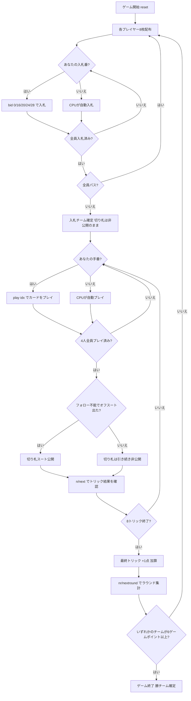

# トゥエンティナイン (29)（CUI版）遊び方

## ゲーム概要

Twenty-Nine（トゥエンティナイン / 29）は南アジア（インド・バングラデシュ等）で広く親しまれているトリックテイキングゲームです。32枚のデッキを4人2チーム（席0&2 vs 席1&3）でプレイします。各ラウンドの最初に**入札フェーズ**があり、最高入札チームが**隠し切り札**を宣言してトリックを争います。カード得点の合計（最大29点）を巡る駆け引きが特徴です。先に**6ゲームポイント**を獲得したチームの勝利です。

## 起動方法

```sh
go run ./cmd/trumpcards twentynine
go run ./cmd/trumpcards --lang en twentynine  # 英語モード
```

## ルール

### デッキと配布

- **デッキ**: 32枚（7,8,9,10,J,Q,K,A × 4スート）
- **プレイヤー**: 4人2チーム（あなた = 席0、席0&2がチームA、席1&3がチームB）
- **配布**: 各プレイヤー8枚、計8トリック

### カードの強さとカード得点

トリック内での強さ（強い順）。切り札はすべての非切り札を上回ります。

| 強さ順 | カード | カード得点 |
|--------|--------|------------|
| 1位 | J（ジャック） | 3点 |
| 2位 | 9（ナイン） | 2点 |
| 3位 | A（エース） | 1点 |
| 4位 | 10（テン） | 1点 |
| 5位 | K（キング） | 0点 |
| 6位 | Q（クイーン） | 0点 |
| 7位 | 8（エイト） | 0点 |
| 8位 | 7（セブン） | 0点 |

カード得点の合計は J(3)×4 + 9(2)×4 + A(1)×4 + 10(1)×4 = **28点**。さらに**最終トリック（8トリック目）を取ったチームに +1点**が加算されるため、1ラウンドの争いの合計は**29点**です。

### 入札フェーズ

ディーラーの左隣から時計回りに、各プレイヤーが1回だけ入札します。

| 入札 | 内容 |
|------|------|
| **Pass（パス）** | 入札をパスする |
| **16** | チームとして16点以上取ることを宣言 |
| **20** | チームとして20点以上取ることを宣言 |
| **24** | チームとして24点以上取ることを宣言 |
| **28** | チームとして28点以上取ることを宣言（最高入札） |

- パス以外の入札は、現在の最高入札を上回らなければなりません（16 < 20 < 24 < 28）。
- 全員がパスした場合はそのラウンドは無効となり、再配布されます。
- 最高入札者のチームが**入札チーム（デクレアラー側）**となり、入札者の最長スートが自動的に**切り札スート**に決まります。

### 隠し切り札（Hidden Trump）

切り札は宣言直後には公開されません。**隠し切り札**として秘密にされたまま進行します。

- 切り札は、いずれかのプレイヤーがリードスートに追従できず、切り札以外のカードを出した瞬間に**自動的に公開**されます。
- それまでは、手番のプレイヤー全員が切り札スートを知ることなくプレイします。

### トリック・テイキング

- **スートフォロー義務**: リードされたスートのカードを持っている場合は必ず出さなければなりません。
- 持っていない場合は任意のカードを出せます（切り札でも非切り札でも）。
- **トリックの勝者**:
  - 切り札スートのカードが場にあれば、最も強い切り札カード（J > 9 > A > 10 > K > Q > 8 > 7）が勝ちます。
  - 切り札がなければ、リードスートの最も強いカードが勝ちます。
- トリックの勝者が次のトリックをリードします。

### 得点計算と勝利条件

- 各チームが獲得したカードの合計カード得点 + 最終トリック得点（合計29点を分け合う）を集計します。
- **入札チーム**が入札値以上のカード得点を取った場合 → そのチームが**1ゲームポイント**を獲得。
- **入札チーム**が入札値を下回った場合 → 非入札チームが**1ゲームポイント**を獲得。
- 先に**6ゲームポイント**に達したチームがマッチ勝利。

## ゲームの流れ



## コマンド一覧

| コマンド | 短縮形 | 説明 |
|----------|--------|------|
| `bid <0/16/20/24/28>` | — | 入札する（0=Pass, 16/20/24/28=入札点） |
| `pass` | — | パスする（bid 0 と同じ） |
| `play <idx>` | — | 手札のidx番目のカードを出す（トリックフェーズ） |
| `next` | `n` | 次のトリックへ進む（トリック終了後） |
| `nextround` | `nr` | 次のラウンドへ進む（8トリック終了後） |
| `setdifficulty <0-2>` | `sd <0-2>` | CPU難易度設定（0=Easy, 1=Normal, 2=Hard） |
| `log` | `l` | アクションログを表示 |
| `reset` | `r` | 新しいゲームを開始（設定保持） |
| `quit` | `q` | ゲーム終了 |
| `help` | `?` | コマンド一覧を表示 |

## 画面の見方

```
==========
Twenty-Nine / 29 (トゥエンティナイン)
==========
ラウンド: 1  トリック: 0
ゲームポイント: チームA(あなた)=0  チームB=0
----------
フェーズ: BID
入札状況: あなた=?  CPU1=?  CPU2=?  CPU3=?
あなたの手番です。入札してください。
bid <0/16/20/24/28>  (0=Pass)

==========
ラウンド: 1  トリック: 1
ゲームポイント: チームA(あなた)=0  チームB=0
切り札: 非公開  入札チーム: チームA [20]
You: 8枚 [入札チーム]
[0]SPADE 11*  [1]CLOVER 9  [2]HEART 1*  [3]DIAMOND 10  [4]SPADE 13*  [5]DIAMOND 12  [6]CLOVER 8  [7]HEART 7
CPU1: 8枚 [非入札チーム]  CPU2: 8枚 [入札チーム]  CPU3: 8枚 [非入札チーム]
----------
フェーズ: PLAY
あなたの手番です。カードを出してください。
play <idx>
```

- **フェーズ: BID**: 入札フェーズ。各プレイヤーが1回入札します。
- **フェーズ: PLAY**: トリックフェーズ。スートフォロー義務に従いカードを出します。
- **切り札行**: 「非公開」または公開後の切り札スートと入札チーム・入札値を表示。
- **ゲームポイント行**: 両チームの累積ゲームポイント。
- **`[n]`付き行**: あなたの手札（インデックス付き）。
- **末尾に `*` が付くカード**: いま出せるカード（スートフォロー義務を満たすもの）。あなたのプレイ手番でのみ表示され、入札中や相手の手番では付きません。CrazyEights / Wizard と同じ表記です。

## 遊び方のコツ

- **入札の判断**: J（3点）と9（2点）は高得点カード。これらを複数持っているときは積極的な入札を検討しましょう。特に同スートのJ+9は確実に2つのトリックを取れる見込みがあります。
- **隠し切り札の活用**: 切り札スートが公開される前は、相手チームも切り札を把握していません。スートフォロー不能の場面を意図的に作ることで、切り札の公開タイミングを自チームに有利にコントロールできます。
- **最終トリック（+1点）を意識する**: 28点の均衡局面では最終トリックの+1点が勝負を分けます。得点カードを使い切った後半でも最終トリックを狙う意識を持ちましょう。
- **チームメイトとの連携**: チームメイト（席2のCPU）がリードしたトリックでは、得点カード（J・9・A・10）を投入してチームの得点を積み上げましょう。
- **非入札チームの守り**: 非入札チームは入札チームが入札値を下回るよう妨害します。相手の高得点カード（J・9）を切り札で取ることが最も効果的です。
- **入札28のリスク**: 入札28は全28カード得点をほぼ独占する高難度の宣言です。入札失敗時は相手チームにゲームポイントが渡ります。J・9を多数持つ強力な手札がなければ控えましょう。
