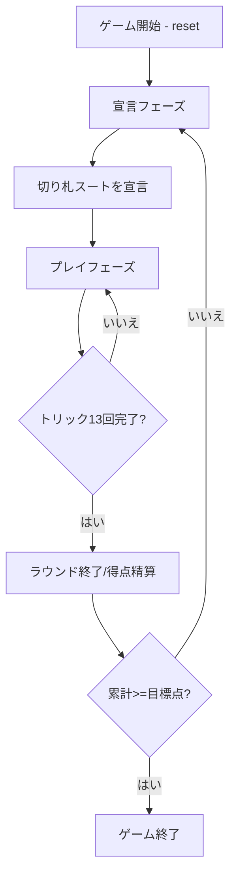

# ツーテンジャック（CUI版）遊び方

## ゲーム概要

ツーテンジャックは日本生まれのトリックテイキングゲームです。4人(2人 vs 2人のチーム戦)で13枚ずつのカードを配り、エース・ジャック・10が得点カード。宣言者のチームが26点以上獲得すれば成功。累計で目標点に到達したチームが勝ちます。

## 起動方法

```sh
go run ./cmd/trumpcards twotenjack
go run ./cmd/trumpcards --lang en twotenjack  # 英語モード
```

## ルール

### 基本ルール

- プレイヤー: 人間1人 + CPU 3人、席 0/2 が味方チーム、席 1/3 が相手チーム
- 1ラウンドあたり13枚ずつ配札
- 宣言者は切り札スート (♠/♣/♥/♦) を1つ宣言
- 以降はリードスートに従って手札を1枚ずつ出し、トリックを競う

### 得点

- A, J = 各1点、10 = 10点、その他 = 0点
- 最終トリックを取ったチームにボーナス +2点
- 1ラウンドの総得点 = 50点

### ラウンド決着

- 宣言チームが 26 点以上獲得 → 成功、取得点 - 25 をチーム得点に加算
- 26 点未満 → 失敗、相手チームに 26 - 取得点 を加算

### ゲーム終了

- いずれかのチームが累計で目標点 (既定 50 点) 以上に到達した時点で勝利

### CPU 難易度

- Easy: ランダムに合法手を選択
- Normal: 単純なヒューリスティック (手札強さ)
- Hard: トランプスート管理と得点カード保護

## ゲームの流れ



## コマンド一覧

| コマンド | 短縮形 | 説明 |
|----------|--------|------|
| `reset` | `r` | 新しいゲームを開始 |
| `declare <s>` | `d <s>` | 切り札スートを宣言 (1=♠, 2=♣, 3=♥, 4=♦) |
| `play <idx>` | `p <idx>` | 手札から1枚プレイ |
| `next` | `n` | 次のトリックへ |
| `nextround` | `nr` | 次のラウンドへ |
| `help` | `?` | コマンド一覧を表示 |
| `quit` | `q` | 終了 |

## 画面の見方

```
==========
Two Ten Jack
==========
round: 1  trick: 1  trump: ♠
You      : total=0 round=0 tricks=0 pts=0
  [0]♠A [1]♥J [2]...
CPU 1    : total=0 round=0 tricks=0 pts=0
...
```

## 遊び方のコツ

- 長いスートを切り札にするとトリックを取りやすい
- 10 は 10 点なので、捨て札として使わず守る
- 宣言チームは 26 点以上確保できる見込みがあるスートを選ぶ
