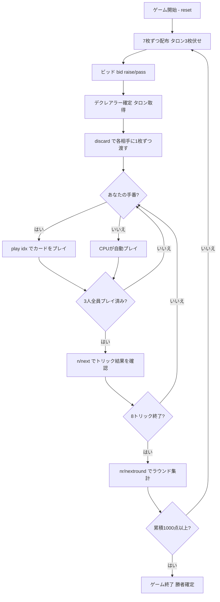

# トゥシオンツ（1000）（CUI版）遊び方

## ゲーム概要

Thousand（Tysiąc / トゥシオンツ）はポーランドおよび東欧で広く親しまれている**ビッド式トリックテイキングゲーム**です。24枚デッキを3人でプレイし、各プレイヤーが個別に得点します（チームなし）。100点から始まるオークションで最後まで残ったプレイヤーが**デクレアラー（declarer）**となり、宣言した**コントラクト（contract）**の達成を目指します。最初に累積**1000点**に達したプレイヤーがマッチ勝利です。

## 起動方法

```sh
go run ./cmd/trumpcards tysiac
go run ./cmd/trumpcards --lang en tysiac  # 英語モード
```

## ルール

### デッキと配布

- **デッキ**: 24枚（9, J, Q, K, 10, A × 4スート）
- **プレイヤー**: 3人（プレイヤー0 = あなた、プレイヤー1〜2 = CPU）
- **配布**: 各プレイヤー7枚（合計21枚）。残り**3枚はタロン（widow）**として伏せられます。

### ビッド（オークション）

- 開始額は **100**。前手（forehand = ディーラーの左隣）から順に、各プレイヤーは**+10刻みでビッドを上げる**か**パス**します。
- 一度パスすると以降は降りた扱いになります。
- 最後まで残った1人が**デクレアラー**となり、その時点の最高額が**コントラクト**になります。
- 全員が即パスした場合は、前手が最低コントラクト100を引き受けます。

### タロン交換

- デクレアラーは伏せられた**タロン3枚を引き取り**（手札10枚）、**各相手に1枚ずつ渡します**（デクレアラー8枚、各相手8枚、合計24枚）。

### マリッジ（婚礼）＝ 動的切り札

- リード（その回の先手）の番で、同一スートの **K と Q を両方**持っていれば、その**KまたはQをリードする**ことでマリッジを宣言できます。
- 宣言したスートは**即座に切り札**になります（それまでの切り札を置き換える）。
- ラウンド開始時は**切り札なし**。マリッジ宣言のたびに切り札が変わります。

| スート | マリッジ点 |
|--------|------------|
| ♠ スペード | **40点** |
| ♣ クラブ | **60点** |
| ♦ ダイヤ | **80点** |
| ♥ ハート | **100点** |

### カードの強さ

**切り札・非切り札ともに同じランク順**（強い順）: A > 10 > K > Q > J > 9。切り札は非切り札に勝ちます。

### カード点数

| カード | 点数 |
|--------|------|
| A | 11点 |
| 10 | 10点 |
| K | 4点 |
| Q | 3点 |
| J | 2点 |
| 9 | 0点 |

4スート合計 = **120点**

### フォロー義務

1. リードスートを持っていれば必ず出す
2. ボイド時、切り札を持っていれば必ず切り札を出す
3. 場に切り札があり、それより高い切り札を持っていれば勝てる札を出す（オーバートランプ義務）
4. いずれもなければ任意の札を捨てる

### 得点計算と勝利条件

各プレイヤーの合計 = 獲得カード点 + マリッジ点。

| プレイヤー | 獲得点 |
|------------|--------|
| デクレアラー（合計 ≥ コントラクト） | **+コントラクト** |
| デクレアラー（合計 < コントラクト） | **−コントラクト** |
| 非デクレアラー | 自分の合計を**10単位に丸めた値** |

**マッチ勝利**: 先に累積 **1000** 点に達したプレイヤーが勝利。

## ゲームの流れ



## コマンド一覧

| コマンド | 短縮形 | 説明 |
|----------|--------|------|
| `bid raise` / `bid pass` |  | ビッドを+10上げる／パスする |
| `discard <idx>` | `d` | タロン交換で相手に1枚渡す（2回） |
| `play <idx>` | `p` | 手札のidx番目のカードを出す |
| `next` | `n` | 次のトリックへ進む |
| `nextround` | `nr` | 次のラウンドへ進む |
| `setdifficulty <0-2>` | `sd` | CPU難易度設定（0=Easy, 1=Normal, 2=Hard） |
| `log` | `l` | アクションログを表示 |
| `reset` | `r` | 新しいゲームを開始（設定保持） |
| `quit` | `q` | ゲーム終了 |
| `help` | `?` | コマンド一覧を表示 |

## 画面の見方

実際の出力例です。配りは毎回シャッフルされるので、カードの並びは実行ごとに変わります。

```
==========
トゥシオンツ（1000）
==========
ラウンド: 1  トリック: 1  切り札: ?
契約: - / 目標: 1000
現在ビッド: 120
あなた (プレイヤー): 7枚  得点: 0  トリック: 0
[0]SPADE 10  [1]CLOVER 13  [2]CLOVER 11  [3]HEART 10  [4]HEART 12  [5]HEART 11  [6]HEART 9
CPU 1 (プレイヤー): 7枚  得点: 0  トリック: 0
CPU 2 (プレイヤー): 7枚  得点: 0  トリック: 0
----------
ビッド中 — 現在のビッド: 120  手番: あなた
bid raise・・・10上げる ｜ bid pass・・・オークションから降りる
==========
```

- **1〜3行目**: ゲーム名の見出し
- **ディール / トリック**: 進行状況
- **プレイヤー行**: 各席の宣言・獲得点・残り手札枚数
- **`[i]` 付きの行**: あなたの手札
- **`----------` の下**: 現在のフェーズ（ビッド → タロン交換 → プレイ）と手番
- **`いま宣言できるマリッジ:`**: プレイ中のあなたの手番で、K と Q を両方持つスートを結婚点つきで挙げます（`SPADE K-Q (+40)` 形式）。対象が無ければ行ごと出ません。CPU の手番では出しません

## 遊び方のコツ

- **手札が強いときだけ高く張れ**: コントラクトを達成できなければ**−コントラクト**の大ダメージ。A・10とマリッジの見込みで上限を決めましょう。
- **マリッジで切り札を握れ**: ♥（100点）や♦（80点）のマリッジは強力。KとQを揃えたらリードで宣言し、切り札を自分に有利なスートへ。
- **タロンで弱い札を押し付ける**: 交換では点の低い9などを相手に渡し、KやQ（マリッジ素材）は手元に残しましょう。
- **オーバートランプ義務に注意**: ボイドで切り札を出すとき、勝てる高い切り札があれば出さなければなりません。
