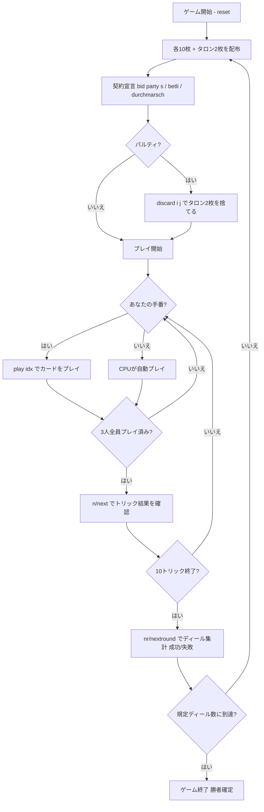

# ウルティ（CUI版）遊び方

## ゲーム概要

Ulti（Ultimó / ウルティ）はハンガリー発祥の3人用**契約トリックテイキングゲーム**です。32枚デッキ（A, 10, K, Q, J, 9, 8, 7 × 4スート）を使い、あなた（プレイヤー0）は常に**デクレアラー（declarer）**として、残り2人のCPUからなる**連合（coalition）**を相手に1人で10トリックを戦います。デクレアラーは契約（コントラクト）を宣言し、その成否に応じてコインをやり取りします。

## 起動方法

```sh
go run ./cmd/trumpcards ulti
go run ./cmd/trumpcards --lang en ulti  # 英語モード
```

## ルール

### デッキと配布

- **デッキ**: 32枚（A, 10, K, Q, J, 9, 8, 7 × 4スート）。トリックの強さは **A＞10＞K＞Q＞J＞9＞8＞7**。
- **プレイヤー**: 3人（プレイヤー0 = あなた = デクレアラー、プレイヤー1〜2 = CPU連合）
- **配布**: 各プレイヤー10枚＋場に伏せた**タロン（talon）**2枚。

### 契約（ビッド）

デクレアラーであるあなたは、次のいずれかの契約を宣言します。

- **パルティ（Party）**: 得点（A・10 が各10点、最終トリック +10）で連合を上回ることを目指す。**切り札スート**（♠♣♥♦）を指定します。
- **ベトリ（Betli）**: 切り札なしで、1トリックも取らないことを目指す。
- **ドゥルマルス（Durchmarsch）**: 全10トリックを取ることを目指す。

### タロン交換

パルティを宣言した場合、デクレアラーはタロン2枚を拾って12枚となり、不要な**2枚を伏せて捨てます（discard）**。捨てた札の点数はデクレアラーの取り札に加算されます。

### フォロー義務とカードの強さ

- リードスートを持っていれば**必ず従わなければなりません（must-follow）**。ボイド時は切り札を含む任意の札を出せます。パルティでは切り札スートがすべてに勝ちます。
- トリック内の強さ: **A＞10＞K＞Q＞J＞9＞8＞7**。

### 得点と勝利条件

- 契約が**成功**すればデクレアラーがコインを獲得、**失敗**すれば連合がコインを獲得します。
- **マッチ勝利**: 規定ディール数（既定 **5**）を配り終えた時点で、コイン残高が最上位のプレイヤーが勝者です。

## ゲームの流れ



## コマンド一覧

| コマンド | 短縮形 | 説明 |
|----------|--------|------|
| `bid party <s\|c\|h\|d>` | `b` | パルティを切り札スート指定で宣言 |
| `bid betli` | `b` | ベトリを宣言 |
| `bid durchmarsch` | `b` | ドゥルマルスを宣言 |
| `discard <i> <j>` | `d` | タロン受け取り後に不要な2枚を捨てる |
| `play <idx>` | `p` | 手札のidx番目のカードを出す |
| `next` | `n` | 次のトリックへ進む |
| `nextround` | `nr` | 次のディールへ進む |
| `setdifficulty <0-2>` | `sd` | CPU難易度設定（0=Easy, 1=Normal, 2=Hard） |
| `hint` | `h` | 推奨アクションを表示 |
| `log` | `l` | アクションログを表示 |
| `reset` | `r` | 新しいゲームを開始（設定保持） |
| `quit` | `q` | ゲーム終了 |
| `help` | `?` | コマンド一覧を表示 |

## 画面の見方

- **手札**: プレイ可能な札（フォロー義務でフィルタ済み）が表示されます。
- **プレイヤー情報**: 各プレイヤーのコイン残高・デクレアラー表示・獲得トリック数・取り札点数。
- **現在のトリック**: 場に出ている札とリードプレイヤー。
- **ディール結果**: 契約の成功（成功＝デクレアラー勝ち）／失敗（＝連合勝ち）とコインの移動。
- **`精算:`**: そのディールで動いた符号付きのコイン増減（例 `精算: あなた +10 / CPU 1 -5 / CPU 2 -5`）。ディール終了時とマッチ終了時に出ます。残高そのものはプレイヤー情報の行にあります。

## 遊び方のコツ

- **契約は手札に応じて選ぶ**: 点札（A・10）が多ければパルティ、低い札ばかりならベトリ、高い札で固めていればドゥルマルスが狙い目です。
- **切り札スートの選択が要**: パルティでは手札で最も長く強いスートを切り札に選ぶのが基本です。
- **タロン交換で弱点を消す**: 短いスートや点数の低い札を捨てて、切り札やエースを温存しましょう。
- **フォロー義務を意識する**: リードスートを持っていれば必ず従う必要があります。ボイド時に切り札を切って主導権を握りましょう。
