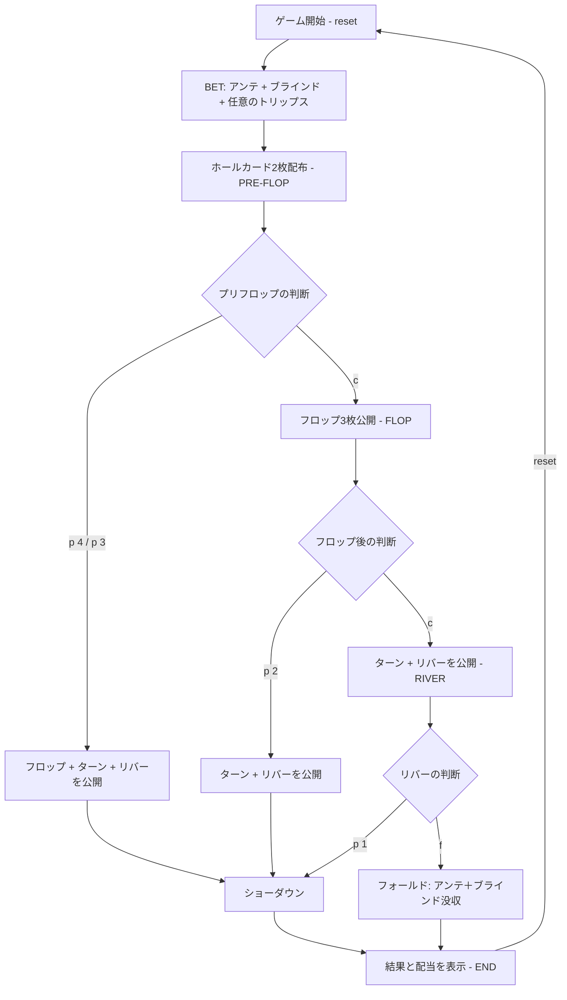

# アルティメット・テキサスホールデム（CUI版）遊び方

## ゲーム概要

プレイヤー対ディーラーの 1 対 1 で行うテキサスホールデム派生のカジノゲームです。アンテと同額のブラインドを置いた状態で、コミュニティカードを段階的に開きつつ、プリフロップ / フロップ / リバーの 3 段階で「ベット倍率を決めるかチェックで先送りする」ことで最終的な勝負額を組み立てます。

## 起動方法

```sh
go run ./cmd/trumpcards ultimatetexasholdem
go run ./cmd/trumpcards --lang en ultimatetexasholdem  # 英語モード
go run ./cmd/trumpcards uth                            # エイリアス
```

## ルール

### 基本ルール

1. **ベット**: アンテを置くと同額のブラインドが自動的にベットされます。任意でトリップス（サイドベット）も置けます。
2. **ホールカード**: プレイヤー・ディーラーに 2 枚ずつ配ります。
3. **プリフロップ**: `p 4`（4×アンテ）または `p 3`（3×アンテ）でプレイベットを置くか、`c` でチェック（追加ベットなし）します。
4. **フロップ（コミュニティ 3 枚）**: プリフロップでチェックした場合のみ。`p 2`（2×アンテ）または `c` でチェックします。
5. **リバー（コミュニティ 5 枚）**: フロップでもチェックした場合のみ。`p 1`（1×アンテ）または `f` でフォールド（アンテ＋ブラインドを没収）します。

### 役・配当

- **ディーラークオリファイ**: ペア以上で成立。不成立時はアンテはプッシュ（返却のみ）になります。
- **アンテ**: クオリファイ時、勝利で 1:1、引き分けでプッシュ、敗北で没収。
- **プレイベット**: クオリファイ有無に関わらず、勝利で 1:1、引き分けでプッシュ、敗北で没収。
- **ブラインド**: 勝利かつ役がストレート以上のときペイテーブルで支払い。ストレート未満で勝利／引き分けはプッシュ、敗北で没収。
  - ロイヤルフラッシュ 500:1 / ストレートフラッシュ 50:1 / フォーカード 10:1 / フルハウス 3:1 / フラッシュ 3:2 / ストレート 1:1
- **トリップス**（任意）: ディーラーの結果に関係なくプレイヤーの 7 枚最良役で支払い。ロイヤル 50:1 / ストレートフラッシュ 40:1 / フォーカード 30:1 / フルハウス 8:1 / フラッシュ 7:1 / ストレート 4:1 / スリーカード 3:1。

### ゲーム終了

ショーダウンまたはフォールドでゲームは終了し、各ベットの配当が表示されます。`reset` で次のラウンドへ進みます。

## ゲームの流れ



## コマンド一覧

| コマンド | 短縮形 | 説明 |
|----------|--------|------|
| `reset` | `r` | 新しいラウンドを開始 |
| `quit` | `q` | ゲーム終了 |
| `bet <ante> [trips]` | `b` | アンテ（ブラインドは同額自動）と任意のトリップスを設定 |
| `play <mult>` | `p` | プレイベット（プリフロップ: 3/4、フロップ: 2、リバー: 1） |
| `check` | `c` | プリフロップまたはフロップでチェック |
| `fold` | `f` | リバーでフォールド |
| `log` | `l` | 棋譜を表示 |
| `help` | `?` | コマンド一覧を表示 |

## 画面の見方

```
----------
チップ: 800
フェーズ: PRE-FLOP
--- PLAYER ---
SPADE 1,SPADE 13
--- DEALER ---
??,??
----------
```

- **チップ**: 現在の残高。
- **フェーズ**: 現在の進行段階（BET / PRE-FLOP / FLOP / RIVER / END）。
- **PLAYER**: 自分のホールカード。
- **DEALER**: ディーラーのホールカード。ショーダウンまで `??` で伏せられます。
- **BOARD**: コミュニティカード（フロップ以降）。

## 遊び方のコツ

- ポケットペア、スーテッドエース、ハイブロードウェイは `p 4` で強気に。
- ペア以上が確定したフロップでは積極的に `p 2`。
- リバーは「コミュニティの上位 5 枚と勝てるか」を基準に `p 1` か `f` を選ぶ。
- トリップスはオプション。スリーカード以上を狙える運勝負として置きます。
