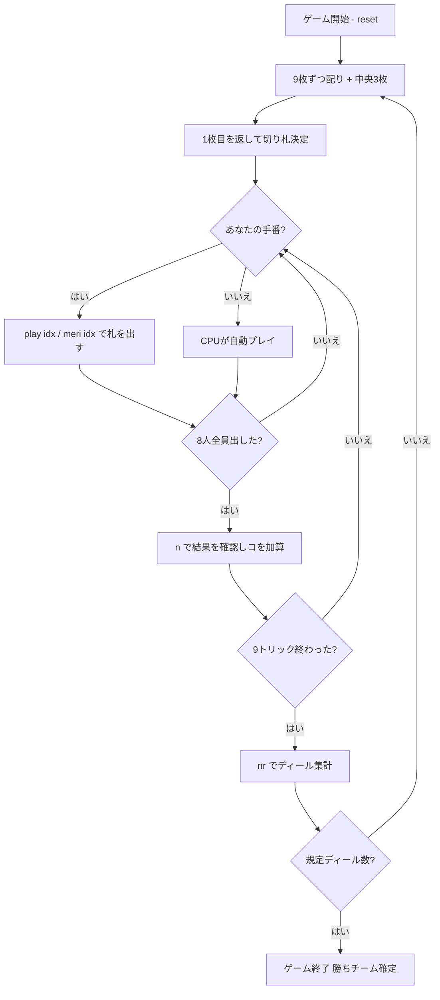

# うんすんカルタ（CUI版）遊び方

## ゲーム概要

うんすんカルタは熊本県人吉市に伝わる、**日本に現存する最古級のトリックテイキング**です。**75枚（5スート×15枚）**のカルタを使い、**8人が4対4のチーム戦**で戦います（本実装ではあなた 1 人 + CPU 7 人）。ここで遊べるのは、人吉に伝承されている遊び方「**八人メリ（はちにんメリ）**」です。

一番の特徴は **数札の強弱がスートで逆になる**こと。長物（ぱお・いす）は 9 が最強ですが、**丸物（こつ・おうる・くる）は 1 が最強**です。

## 起動方法

```sh
go run ./cmd/trumpcards unsunkaruta
go run ./cmd/trumpcards --lang en unsunkaruta  # 英語モード
```

## ルール

### デッキ

75枚 = 5スート × 15枚。

| スート | 種類 | 数札の強さ |
|--------|------|-----------|
| ぱお（棍棒） | 長物 | 9 が最強 → 1 が最弱 |
| いす（刀剣） | 長物 | 9 が最強 → 1 が最弱 |
| こつ（聖杯） | 丸物 | **1 が最強 → 9 が最弱** |
| おうる（金貨） | 丸物 | **1 が最強 → 9 が最弱** |
| くる（巴紋） | 丸物 | **1 が最強 → 9 が最弱** |

各スートは 数札 1〜9 と、絵札 6 枚（ソウタ・ウマ・キリ・ウン・スン・ロバイ）です。

### 札の強さ

**ウン > スン > ソウタ > ロバイ > キリ > ウマ > 数札** の順です。数札の並びは上の表のとおりスートで逆になります。

### 席とチーム

8 人が **敵味方交互**に座ります。あなたは席 0（組 0）で、CPU 2・4・6 が味方、CPU 1・3・5・7 が相手です。

### 配りと切り札

**3 枚ずつ 3 回**配って 1 人 9 枚（72 枚）。残る 3 枚は中央に伏せ、**その 1 枚目を表に返します。そのスートがそのディールの切り札**です。

### メリ / モンチ（宣言）

**フォロー義務は宣言で生まれます。** リードする人は札と一緒に宣言でき、宣言されたトリックは全員が台札のスートに従います（持っていなければ何を出してもよい）。切り札でリードするときが「メリ」、平札でリードするときが「モンチ」です。**宣言が無ければ、誰でも好きな札を出せます。**

### トリックと「コ」

8 枚が出揃った時点で、**切り札が出ていればその最強、無ければ台札スートの最強**を出した人のチームが「**コ**」を 1 つ取ります。9 トリックで 9 コを分け合います。

### 勝敗

規定ディール数（既定 **4**、最大 8 = 全員が 1 回ずつ親）を終えた時点で、**累計の「コ」が多いチームの勝ち**です。

> 本実装では、返した切り札の「ヤク」による 2 コ／5 コ の移動は扱っていません（宣言と席順の組み合わせで決まる別系統の規則です）。1 トリック = 1 コ に揃えています。

## ゲームの流れ



## コマンド一覧

| コマンド | 短縮形 | 説明 |
|----------|--------|------|
| `play <idx>` | `p` | 手札の idx 番目の札を出す |
| `meri <idx>` | `m` / `monchi` | 宣言しつつ出す（**リードのときだけ**。以降このトリックはフォロー義務） |
| `next` | `n` | 次のトリックへ進む |
| `nextround` | `nr` | 次のディールへ進む |
| `setdifficulty <0-2>` | `sd` | CPU難易度（0=Easy, 1=Normal, 2=Hard） |
| `setdeals <1-8>` | `st` | マッチのディール数 |
| `hint` | `h` | 推奨アクションを表示 |
| `log` | `l` | アクションログを表示 |
| `reset` | `r` | 新しいゲームを開始（設定保持） |
| `quit` | `q` | 終了 |
| `help` | `?` | コマンド一覧を表示 |

## 画面の見方

```
==========
うんすんカルタ（八人メリ）
==========
ディール: 1  トリック: 1/9
切り札: いす（返した札: いすキリ）
コ — 味方: 0 / 相手: 0　（累計 0 / 0）
あなた (組0 / 親): 9 枚  取った個: 0
[0]ぱおスン  [1]ぱおロバイ  [2]いす7  [3]こつ3  ...
CPU 1 (組1 / 子): 8 枚  取った個: 0
...
----------
トリック: CPU 1=いす3, CPU 2=いす8, ...
手番: あなた
※ 宣言あり — 台札のスートに従ってください。
出せる札: [2]いす7
play <idx> ... 札を出す　meri <idx> ... 宣言して出す（リードのみ）
```

- 札は「スート名 + 位」で出ます。**丸物（こつ・おうる・くる）は赤**で表示され、数札の強弱が逆であることの目印になります。
- **切り札の行**は毎回出ます。返した札そのものも併記されるので、どのスートが強いのかが常に読めます。
- 「**出せる札**」の行は、宣言によるフォロー義務を満たす番号だけを並べます。宣言が無いトリックでは全部並びます。

## 遊び方のコツ

- **丸物の 1 を数札の切り札として扱う。** こつ・おうる・くるの 1 は、その系統では最強の数札です。ぱお・いすの 1 とは価値がまったく違います。
- **宣言は押し切れるときだけ。** メリ／モンチはフォロー義務を全員に課すので、強い台札を持っているときは有利ですが、弱い札で宣言すると確実に取られます。
- **味方が取っているトリックは奪わない。** 敵味方が交互に座るので、自分の 2 つ前と 2 つ後ろが味方です。すでに味方が最強札を出しているなら、安い札を落とすほうが得です。
- **絵札は 6 枚もある。** ウン・スン・ソウタ・ロバイ・キリ・ウマ はどの数札より強く、1 スートの 4 割が絵札です。数札で取りにいく前に、絵札が残っているかを数えましょう。
