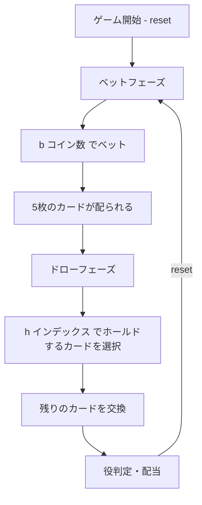

# ビデオポーカー（CUI版）遊び方

## ゲーム概要

1人用カジノカードゲームです。52枚のトランプを使い、5枚のカードでポーカーの役を作ります。Jacks or Better（J以上のワンペアから配当）のペイテーブルに基づいて配当が支払われます。

## 起動方法

```sh
go run ./cmd/trumpcards videopoker
go run ./cmd/trumpcards --lang en videopoker  # 英語モード
```

## ルール

### 基本ルール

- 52枚のトランプ（ジョーカーなし）を使用
- 1〜5コインをベットしてゲーム開始
- 5枚のカードが配られる
- 残したいカード（ホールド）を選び、残りを交換
- 最終的な5枚の手札で役を判定し、配当を支払い

### 配当表（Jacks or Better）

| 役 | 1コイン | 2コイン | 3コイン | 4コイン | 5コイン |
|----|---------|---------|---------|---------|---------|
| ロイヤルフラッシュ | 250 | 500 | 750 | 1000 | 4000 |
| ストレートフラッシュ | 50 | 100 | 150 | 200 | 250 |
| フォーカード | 25 | 50 | 75 | 100 | 125 |
| フルハウス | 9 | 18 | 27 | 36 | 45 |
| フラッシュ | 6 | 12 | 18 | 24 | 30 |
| ストレート | 4 | 8 | 12 | 16 | 20 |
| スリーカード | 3 | 6 | 9 | 12 | 15 |
| ツーペア | 2 | 4 | 6 | 8 | 10 |
| ジャックスオアベター | 1 | 2 | 3 | 4 | 5 |

### ジャックスオアベター

- J、Q、K、Aのワンペア以上が配当の最低条件
- 10以下のワンペアは配当なし

## ゲームの流れ



## コマンド一覧

| コマンド | 短縮形 | 説明 |
|----------|--------|------|
| `reset` | `r` | 新しいゲームを開始 |
| `bet <amount>` | `b <amount>` | ベットする（1〜5コイン） |
| `hold <indices>` | `h <indices>` | カードをホールドして交換（インデックス0〜4） |
| `log` | `l` | アクションログ（棋譜）を表示 |
| `quit` | `q` | ゲーム終了 |
| `help` | `?` | コマンド一覧を表示 |

### コマンド例

- `r` → ゲームリセット
- `b 5` → 5コインベット
- `h 0 2 4` → 0番目、2番目、4番目のカードをホールドし、残りを交換
- `h` → 全カード交換（ホールドなし）
- `l` → 棋譜を表示

## 画面の見方

```
==========
ビデオポーカー
==========
チップ: 100
----------
ベットフェーズ
b・・・ベット  l・・・棋譜
==========

> b 3

==========
ビデオポーカー
==========
チップ: 97
----------
[0]♠A  [1]♥5  [2]♦K  [3]♣3  [4]♠J
----------
ドローフェーズ
h・・・ホールド  l・・・棋譜
==========

> h 0 2 4

==========
ビデオポーカー
==========
チップ: 100
----------
[0]♠A  [1]♦9  [2]♦K  [3]♥A  [4]♠J
----------
ジャックスオアベター  配当: 3
----------
r・・・リセット  l・・・棋譜
==========
```

- `チップ: N`: 所持チップ数
- `[N]♠A`: カードのインデックスとカード表示
- `配当: N`: 獲得配当

## 遊び方のコツ

- 5コインベットでロイヤルフラッシュの配当が大幅に増える（250→4000）ため、可能なら最大ベットがお得
- 高いペア（J以上）は必ずホールドする
- ストレートやフラッシュのドロー（あと1枚で役が完成）は積極的に狙う
- ローペア（10以下）でもスリーカード以上を狙えるのでホールドする価値がある
