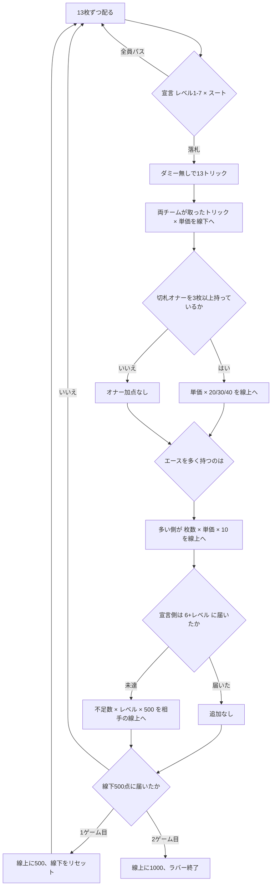
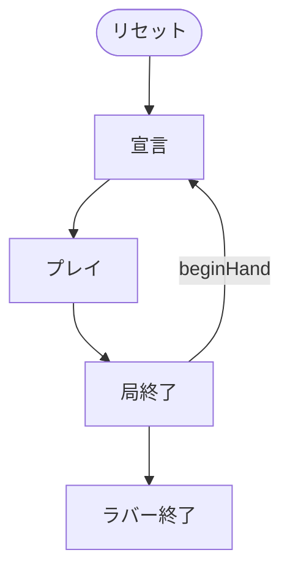

# ヴィント（CUI版）遊び方

## ゲーム概要

帝政ロシアの「ロシア式ブリッジ」。52 枚・4 人 2 対 2、各自 13 枚。コントラクトブリッジの原型でありながら、**ダミーを出しません**。

出典: [pagat.com: Vint](https://www.pagat.com/auctionwhist/vint.html) ／ [Wikipedia: Vint](https://en.wikipedia.org/wiki/Vint)

## 起動方法

```sh
go run ./cmd/trumpcards vint
go run ./cmd/trumpcards --lang en vint   # 英語表示
```

## ルール

### 宣言のスート序列（**ブリッジと逆です**）

**♠ < ♣ < ♦ < ♥ < NT** で、**♠ が最弱**です。ブリッジの ♣<♦<♥<♠<NT を持ち込むと競りが逆になります。

### トリック単価（**スートとレベルの両方**で決まる）

| 宣言 | レベル 1 の単価 |
|---|---|
| ♠ | 4 |
| ♣ | 6 |
| ♦ | 8 |
| ♥ | 10 |
| NT | 12 |

**レベルが 1 上がるごとに +10。**（2♠ = 14、3♠ = 24、7NT = 72）

宣言レベル N は「**6 + N トリック**」を意味します。

### 得点（**ここが最重要**）

**両チームが、取ったトリック全部を線下に得点します。**

> Both teams score below the line for tricks won, **irrespective of whether the contract succeeds or not**.

「宣言側だけ」でも「7 を超えた分だけ」でもありません。守備側も、契約が成立していても、自分の取ったトリック × 単価を得ます。ブリッジと決定的に違う点です。

### オナー（切札の A K Q J 10）

**3 枚以上から**得点します。線上に入ります。

| 枚数 | 得点 |
|---|---|
| 2 枚以下 | **0** |
| 3 枚 | 単価 × 20 |
| 4 枚 | 単価 × 30 |
| 5 枚 | 単価 × 40 |

**ノートランプ宣言では切札が無いので、オナーは付きません。**

### エース（オナーとは**別勘定**）

エースを**多く持っているチーム**が、線上に **1 枚につき単価 × 10** を得ます。**2 対 2 で分かれたら、トリックを多く取った側が 4 枚ぶん全部**を得ます。

### 未達のペナルティ

**不足トリック数 × 宣言レベル × 500** を相手が線上に得ます。

### ゲームとラバー

**線下 500 点**で 1 ゲーム。取ったら線下はリセットされます。

- 先に 1 ゲーム取ると線上に **500**
- 2 ゲーム目（ラバー）を取ると **1000**



## ゲームの流れ

ゲームの進行は `internal/domain/Vint.go` のフェーズ機械そのものです。各ノードは同ファイルの `VintPhase` 定数、矢印ラベルはその遷移を行うメソッド名です。



## コマンド一覧

| コマンド | 短縮形 | 説明 |
|----------|--------|------|
| `bid <1-7> <0-4>` | `b` | 宣言する（**0=♠ 1=♣ 2=♦ 3=♥ 4=NT**） |
| `pass` | `ps` | 宣言を見送る |
| `play <i>` | `p` | 手札 `i` を出す |
| `next` | `n` | 次の局へ進む |
| `log` | `l` | 棋譜を表示する |
| `reset` | `r` | ゲームごとリセットする |
| `quit` | `q` | 終了する |
| `help` | `?` | コマンド一覧を表示 |

## 画面の見方

```
局: 1  1ゲーム: 線下 500点
チーム0: 線下 0 線上 0 ゲーム 0 / チーム1: 線下 0 線上 0 ゲーム 0
契約: 3 ♥  トリック単価 30
あなた(T0)[親]: トリック 2  手札: [0]♠1 [1]♠13 ...
CPU 1(T1)[宣言]: トリック 3  手札: 非公開 11枚
場: ♠1
----------
手番: あなた
出せる札: 0 1
p <i> ・・・手札 i を出す（追随は強制です）
```

- **`(T0)` `(T1)`** がチームです。**席 0 と 2、席 1 と 3 が味方**です
- **誰の手札も見えません。**ダミーが無いので、味方の手札も伏せられます
- **`出せる札`** を必ず確認してください。追随が強制です
- 精算では**両チームの線下加点**が表示されます

## 遊び方のコツ

- **♠ が最弱です。**ブリッジの感覚で ♠ を高く見積もると競り負けます
- **守備側でもトリックを取る価値があります。**取った分がそのまま線下に入るので、契約を潰せなくても得点は積めます
- **単価はレベルで跳ね上がります。**3NT なら 32、7NT なら 72。高い宣言は失敗しても両者の線下を大きく動かします
- **オナーは 3 枚から。**2 枚では 1 点も入りません
- **エースは別勘定です。**2 対 2 のときはトリック数で決まるので、終盤のトリックが 4 枚ぶんの価値を持つことがあります
- **ノートランプではオナーが付きません。**エースだけが線上の対象です
