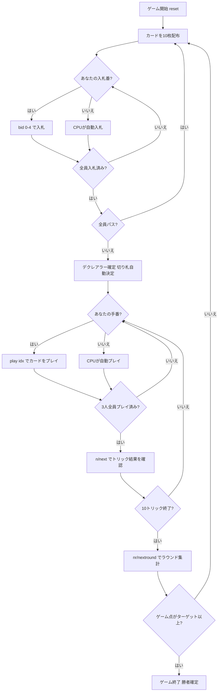

# Vira ヴィーラ（CUI版）遊び方

## ゲーム概要

Vira（ヴィーラ）は中欧・東欧で広く親しまれているトリックテイキングゲームです。52枚デッキを3人でプレイします。各ラウンドの最初に**入札フェーズ**があり、最高入札者が**デクレアラー**（宣言者）として1人で2人の**ディフェンダー**と対戦します。精算は**ポット式**です。各局の開始時に全員が**アンティ1点**をポットへ入れ、デクレアラーが達成すれば**ポットを総取り**したうえで各ディフェンダーからコントラクト価値を受け取ります。失敗すればコントラクト価値をポットへ積み増し、各ディフェンダーにも同額を支払います。**ポットは次局へ持ち越される**ので、失敗が続くほど次のデクレアラーの見返りが大きくなります。全員パスの流局でもポットは戻らず持ち越されます。規定局数（デフォルト**6局**）を終えた時点で持ち点が最大のプレイヤーが勝者です。同点なら勝者なしとなります。

## 起動方法

```sh
go run ./cmd/trumpcards vira
go run ./cmd/trumpcards --lang en vira  # 英語モード
```

## ルール

### デッキと配布

- **デッキ**: 52枚（A,2〜10,J,Q,K × 4スート）
- **プレイヤー**: 3人（プレイヤー0 = あなた、プレイヤー1〜2 = CPU）
- **配布**: 各プレイヤー13枚、計13トリック（残り13枚のタロンは未使用）
- **カードの強さ（高い順）**: A > K > Q > J > 10 > 9 > 8 > 7

### 入札フェーズ

ディーラーの左隣から時計回りに、各プレイヤーが1回だけ入札します。入札できるコントラクトは以下のとおりです（弱い順）。

| コントラクト | 値 | 内容 |
|--------------|-----|------|
| **Pass（パス）** | — | 入札をパスする |
| **Six（シックス）** | 6 | 単独で6トリック以上取ることを宣言 |
| **Misère（ミゼール）** | 10 | 単独で0トリックを取ることを宣言（切り札なし） |
| **Seven（セブン）** | 7 | 単独で7トリック以上取ることを宣言 |
| **Eight（エイト）** | 8 | 単独で8トリック以上（全10中）取ることを宣言 |

- 先の入札より高いコントラクトのみ上書きできます（Pass < Six < Misère < Seven < Eight）。
- 全員がパスした場合はそのラウンドは無効となり、再配布されます。
- 最高入札者が**デクレアラー**となり、他の2人が**ディフェンダー**として対戦します。
- 伝統的な2枚タロン（ウィドウ）の交換は省略されており、配られた10枚のみでプレイします。

### 切り札

- **Six / Seven / Eight**: デクレアラーの手札で最も枚数の多いスートが自動的に切り札スートになります（簡易実装）。
- **Misère**: 切り札はありません。

### トリック・テイキング

- **スートフォロー義務**: リードされたスートのカードを持っている場合は必ず出さなければなりません。
- 持っていない場合は任意のカードを出せます（切り札でも他スートでも可）。
- **トリックの勝者**:
  - 切り札スートのカードが場にあれば、最も強い切り札カードが勝ちます。
  - 切り札がなければ、リードスートの最も強いカードが勝ちます。
- トリックの勝者が次のトリックをリードします。

### 得点計算と勝利条件

| 結果 | 得点 |
|------|------|
| デクレアラーがコントラクト達成 | デクレアラーがコントラクト値（Six=6, Seven=7, Eight=8, Misère=10）を獲得 |
| デクレアラーがコントラクト失敗 | **各**ディフェンダーがコントラクト値を獲得 |

**マッチ勝利**: 先にターゲット（デフォルト **30** ゲーム点）に達したプレイヤーが勝利。

> **簡略化について**: 伝統的なヴィーラのタロン交換・プールペナルティ方式の代わりに、シンプルな累積ポイント制を採用しています。

## ゲームの流れ



## コマンド一覧

| コマンド | 短縮形 | 説明 |
|----------|--------|------|
| `bid <0-4>` | — | 入札する（0=Pass, 1=Six, 2=Misère, 3=Seven, 4=Eight） |
| `pass` | — | パスする（bid 0 と同じ） |
| `play <idx>` | — | 手札のidx番目のカードを出す（トリックフェーズ） |
| `next` | `n` | 次のトリックへ進む（トリック終了後） |
| `nextround` | `nr` | 次のラウンドへ進む（10トリック終了後） |
| `setdifficulty <0-2>` | `sd <0-2>` | CPU難易度設定（0=Easy, 1=Normal, 2=Hard） |
| `log` | `l` | アクションログを表示 |
| `reset` | `r` | 新しいゲームを開始（設定保持） |
| `quit` | `q` | ゲーム終了 |
| `help` | `?` | コマンド一覧を表示 |

## 画面の見方

```
==========
Vira (ヴィーラ)
==========
ラウンド: 1  トリック: 0
ゲーム点: あなた=0  CPU1=0  CPU2=0
----------
フェーズ: BID
入札状況: あなた=?  CPU1=?  CPU2=?
あなたの手番です。入札してください。
bid <0-4>  (0=Pass, 1=Six, 2=Misère, 3=Seven, 4=Eight)

==========
ラウンド: 1  トリック: 1
ゲーム点: あなた=0  CPU1=0  CPU2=0
切り札: ♠  デクレアラー: CPU1 [Six]
You: 10枚 [ディフェンダー]
[0]A♥ [1]K♥ [2]Q♠ [3]J♦ [4]10♣ [5]9♠ [6]8♥ [7]7♦ [8]K♣ [9]Q♦
CPU1: 10枚 [デクレアラー]  CPU2: 10枚 [ディフェンダー]
----------
フェーズ: PLAY
あなたの手番です。カードを出してください。
play <idx>
```

- **フェーズ: BID**: 入札フェーズ。各プレイヤーが1回入札します。
- **フェーズ: PLAY**: トリックフェーズ。スートフォロー義務に従いカードを出します。
- **切り札行**: 現在の切り札スートとデクレアラー・コントラクト表示。
- **ゲーム点行**: 各プレイヤーの累積ゲーム点。
- **`[n]`付き行**: あなたの手札（インデックス付き）。

## 遊び方のコツ

- **入札の判断**: Six（6トリック以上）は手札のA・K・Qが十分にあれば検討できます。Seven・Eightは強いカードが手厚い場合のみ宣言しましょう。Misère（10点）はリスクが高い代わりにリターンも大きく、手札が弱いカードで揃っているときが狙い目です。
- **デクレアラーは切り札を引き出せ**: Six / Seven / Eight では、デクレアラーの最長スートが切り札になります。序盤に切り札リードを繰り返してディフェンダーの切り札を消費させると、後半の高得点スートで安全にトリックを取れます。
- **ディフェンダーは2人で連携して阻止**: Solo Whist より少ない2人ですが、互いに協力します。デクレアラーが強いスートでリードしてきたら、片方が低いカードを捨ててもう片方の高いカードが勝てるようにサポートしましょう。
- **Misèreはボイドを活用**: Misèreのデクレアラーは切り札なしで0トリックを目指します。手札の強いカードを早めに捨てられるよう、ボイド（そのスートを持たない）状態を意図的に作ることが重要です。ディフェンダーはデクレアラーが強いカードを捨てられないよう、そのスートをリードし続けましょう。
- **コントラクト価値を意識**: Eight（8トリック以上）の失敗は各ディフェンダーが8点（合計16点）を獲得します。確実でなければ Seven に留めましょう。Misère失敗は各ディフェンダーが10点と高リターンです。
- **32枚デッキの強さ**: 7が最弱ですが、32枚デッキでは上位カードが少ないため、Jや10でもトリックを取りやすくなっています。A・K・Qの価値が52枚デッキより高くなりがちです。
- **得点管理**: ゲーム点は累積制で誰が勝っても常に変動します。上位者がデクレアラーになりやすい状況では、ディフェンダーに回るチャンスを活かして複数人で点数を分散させましょう。
