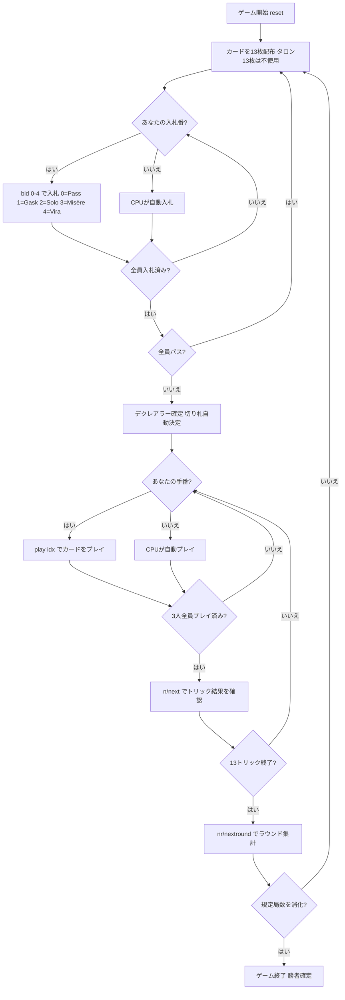

# Vira ヴィーラ（CUI版）遊び方

## ゲーム概要

Vira（ヴィーラ）は19世紀スウェーデンで生まれたオークション・トリックテイキングゲームです。52枚デッキを3人でプレイします。各ラウンドの最初に**入札フェーズ**があり、最高入札者が**デクレアラー**（宣言者）として1人で2人の**ディフェンダー**と対戦します。精算は**ポット式**です。各局の開始時に全員が**アンティ1点**をポットへ入れ、デクレアラーが達成すれば**ポットを総取り**したうえで各ディフェンダーからコントラクト価値を受け取ります。失敗すればコントラクト価値をポットへ積み増し、各ディフェンダーにも同額を支払います。**ポットは次局へ持ち越される**ので、失敗が続くほど次のデクレアラーの見返りが大きくなります。全員パスの流局でもポットは戻らず持ち越されます。規定局数（デフォルト**6局**）を終えた時点で持ち点が最大のプレイヤーが勝者です。同点なら勝者なしとなります。

## 起動方法

```sh
go run ./cmd/trumpcards vira
go run ./cmd/trumpcards --lang en vira  # 英語モード
```

## ルール

### デッキと配布

- **デッキ**: 52枚（A,2〜10,J,Q,K × 4スート）
- **プレイヤー**: 3人（プレイヤー0 = あなた、プレイヤー1〜2 = CPU）
- **配布**: 各プレイヤー13枚、計13トリック（残り13枚のタロンは未使用）
- **カードの強さ（高い順）**: A > K > Q > J > 10 > 9 > 8 > 7

### 入札フェーズ

ディーラーの左隣から時計回りに、各プレイヤーが1回だけ入札します。入札できるコントラクトは以下のとおりです（弱い順）。

| コントラクト | 目標トリック | 価値 | 内容 |
|--------------|------------|------|------|
| **Pass（パス）** | — | — | 入札をパスする |
| **Gask（ガスク）** | 7 | 2 | 単独で7トリック以上取ることを宣言 |
| **Solo（ソロ）** | 8 | 4 | 単独で8トリック以上取ることを宣言 |
| **Misère（ミゼール）** | 0 | 6 | 単独で0トリックを取ることを宣言（切り札なし） |
| **Vira（ヴィーラ）** | 10 | 8 | 単独で10トリック以上取ることを宣言。ゲーム名を冠する最上位 |

- 先の入札より高いコントラクトのみ上書きできます（Pass < Gask < Solo < Misère < Vira）。同値も通りません。
- **Misère はソロとヴィーラの間**です。0トリックを狙う特殊契約ですが「降りる手」ではなく、価値6の実契約として梯子の上位に置かれています。
- 全員がパスした場合はそのラウンドに宣言者は立たず、**ポットはそのまま次局へ持ち越されます**。
- 最高入札者が**デクレアラー**となり、他の2人が**ディフェンダー**として対戦します。
- 史実のヴィーラは30を超える契約を持ちますが、本実装はこの5段に絞っています。タロン交換も省略し、配られた13枚のみでプレイします。

### 切り札

- **Gask / Solo / Vira**: デクレアラーの手札で最も枚数の多いスートが自動的に切り札スートになります（簡易実装）。
- **Misère**: 切り札はありません。

### トリック・テイキング

- **スートフォロー義務**: リードされたスートのカードを持っている場合は必ず出さなければなりません。
- 持っていない場合は任意のカードを出せます（切り札でも他スートでも可）。
- **トリックの勝者**:
  - 切り札スートのカードが場にあれば、最も強い切り札カードが勝ちます。
  - 切り札がなければ、リードスートの最も強いカードが勝ちます。
- トリックの勝者が次のトリックをリードします。

### 得点計算と勝利条件

精算は**ポット式**です。各局の開始時に全員が**アンティ1点**をポットへ入れます。

| 結果 | 精算 |
|------|------|
| デクレアラーが契約達成 | **ポットを総取り**し、さらに**各**ディフェンダーからコントラクト価値（Gask=2, Solo=4, Misère=6, Vira=8）を受け取る |
| デクレアラーが契約失敗 | コントラクト価値をポットへ積み増し、**各**ディフェンダーにも同額を支払う |
| 全員パス（宣言者なし） | 持ち点は動かず、ポットはそのまま持ち越される |

**Misère だけ達成条件が逆**です。他の契約は目標トリック数**以上**で達成ですが、Misère は**1トリックも取らなかったとき**にのみ達成となります。

**ポットは次局へ持ち越されます**。失敗が続くほど積み上がるので、次に達成した宣言者の見返りが大きくなります。

**マッチ勝利**: 規定局数（デフォルト **6局**、各プレイヤーがディーラーを一巡するため**プレイヤー数の倍数**）を終えた時点で持ち点が最大のプレイヤーが勝者です。**同点なら勝者なし**となります。

## ゲームの流れ



## コマンド一覧

| コマンド | 短縮形 | 説明 |
|----------|--------|------|
| `bid <0-4>` | — | 入札する（0=Pass, 1=Gask, 2=Solo, 3=Misère, 4=Vira） |
| `pass` | — | パスする（bid 0 と同じ） |
| `play <idx>` | — | 手札のidx番目のカードを出す（トリックフェーズ） |
| `next` | `n` | 次のトリックへ進む（トリック終了後） |
| `nextround` | `nr` | 次のラウンドへ進む（13トリック終了後） |
| `setdifficulty <0-2>` | `sd <0-2>` | CPU難易度設定（0=Easy, 1=Normal, 2=Hard） |
| `log` | `l` | アクションログを表示 |
| `reset` | `r` | 新しいゲームを開始（設定保持） |
| `quit` | `q` | ゲーム終了 |
| `help` | `?` | コマンド一覧を表示 |

## 画面の見方

```
==========
Vira (ヴィーラ)
==========
ラウンド: 1  トリック: 0
ゲーム点: あなた=0  CPU1=0  CPU2=0
----------
フェーズ: BID
入札状況: あなた=?  CPU1=?  CPU2=?
あなたの手番です。入札してください。
bid <0-4>  (0=Pass, 1=Gask, 2=Solo, 3=Misère, 4=Vira)

==========
ラウンド: 1  トリック: 1
ゲーム点: あなた=0  CPU1=0  CPU2=0
ポット: 3
切り札: SPADE  デクレアラー: CPU1 — ガスク (7)
You: 13枚  得点: -1  トリック: 0
[0]HEART 1  [1]HEART 13  [2]SPADE 12  [3]DIAMOND 11  ... （13枚）
CPU1: 13枚  得点: -1  トリック: 0
CPU2: 13枚  得点: -1  トリック: 0
----------
フェーズ: PLAY
あなたの手番です。カードを出してください。
play <idx>
```

- **フェーズ: BID**: 入札フェーズ。各プレイヤーが1回入札します。
- **フェーズ: PLAY**: トリックフェーズ。スートフォロー義務に従いカードを出します。
- **切り札行**: 現在の切り札スートとデクレアラー・コントラクト表示。
- **ゲーム点行**: 各プレイヤーの累積ゲーム点。
- **`[n]`付き行**: あなたの手札（インデックス付き）。

## 遊び方のコツ

- **入札の判断**: Gask（7トリック以上）は手札のA・K・Qが十分にあれば検討できます。Solo・Vira は強いカードが手厚い場合のみ宣言しましょう。Misère（価値6）はリスクが高い代わりにリターンも大きく、手札が弱いカードで揃っているときが狙い目です。
- **ポットを見て入札する**: 失敗が続いた後のポットは大きく膨らんでいます。同じ手札でも、ポットが厚い局は宣言する価値が上がります。**ポットは達成した宣言者の総取り**なので、画面のポット表示は入札判断の一部です。
- **デクレアラーは切り札を引き出せ**: Gask / Solo / Vira では、デクレアラーの最長スートが切り札になります。序盤に切り札リードを繰り返してディフェンダーの切り札を消費させると、後半で安全にトリックを取れます。
- **ディフェンダーは2人で連携して阻止**: デクレアラーが強いスートでリードしてきたら、片方が低いカードを捨ててもう片方の高いカードが勝てるようにサポートしましょう。失敗させればポットが積み増され、次に自分が宣言するときの取り分が増えます。
- **Misèreはボイドを活用**: Misèreのデクレアラーは切り札なしで0トリックを目指します。手札の強いカードを早めに捨てられるよう、ボイド（そのスートを持たない）状態を意図的に作ることが重要です。ディフェンダーはデクレアラーが強いカードを捨てられないよう、そのスートをリードし続けましょう。**1トリック取らせれば即失敗**です。
- **コントラクト価値を意識**: Vira（10トリック以上）の失敗は各ディフェンダーに8点ずつ払い、さらに8点をポットへ積みます。確実でなければ Solo に留めましょう。
- **52枚デッキで13枚ずつ**: 残り13枚のタロンは使わないので、場に出ない札が13枚あります。相手が持っていないと決めつけられず、フォロー切れが判明するまでスートの分布は読み切れません。
- **同点は勝者なし**: 規定局数を終えて持ち点が並ぶと、誰も勝ちません。最終局で首位と並ぶだけの手を選ぶより、抜き去る手を選ぶ必要があります。
