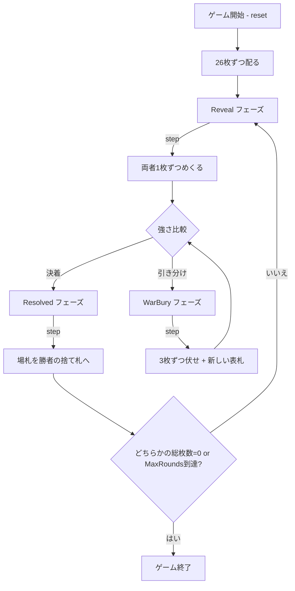

# 戦争（CUI版）遊び方

## ゲーム概要

プレイヤー1人対CPU 1人で遊ぶ、世界的に知名度の高い純粋運ゲーム。52枚のデッキを半分ずつに分け、お互い山札の一番上をめくって強いカードを出した方がそのラウンドに勝ち、場札を自分の捨て札に加えます。引き分けが起きると「戦争」が発動し、追加の伏せ札と新しい表札で勝敗を決めます。

## 起動方法

```sh
go run ./cmd/trumpcards war
go run ./cmd/trumpcards --lang en war  # 英語モード
```

## ルール

### 基本ルール

- 52枚のトランプ（ジョーカーなし）を使用
- シャッフル後、26枚ずつプレイヤーとCPUの山札として配る
- `step` コマンドで各ラウンドを進める
- 両者が山札から1枚ずつめくり、強さを比較する（A > K > Q > ... > 2、スートは無視）
- 勝った方が場に出た両方のカードを捨て札に回収する
- 山札が空になったら捨て札をシャッフルして山札に戻す

### 戦争（タイ）

- 表札の強さが等しい場合、戦争が発動する
- 追加 `step` で各プレイヤーが最大3枚を伏せ札として場に積み、もう1枚を表向きに出す
- 表札のうち強い方が場のカード全て（伏せ札含む）を獲得する
- 新しい表札でも再び引き分けなら、さらに戦争を重ねる
- 残り枚数が不足する側は、持てる分だけを積み、最後の1枚を表札として出す

### ゲーム終了

- どちらかのプレイヤーが全52枚を保有したら勝利
- プレイ中に相手の総枚数が0になったら勝利
- 設定の `MaxRounds`（既定500）に達した時点で総枚数の多い側を勝者とする

## ゲームの流れ



## コマンド一覧

| コマンド | 短縮形 | 説明 |
|----------|--------|------|
| `reset` | `r` | 新しいゲームを開始 |
| `step`  | `s` | 次の1枚をめくる / ラウンド解決 / 戦争解決を進める |
| `autoplay` | `a` | 決着まで `step` を自動で繰り返す |
| `sm <n>` | `setmax <n>` | MaxRounds を設定してリセット（10-10000）|
| `log`   | `l` | 棋譜（アクションログ）を表示 |
| `quit`  | `q` | ゲーム終了 |
| `help`  | `?` | コマンド一覧を表示 |

## 画面の見方

```
==========
War (戦争)
==========
ラウンド: 43 / 500（上限で保有枚数の多い方が勝ち）
CPU: 山札22枚 / 捨札4枚 (計26枚)
----------
[場札] CPU: [HEART 5]  あなた: [SPADE 10]  (場に2枚)
----------
あなた: 山札21枚 / 捨札5枚 (計26枚)
あなたがラウンドに勝利！ step で回収します。
==========
```

- `ラウンド: n / max（上限で保有枚数の多い方が勝ち）`: 消化ラウンド数と打ち切り上限。上限に達すると保有枚数の多い方が勝者になります (`finishByTotal`)。9 割を超えると黄色で強調されます
- `山札 N枚 / 捨札 M枚 (計X枚)`: プレイヤーの保有カード内訳
- `[場札]`: 今表になっているカードと場に積まれた総枚数
- `戦争発生！`: 表札が引き分けて戦争に突入した表示

## 遊び方のコツ

- 完全な運ゲームなので戦略はありません。純粋にテンポを楽しみましょう
- `log` で過去のラウンドを振り返ると、戦争の連鎖がどれだけ大きかったか確認できます
- 終わりが見えないときは `setmax` で上限を低く設定すると決着が早まります
- 1枚ずつめくるのが面倒な場合は `autoplay` で決着まで一気に進められます
