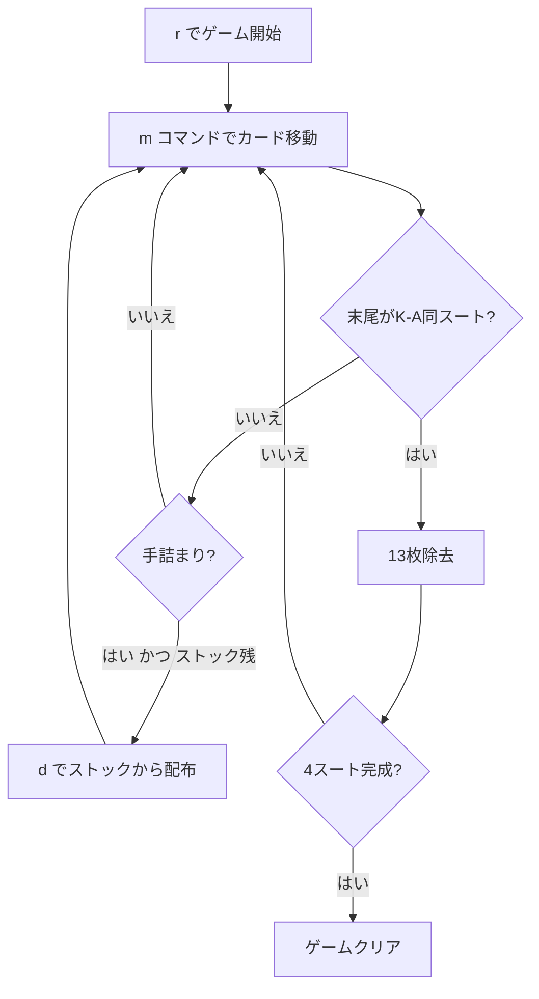

# ワスプ（CUI版）遊び方

## ゲーム概要

ワスプ（Wasp）は1人用のソリティアカードゲームで、スコーピオン（Scorpion）の易しいバリアントです。ユーコン的な「順序に関係なく表向きのカードをまとめて移動できる」仕組みに、スパイダー的な「同スートのK→Aを揃えると除去される」仕組みを組み合わせています。スコーピオンとの唯一の違いは、**空の列に任意のカードを置ける**点で、手詰まりになりにくく爽快にプレイできます。49枚が7列に配られ、残り3枚はストックとして保持されます。

## 起動方法

```sh
go run ./cmd/trumpcards wasp           # 日本語
go run ./cmd/trumpcards --lang en wasp # 英語
```

## ルール

### 配り方

- 49枚を7列に配り、残り3枚はストックへ
- 列0〜3: 先頭3枚が裏向き、残り4枚が表向き
- 列4〜6: 全7枚が表向き

### 移動ルール

- タブロー → タブロー: 表向きカードとその上のカード全てをまとめて移動可能（同スート・降順）
- **空の列には任意のカードを置ける**（スコーピオンとの唯一の違い。スコーピオンはKのみ）
- 列の末尾が同スートのK→Aになったらその13枚が除去される

### ストック

- `d` コマンドでストックの3枚を列0〜2に1枚ずつ配る
- 空列がある場合は配れない

## ゲームの流れ



## コマンド一覧

| コマンド | 短縮形 | 説明 |
|----------|--------|------|
| `move <列> <列>` | `m` | 列間の最上段カード移動（ショートハンド） |
| `move t <列> <ID> t <列>` | `m` | タブロー間移動（カードID指定、表向きカードとその上） |
| `d` |  | ストックから配布 |
| `g` |  | ギブアップ |
| `hint` | `h` | ヒント |
| `ac` |  | オートコンプリート |
| `u` |  | 元に戻す |
| `log` | `l` | 棋譜表示 |
| `reset` | `r` | リセット |
| `quit` | `q` | 終了 |
| `help` | `?` | コマンド一覧を表示 |

## 画面の見方

```
=== Wasp (ワスプ) ===
Completed: 0/4 | Stock: 3枚
----------
列0: [0]?? [1]?? [2]?? [3]♥5 [4]♣8 [5]♦3 [6]♠7
列1: [0]?? [1]?? [2]?? [3]♠4 [4]♥K [5]♣6 [6]♦9
...
列6: [0]♣10 [1]♠2 [2]♦4 [3]♥7 [4]♣J [5]♠9 [6]♥Q
----------
手数: 0
```

`[i]XY` 形式の `i` はカードインデックス、`X` はスート、`Y` はランクです。`??` は裏向きカードです。

## 遊び方のコツ

- 同スートのK→Aを1列にまとめることを意識しましょう
- 裏向きカードの列を優先的に解放
- 空列には任意のカードを置けるので、大きな「仮置き場」として積極的に活用しましょう
- `h` コマンドでヒントを活用
- ストックは盤面の手が尽きてから配りましょう（空列があると配れません）
- 手詰まりになったら `u` で戻ってやり直しましょう
