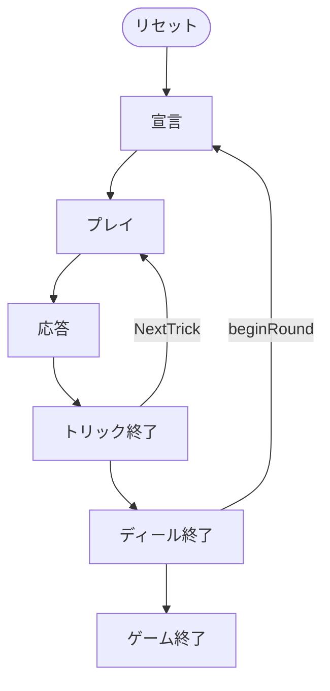

# ヴァッテン（CUI版）遊び方

## ゲーム概要

Watten（ヴァッテン）はバイエルン／オーストリアで親しまれる4人2チームのトリックテイキングゲームです。32枚デッキ（7〜A × 4スート）を使い、ディーラーが「Schlag（シュラーク）ランク」と「切り札スート（critical）」を宣言します。永久最強札 Max（K♥）＞ Belli（K♦）＞ Spitz（7♦）に続き、Schlag ランクの4枚、切り札スート、平札の順で強さが決まります。各ディールは5トリックで、いずれかのチームがステーク（賭け点）をレイズし、相手は hold（受ける）か fold（降りる）を選びます。3トリック以上取ったチームがステークを得点し、先に15点（変更可）に達したチームが勝利します。

## 起動方法

```sh
go run ./cmd/trumpcards watten
go run ./cmd/trumpcards --lang en watten  # 英語モード
```

## ルール

### 基本ルール

- プレイヤーは4人（人間1 + CPU3）。プレイヤー0と2、プレイヤー1と3が同チーム。人間はシート0（チーム0）。
- 32枚デッキ（7,8,9,10,J,Q,K,A × 4スート）を使用。各プレイヤーに5枚配る。各ディールは5トリック。

### 宣言（Declare）

- ディーラーが Schlag ランク（A または 7〜K）と切り札スート（1=S,2=C,3=H,4=D）を宣言します。
- 宣言フェーズでは、自分の手札から算出した目安が 2 行表示されます。

```
  切り札にすると増える枚数: SPADE 2  CLOVER 1  HEART 0  DIAMOND 0（常時切り札の保持: 2 枚）
  Schlag にすると増える枚数: A 1  10 2
```

  ♥K（Max）・♦K（Belli）・♦7（Spitz）は宣言に関わらず切り札なので「常時切り札の保持」に数え、スート別・ランク別の「増える枚数」には含めません（二重に数えないため）。Schlag 側は手札に持っているランクだけを並べます。

### 札の強さ

1. Max（K♥） ＞ Belli（K♦） ＞ Spitz（7♦）— 永久の3大トランプ
2. Schlag ランクの4枚
3. 切り札（critical）スートの札
4. 平札（リードスートに従う）

### ステーク（レイズ／応答）

- リードのプレイヤーはトリック開始前にステークをレイズできます。
- レイズされた相手チームは hold（受ける）か fold（降りる）を選びます。fold すると即座に現ステークが相手に入ります。

### 勝敗

- 5トリック中3トリック以上を取ったチームがそのディールのステークを得点。
- 先に15点（変更可）に達したチームがマッチ勝利。

## ゲームの流れ

ゲームの進行は `internal/domain/Watten.go` のフェーズ機械そのものです。各ノードは同ファイルの `WattenPhase` 定数、矢印ラベルはその遷移を行うメソッド名です。



## コマンド一覧


| コマンド | 短縮形 | 説明 |
|----------|--------|------|
| `declare <r> <s>` | `d` | 宣言 (Schlagランク + 切り札スート 1=S,2=C,3=H,4=D) |
| `play <idx>` | `p` | カードをプレイ |
| `raise` | `rz` | ステークを引き上げる (レイズ) |
| `respond <h\|f>` | `resp` | レイズに応答 (h=hold, f=fold) |
| `nextround` | `nr` | 次のディールへ |
| `log` | `l` | action log |
| `setdifficulty [0-2]` | `sd` | CPU難易度 (0=Easy, 1=Normal, 2=Hard) |
| `settarget <n>` | `st` | 目標スコア (デフォルト15) |
| `hint` | `h` | ヒントを表示 |
| `reset` | `r` | 新しいゲームを開始 |
| `quit` | `q` | ゲーム終了（`exit` も同じ） |
| `help` | `?` | コマンド一覧を表示 |
