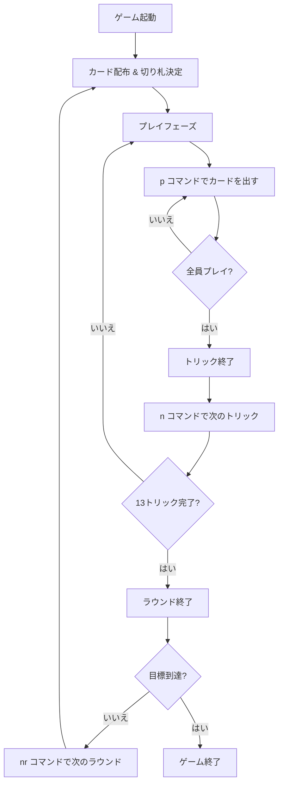

# ホイスト（CUI版）遊び方

## ゲーム概要

4人プレイの2vs2パートナー戦トリックテイキングゲームです。ビッドフェーズがなく、純粋なカードプレイのみで構成された古典的なゲームです。先に目標ポイントに到達したチームが勝利します。

## 起動方法

```sh
go run ./cmd/trumpcards whist          # 日本語で起動
go run ./cmd/trumpcards --lang en whist # 英語で起動
```

## ルール

### 基本ルール

- 52枚のカードを4人に13枚ずつ配ります
- ディーラーの最後のカードのスートがそのラウンドの切り札（トランプ）になります
- フォロースート必須（リードされたスートのカードを持っていればそれを出す）
- 切り札は常にリードスートに勝ちます

### チーム

- 席0と席2がチーム0（あなたはチーム0）
- 席1と席3がチーム1

### 得点

- 各チームが獲得したトリック数を合計します
- 6トリックを超えた分がそのラウンドのポイントになります
- 先に目標ポイント（デフォルト5）に到達したチームが勝利

## コマンド一覧

| コマンド | 説明 |
|----------|------|
| `p <idx>` | 手札のカードを出す（インデックス指定） |
| `n` / `next` | 次のトリックへ進む |
| `nr` / `nextround` | 次のラウンドへ進む |
| `sd <0-2>` | CPU難易度設定 (0=Easy, 1=Normal, 2=Hard) |
| `sl <n>` | 目標ポイント設定 |
| `h` / `hint` | ヒント表示 |
| `l` / `log` | 棋譜表示 |
| `r` / `reset` | ゲームリセット |
| `q` / `quit` | ゲーム終了 |
| `help` | ヘルプ表示 |

## ゲームの流れ


