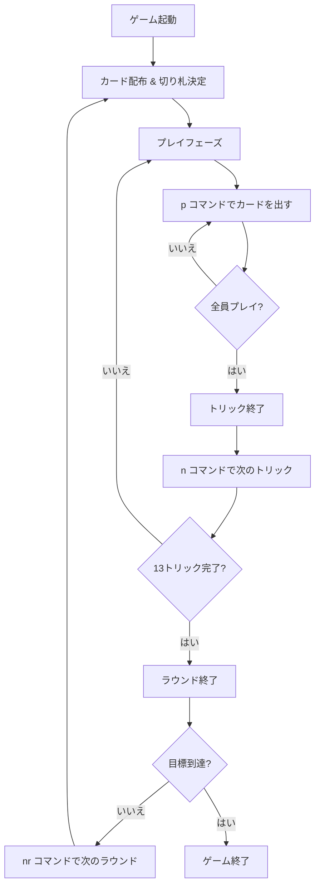

# ホイスト（CUI版）遊び方

## ゲーム概要

4人プレイの2vs2パートナー戦トリックテイキングゲームです。ビッドフェーズがなく、純粋なカードプレイのみで構成された古典的なゲームです。先に目標ポイントに到達したチームが勝利します。

## 起動方法

```sh
go run ./cmd/trumpcards whist          # 日本語で起動
go run ./cmd/trumpcards --lang en whist # 英語で起動
```

## ルール

### 基本ルール

- 52枚のカードを4人に13枚ずつ配ります
- ディーラーの最後のカードのスートがそのラウンドの切り札（トランプ）になります
- フォロースート必須（リードされたスートのカードを持っていればそれを出す）
- 切り札は常にリードスートに勝ちます

### チーム

- 席0と席2がチーム0（あなたはチーム0）
- 席1と席3がチーム1

### 得点

- 各チームが獲得したトリック数を合計します
- 6トリックを超えた分がそのラウンドのポイントになります
- 先に目標ポイント（デフォルト5）に到達したチームが勝利

## ゲームの流れ



## コマンド一覧

| コマンド | 短縮形 | 説明 |
|----------|--------|------|
| `play <idx>` | `p` | 手札のカードを出す（インデックス指定） |
| `next` | `n` | 次のトリックへ進む |
| `nextround` | `nr` | 次のラウンドへ進む |
| `setdifficulty <0-2>` | `sd` | CPU難易度設定 (0=Easy, 1=Normal, 2=Hard) |
| `setlimit <n>` | `sl` | 目標ポイント設定 |
| `hint` | `h` | ヒント表示 |
| `log` | `l` | 棋譜表示 |
| `reset` | `r` | ゲームリセット |
| `quit` | `q` | ゲーム終了 |
| `help` | `?` | ヘルプ表示 |

## 画面の見方

```
=== Whist ===
Round 1 | Team0: 2 - Team1: 3 | Target: 5
Trump: ♥
----------
Trick 4:  [0]♠5  [1]♠K  [2]♠3  [3]?
Lead: ♠                  You are player 0 (Team0)
----------
Your hand:
  [0]♠9  [1]♣4  [2]♦J  [3]♥2  [4]♥A  [5]♣Q  ...

Play a card (p <idx>):
```

- `Trump:` はそのラウンドの切り札スートです。
- `Trick` 行はテーブル上の現在トリックで、各席のプレイ状況を示します。
- `Your hand:` のインデックスは `p <idx>` で指定できます。

## 遊び方のコツ

- 切り札は温存し、重要なトリックで出しましょう。
- パートナー（席2）のリードをよく観察し、同じスートで協力します。
- リードスートが尽きたら切り札を切るか、不要なカードを捨てるかを状況で選択しましょう。
- `h` コマンドでヒントを参照し、迷ったときの指針にできます。
