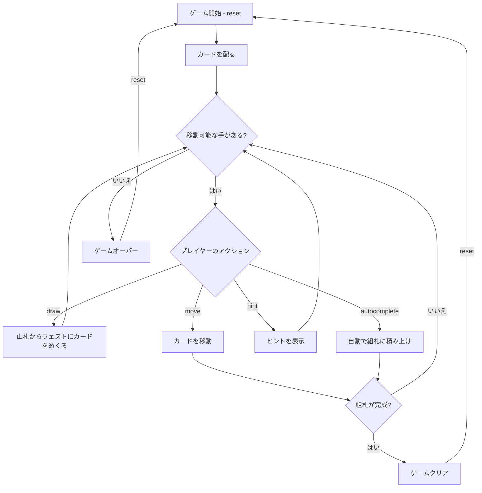

# ホワイトヘッド（CUI版）遊び方

## ゲーム概要

1人用のソリティアカードゲームです。52枚のカードを使い、7列のタブロー、山札、ウェスト、4つの組札で構成されます。組札にA→Kまでスート別に積み上げればクリアです。

## 起動方法

```sh
go run ./cmd/trumpcards whitehead
go run ./cmd/trumpcards --lang en whitehead  # 英語モード
```

## ルール

### 基本ルール

- 52枚のトランプ（ジョーカーなし）を使用
- 7列のタブローに左から1枚、2枚、...、7枚ずつカードを配る（**28枚すべてが表向き**）
- 残りの24枚は山札（ストック）に裏向きで置く
- 4つの組札（ファンデーション）はスート別にA→Kの順に積み上げる
- タブローでは降順かつ**同じ色**で重ねる（例: ♠K の上に ♣Q）。Klondike の交互色とは逆

### ゲームクリア

- 4つの組札すべてにA→Kまで13枚ずつ積み上げるとゲームクリア

### ゲームオーバー

- これ以上移動可能な手がない場合はゲームオーバー

### 手詰まり検出

- ヒントが存在せず、かつ山札とウェストが空の場合、または山札を一巡しても進展がなかった場合に「手詰まりです」と表示します
- 手詰まり状態では「元に戻す」またはギブアップを選択できます

## ゲームの流れ



## コマンド一覧

| コマンド | 短縮形 | 説明 |
|----------|--------|------|
| `reset` | `r` | 新しいゲームを開始 |
| `reset 3` | | 3枚引きモードで新しいゲームを開始 |
| `reset 1` | | 1枚引きモードで新しいゲームを開始 |
| `draw` | `d` | 山札からウェストにカードをめくる（1枚または3枚） |
| `move` | `m` | カードを移動する（サブ引数で移動元・移動先を指定） |
| `undo` | `u` | 直前の操作を元に戻す |
| `giveup` | `g` | ギブアップしてゲームを終了 |
| `hint` | `h` | 次の一手のヒントを表示 |
| `autocomplete` | `ac` | 自動的に組札へ積み上げ可能なカードを移動 |
| `log` | `l` | アクションログ（棋譜）を表示 |
| `quit` | `q` | ゲーム終了 |
| `help` | `?` | コマンド一覧を表示 |

### コマンド例

- `d` → 山札からカードをめくる
- `m` → 移動コマンド（移動元・移動先の入力を求められる）
- `u` → 直前の操作を元に戻す
- `h` → ヒントを表示
- `ac` → オートコンプリート
- `reset 3` → 3枚引きモードでリスタート

## 画面の見方

```
==========
Whitehead (ソリティア)
==========
山札: 20枚  ウェスト: ♠K
----------
組札:
[♠] A  [♥] A 2  [♦] --  [♣] --
----------
タブロー:
[1] ?? ♥Q
[2] ?? ?? ♣J
[3] ?? ?? ?? ♦10
[4] ?? ?? ?? ?? ♠9
[5] ?? ?? ?? ?? ?? ♥8
[6] ?? ?? ?? ?? ?? ?? ♣7
[7] ?? ?? ?? ?? ?? ?? ?? ♦6
----------
手数: 15
m・・・カードを移動  d・・・山札をめくる  h・・・ヒント
==========
```

- `山札: N枚`: 山札の残りカード数
- `ウェスト: ♠K`: ウェストの一番上のカード
- `組札`: 各スートの組札の状態（`--`は空）
- 伏せ札は存在しません（タブローは全て表向き）
- `♥Q`: 表向きのカード（ハートのQ）
- `手数: N`: 現在の手数

## 遊び方のコツ

- **伏せ札はありません。**28枚すべてが最初から見えているので、詰みは配りで決まります
- Aが出たらすぐに組札へ移動しましょう
- 空いた列には**どの札でも**置けます（Klondike は K のみ）
- 山札を何度もめくり直して使えるカードを探しましょう
- ヒントコマンドで詰まった時のアドバイスを得られます
- オートコンプリートは組札に安全に移動できるカードがある場合に便利です
