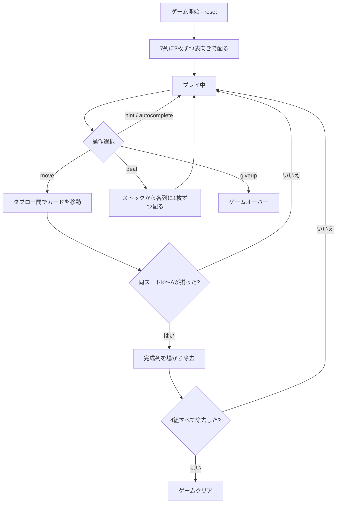

# ウィル・オ・ザ・ウィスプ（CUI版）遊び方

## ゲーム概要

1人用のソリティアゲームです。1デッキ52枚を使い、7列に3枚ずつ、合計21枚をすべて表向きで配ります。残り31枚はストックです。KからAまで同じスートの列を4組すべて除去すれば勝利です。

## 起動方法

```sh
go run ./cmd/trumpcards willothewisp
go run ./cmd/trumpcards --lang en willothewisp
```

## ルール

- 7列に3枚ずつ、21枚をすべて表向きで配る（伏せ札はありません）。
- ストックは31枚。全列に1枚ずつ配る操作を4回行い、最後は残り3枚を左の3列へ配る。
- 空列があるときはストックから配れません。
- タブローはスートを問わずランク降順に積める。
- 同スートの連続降順列はまとめて移動できる。
- 空列には任意の札または連続列を置ける。
- 同スートのKからAが揃うと自動的に除去され、4組すべて除去するとゲームクリア。

### 得点

- 開始時: 500点
- 移動/配り: -1点
- スート完成: +100点

## ゲームの流れ



## コマンド一覧

| コマンド | 短縮形 | 説明 |
|----------|--------|------|
| `reset` | `r` | 新しいゲームを開始 |
| `deal` | `d` | ストックから各列に1枚ずつ配る |
| `move t <fromCol> <cardIdx> t <toCol>` | `m` | タブロー間でカードを移動 |
| `giveup` | `g` | ギブアップ |
| `hint` | `h` | ヒントを表示 |
| `autocomplete` | `ac` | 自動完成 |
| `undo` | `u` | 直前の操作を取り消す |
| `log` | `l` | 棋譜を表示 |
| `quit` | `q` | ゲーム終了 |
| `help` | `?` | コマンド一覧を表示 |

## 画面の見方

```
==========
Will o' the Wisp (ウィル・オ・ザ・ウィスプ)
==========
完成スーツ: 0/4 | 山札: 31枚 | スコア: 500
----------
列0: [0]♠5 [1]♥4 [2]♣3
列1: [0]♦K [1]♦Q [2]♦J
...
列6: [0]♣8 [1]♠7 [2]♥6
----------
手数: 0
```

## 遊び方のコツ

- 同スートの降順列を長くして、まとめて移動する。
- 空列を作ると任意の列を置けるため、配置を整理しやすい。
- ストックを配る前に、空列を埋めておく。
