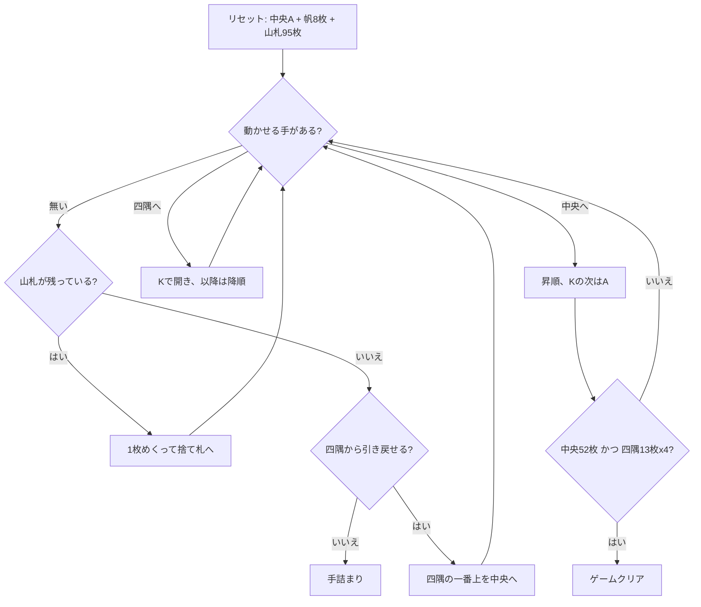

# ウィンドミル（CUI版）遊び方

## ゲーム概要

52 枚 2 組（104 枚）で遊ぶソリティア。別名プロペラ (Propeller)。中央に A を 1 枚置き、その上下左右に 2 枚ずつ計 **8 枚**の「帆」を十字に並べる。四隅の 4 枠は最初は空で、K が出てきたときにそこへ置く。

中央の基礎札は **A→K を 4 周して 52 枚**、四隅は **K→A で 13 枚ずつ**。52 + 13×4 = 104 枚をすべて積み切ればクリア。

## 起動方法

```sh
go run ./cmd/trumpcards windmill
go run ./cmd/trumpcards --lang en windmill   # 英語
```

## ルール

- 52 枚 2 組（104 枚）。中央に A を 1 枚、十字に 8 枚、残り 95 枚が山札
- **中央基礎札**: スート無視の昇順。**K の次は A に戻る**。合計 52 枚（A→K を 4 周）で完成
- **四隅の基礎札**: 最初は空。**K が出たら**そこに置き、以降はスート無視の降順で A まで 13 枚
- 使えるのは十字の 8 枚と捨て札の一番上
- 帆の札が動くと**即座に**捨て札（無ければ山札）から補充される
- 山札は 1 枚ずつ捨て札へめくる。**めくり直しは無い（1 巡のみ）**
- **救済手は「四隅の一番上を中央へ引き戻す」1 つだけ。** ただし引き戻した直後は、次に中央へ置く札を帆か捨て札から取るまで、もう一度引き戻せない
- 中央 52 枚と四隅 13 枚×4 がすべて揃えばクリア

> 補足: issue #4416 の仕様案とは 4 点異なるが、いずれも実際の規則に合わせた。
> (1) 十字は 4 枚ではなく **8 枚**（上下左右に 2 枚ずつ）。
> (2) 四隅の K は最初から置くのではなく、**出てきたときに**置く（最初から置くと基礎札を 4 つ無償で開けてしまう）。
> (3) 中央は A→K を 1 周ではなく **4 周**。issue の「各ランク 8 枚まで」も誤りで、2 組で各ランク 8 枚あるうち中央に 4 枚・四隅に 4 枚ずつ入る。
> (4) 引き戻しは双方向ではなく **四隅 → 中央の一方向のみ**。

## ゲームの流れ



## コマンド一覧

| コマンド | 短縮形 | 説明 |
|----------|--------|------|
| `draw` | `d` | 山札を 1 枚めくって捨て札へ送る |
| `move s <sail> c` | `m` | 帆の札を中央基礎札へ |
| `move s <sail> k <idx>` | `m` | 帆の札を四隅の基礎札へ |
| `move w c` | `m` | 捨て札を中央基礎札へ |
| `move w k <idx>` | `m` | 捨て札を四隅の基礎札へ |
| `move k <idx> c` | `m` | 四隅の一番上を中央へ引き戻す（救済手） |
| `hint` | `h` | ヒントを表示する |
| `autocomplete` | `ac` | 帆と捨て札から基礎札へ送れる札がなくなるまで自動で送る |
| `undo` | `u` | 1 手戻す |
| `giveup` | `g` | ギブアップ |
| `log` | `l` | 棋譜（アクションログ）を表示する |
| `reset` | `r` | 最初からやり直す |
| `quit` | `q` | 終了する |
| `help` | `?` | コマンド一覧を表示 |

## 画面の見方

```
中央基礎札: SPADE 3 (3/52枚)
四隅基礎札: #0 DIAMOND 13 (1/13枚) | #1 [空] | #2 [空] | #3 [空]
山札: 90枚 捨て札: HEART 9 (3枚)
----------
帆0: SPADE 9
帆1: HEART 4
...
帆7: CLOVER 6
----------
手数: 12
```

- 中央・四隅とも `(現在/完成)` の枚数つきで表示される
- 帆は 8 行。補充が尽きた枠は `[空]` のまま残る
- 引き戻した直後は「次に中央へ置く札は帆か捨て札から取ってください」が黄色で出る

## 遊び方のコツ

- **四隅は「置き場」であると同時に「貯金」でもある。** 降順に積んだ札は引き戻しで中央へ回せるので、中央で欲しくなりそうなランクを四隅の上に残しておくと後で効く
- ただし**引き戻しは連続できない**。1 回使ったら、次の中央の 1 枚を帆か捨て札から用意できる形にしてから使う
- 帆は動かすたびに補充される。**帆を 1 枚使うことは、捨て札か山札を 1 枚めくることでもある**ので、詰まりそうなときは帆を消化して盤面を回す
- 山札は 1 巡しか回らない。捨て札に送る前に置き場所を考える
- K は 4 枚（2 組で 8 枚）。四隅を早く開けておくと降順の受け皿が増える
- 詰まったら `undo` で分岐をやり直す
