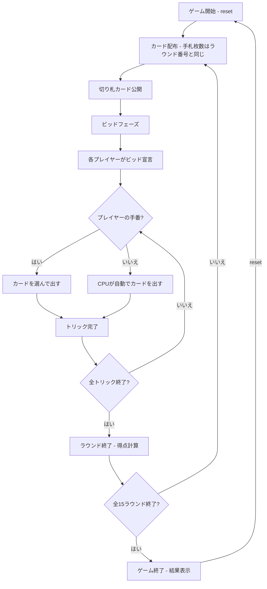

# ぴたり宣言（CUI版）遊び方

## ゲーム概要

4人（プレイヤー1人 + CPU 3人）で遊ぶ「ピタリ当て」型トリックテイキングです。通常の52枚に**ウィザード4枚**と**ジェスター4枚**を加えた60枚のデッキを使います。全15ラウンドを通して獲得トリック数を正確に宣言（ビッド）することを目指します。全ラウンド終了後、累計得点が最も高いプレイヤーが勝者です。

> **原作クレジット**: 『Wizard（ウィザード）』は Ken Fisher 氏が1984年に考案し、U.S. Games Systems, Inc. が発行しているカードゲームです。本実装は非公式・非営利のファン実装であり、権利者とは関係がありません。ルールのみを独自に実装しており、原版のカードデザインやルールブック本文は使用していません。

## 起動方法

```sh
go run ./cmd/trumpcards wizard
go run ./cmd/trumpcards --lang en wizard  # 英語モード
```

## ルール

### 基本ルール

- 60枚のデッキ（52枚 + ウィザード4枚 + ジェスター4枚）を4人に配布
- 手札枚数は**ラウンド番号と同じ**（ラウンド1=1枚 … ラウンド15=15枚）
- 配り終わった山札の一番上のカードが**切り札（トランプ）スート**を決定
  - めくったカードがウィザードならディーラーが切り札スートを選択
  - めくったカードがジェスターなら切り札なし
  - 山札が残らない最終ラウンドは切り札なし
- 各ラウンド開始時にビッド（0〜手札枚数）を宣言（ディーラー制限は**なし**）
- **ウィザード**: いつでも出せて、そのトリックに**必ず勝つ**（先に出したウィザードが勝つ）
- **ジェスター**: いつでも出せて、そのトリックに**必ず負ける**
- それ以外はリードスートに従う（フォロースート）
- トリックの勝者: ウィザードがあれば最初のウィザード、なければ切り札の最高値、それもなければリードスートの最高値

### 得点

- **ビッド成功（正確に一致）**: 20 + 10 × ビッド数
- **ビッド失敗**: -10 × |獲得トリック数 - ビッド数|

### ゲーム終了

- 全15ラウンド終了後、累計得点が最も高いプレイヤーが勝利

### CPU難易度

- **Easy** (0): ランダムにビッド・カードを出す
- **Normal** (1): 基本的なトリック戦略（デフォルト）
- **Hard** (2): 戦略的なプレイ

## ゲームの流れ



## コマンド一覧

| コマンド | 短縮形 | 説明 |
|----------|--------|------|
| `reset` | `r` | ゲームリセット（設定保持） |
| `bid <n>` | `b <n>` | ビッドを宣言（0〜手札枚数） |
| `play <idx>` | `p <idx>` | カードをプレイ（インデックス指定） |
| `next` | `n` | 次のトリックへ |
| `nextround` | `nr` | ラウンドをスコアリングして次のラウンドへ |
| `setdifficulty <0-2>` | `sd <0-2>` | CPU難易度設定（0=Easy, 1=Normal, 2=Hard） |
| `hint` | `h` | 推奨カード/ビッドのヒントを表示 |
| `log` | `l` | 棋譜表示 |
| `quit` | `q` | ゲーム終了 |
| `help` | `?` | ヘルプ表示 |

### コマンド例

- `b 3` → ビッド3を宣言
- `b 0` → ビッド0を宣言
- `p 2` → インデックス2のカードを出す
- `sd 2` → CPU難易度をHardに設定
- `h` → 推奨カード/ビッドのヒントを表示

## 画面の見方

```
==========
Wizard (ウィザード)
==========
ラウンド 3/15 / トリック 2 (手札 3枚)
切り札: HEART (♥K)
----------
[You]: 30点 (ビッド: 2, 獲得: 1)
[0]SPADE 5  [1]Wizard  [2]Jester  ...
CPU 1: 20点 (ビッド: 3, 獲得: 2)
CPU 2: 40点 (ビッド: 1, 獲得: 1)
CPU 3: 10点 (ビッド: 2, 獲得: 0)
----------
現在のトリック:
  CPU 1: CLOVER 10
  CPU 2: Wizard
手番: あなた
p <idx>・・・カードを出す
==========
```

- `ラウンド N/15 / トリック T (手札 X枚)`: 現在のラウンド、トリック番号、手札枚数
- `切り札: SUIT (カード)`: 切り札スートと決定カード
- `[You]: N点 (ビッド: X, 獲得: Y)`: プレイヤーの累計得点、ビッド数、獲得トリック数
- `[1]Wizard` / `[2]Jester`: 特殊カード。ウィザードは必勝、ジェスターは必敗
- `現在のトリック`: 現在のトリックに出されたカード
- `ビッド的中: ...`: ラウンド終了時（およびゲーム終了時）に出る的中サマリー。`的中(N)` / `超過(宣言N→M)` / `未達(宣言N→M)` を全員分並べます。ビッドしていない席は対象外です

## 遊び方のコツ

- ウィザードは必ずトリックを取れるので、確実な1点として数えましょう
- ジェスターは取りたくないトリックを安全に手放せます
- 切り札やウィザードの枚数を数えて、ビッドを慎重に宣言しましょう
- 正確なビッドが高得点の鍵です（多くても少なくても減点）
- 迷った時は `h` コマンドでヒントを表示できます
