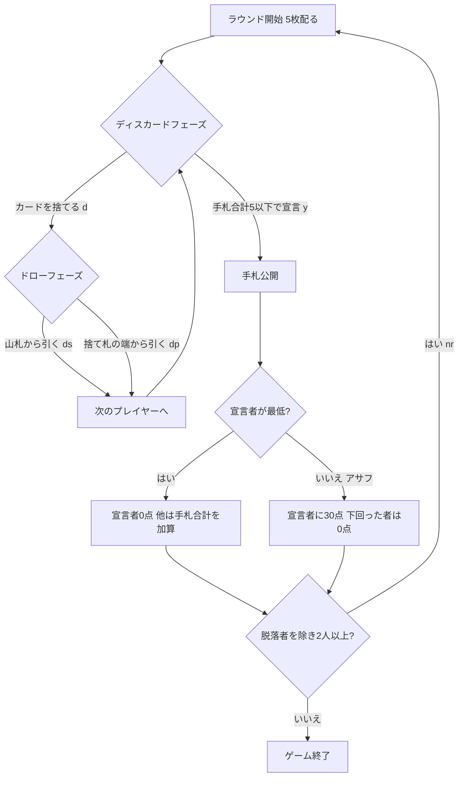

# ヤニブ（CUI版）遊び方

## ゲーム概要

ヤニブ (Yaniv) は、イスラエルを中心にバックパッカーの間で世界的に親しまれているドロー＆ディスカードの手札計算ゲームです。手札を交換しながらカードの合計値を減らしていき、合計が5点以下になった時点で「ヤニブ！」と宣言してラウンドを終わらせます。ただし宣言時に自分より低い (または同点の) 相手がいると「アサフ」となり、30点のペナルティを受けます。累計点が脱落スコアを超えたプレイヤーから脱落し、最後まで生き残ったプレイヤーが勝者です。

- プレイ人数: 4人 (あなた + CPU 3人)
- 使用カード: 54枚 (ジョーカー2枚を含む。ジョーカー=0点、A=1点、J/Q/K=10点、その他は額面)
- 初期手札: 5枚
- 脱落スコア: 200 (設定で変更可能)

## 起動方法

```sh
go run ./cmd/trumpcards yaniv
# 英語表示で起動する場合
go run ./cmd/trumpcards --lang en yaniv
```

## ルール

1. 各プレイヤーに5枚配り、1枚を場の捨て札として表向きに置きます。
2. 自分の番ではまず手札を捨てます。捨てられるのは「単札1枚」「同じ数値の2枚以上の組」「同じスートの3枚以上の連番」のいずれかです。
3. 捨てた後、「山札から引く (ds)」または「直前のプレイヤーが捨てた束の先頭か末尾 (dp 0 / dp 1)」から1枚引きます。
4. 自分の番の開始時に手札の合計が5点以下なら、引かずに「ヤニブ (y)」を宣言してラウンドを終了できます。
5. 宣言後、全員の手札を公開します。宣言者が最も低ければ宣言者は0点。他に宣言者以下 (同点含む) のプレイヤーがいる場合は「アサフ」となり、宣言者に30点が加算されます。
6. 宣言者以外のプレイヤーは手札の合計が失点として加算されます (アサフ時、宣言者を下回ったプレイヤーは0点)。
7. 累計失点が脱落スコアを超えたプレイヤーは脱落します。最後の1人、またはあなたが脱落した時点でゲーム終了です。

## ゲームの流れ



## コマンド一覧

| コマンド | 別名 | 説明 |
|----------|------|------|
| `d <idx...>` | `discard <idx...>` | 手札のカードを捨てる (空白区切りで複数指定可) |
| `y` | `yaniv` | ヤニブを宣言する (手札合計5以下) |
| `ds` | `drawstock` | 山札からカードを引く |
| `dp <0\|1>` | `drawpickup` | 直前の捨て札の端から引く (0=先頭, 1=末尾) |
| `nr` | `nextround` | 次のラウンドへ進む |
| `sd <0-2>` | `setdifficulty` | CPU難易度を変更 (0=易, 1=普通, 2=難) |
| `sl <n>` | `setlimit` | 脱落スコアを変更 (50〜500) |
| `l` | `log` | 棋譜 (アクションログ) を表示 |
| `r` | `reset` | ゲームをリセット |
| `q` | `quit` | 終了 |

## 画面の見方

- 先頭行に現在のラウンド番号と山札の残り枚数が表示されます。
- 「場の捨て札」行には引ける束が表示されます。引けるのは端 (先頭・末尾) のカードのみです。
- 各プレイヤー行には「失点 (累計)」「手札枚数」「手札合計」が表示されます。CPU の手札合計はラウンド終了まで `?` で伏せられます。脱落者は `OUT` と表示されます。
- あなたの手札はインデックス付き (`[0] SPADE 9` など) で表示され、`d <idx...>` の `<idx>` に対応します。

## 遊び方のコツ

- 絵札 (10点) や高い数字のカードを早めに捨て、手札合計を下げましょう。
- 同じ数値の組や同じスートの連番をまとめて捨てると、一度に大きく合計を減らせます。
- 捨て札の端に低いカード (A やジョーカー) があれば、積極的に拾って合計を抑えましょう。
- 手札合計が5以下になったら、相手に先を越される前にヤニブを宣言するのが基本です。
- ただし相手の手札も少なそうなときはアサフ (30点) のリスクがあります。盤面を読んで宣言のタイミングを計りましょう。
