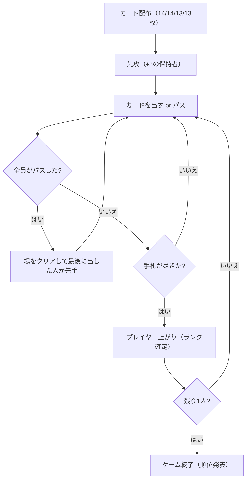

# 争上游（CUI版）遊び方

## ゲーム概要

Zheng Shangyou (争上游 / ジェンシャンヨウ) は、中国の伝統的なクライミング（手札消化）ゲームで、大富豪やビッグツーの祖先にあたります。4人で遊び、手札を最も早く出し切ったプレイヤーが勝者です。ジョーカー2枚を含む54枚デッキを使い、**スートはカードの強さに一切関係しない**のが特徴です。

## 起動方法

```sh
go run ./cmd/trumpcards zheng
go run ./cmd/trumpcards --lang en zheng  # 英語モード
```

## ルール

- **デッキ**: 54枚（52枚 + ジョーカー2枚）を4人に順番に配ります（先頭2人が14枚、残り2人が13枚。この不均等は仕様です）。
- **カードの強さ**: `3 < 4 < ... < K < A < 2 < 小ジョーカー < 大ジョーカー`。**スートは無関係**（同ランクのカードはスートが違っても互角で、場のカードを超えられません）。
- **先攻**: ♠3 を持つプレイヤーが先攻。先攻は必ず何かを出します（♠3 を含める必要はありません）。
- **役（コンビネーション）**: シングル / ペア / スリーカード / ストレート（3枚以上の連続ランク、3〜Aのみ。2とジョーカーは連番に使えません）/ 連続ペア（3組以上の連続ペア、同じく3〜Aのみ）。ジョーカー同士はランクが異なるためペアになりません。
- **爆弾**: 「フォーカード（同ランク4枚）」は任意の通常役をタイプ・枚数無視で切れます。爆弾同士はランク比較。「ジョーカー2枚（ジョーカーボム）」は爆弾を含む**全てに勝つ**最強役です。爆弾・ジョーカーボムはリードでも出せます。
- **出し方**: 場と同じ役・同じ枚数で、より高いキーランク（役中の最高ランク）を出すかパス。
- **場のリセット**: 他全員がパスすると場がクリアされ、最後に出したプレイヤーが自由に出せます（そのプレイヤーが上がっている場合は次のアクティブプレイヤーへ）。
- **勝利条件**: 手札を最初に出し切ったプレイヤーが1位。最後まで残った1人が最下位でゲーム終了です。

## ゲームの流れ



## コマンド一覧

| コマンド | 短縮形 | 説明 |
|----------|--------|------|
| `play <idx...>` | `p` | 指定インデックスのカードを出す（例: `p 0 2 4`） |
| `play` | `p` | パス（場が空でない場合） |
| `reset` | `r` | ゲームリセット |
| `setdifficulty <0-2>` | `sd` | CPU難易度変更 (0=Normal, 1=Easy, 2=Hard) |
| `log` | `l` | 棋譜表示 |
| `quit` | `q` | 終了 |
| `help` | `?` | コマンド一覧を表示 |

## 画面の見方

```
=== Zheng Shangyou (争上游) ===
あなた: 14枚
  [0]♠3 [1]♣4 [2]♦5 ...
CPU 1: 14枚
CPU 2: 13枚
CPU 3: 13枚
----------
場: なし (自由に出せます)
あなたのターンです
```

出せない組み合わせを `play` すると、**何が違うのか**が返ります。

| メッセージ | 意味 |
|---|---|
| 選んだ札はどの役にもなりません | 単騎・ペア・スリーカード・ストレート・連続ペア・爆弾のどれにもならない |
| 場と同じ役の種類で出してください | 役にはなるが、場と種類が違う（ペアに単騎など） |
| 場と同じ枚数で出してください | 種類は同じだが枚数が違う（4枚のストレートに3枚など） |
| 場より強い役で出してください | 種類も枚数も同じだが、ランクが場以下 |
| 場が爆弾です。爆弾でしか切れません | 通常役では爆弾を切れない |
| 場がジョーカーボムです。勝てる役はありません | ジョーカーボムに勝つ役は存在しない |

## 遊び方のコツ

- 弱いカードから順に出し、2やジョーカーは温存しましょう。
- スートは無関係なので、同ランクでは場を超えられません。1ランクでも高いカードが必要です。
- フォーカードとジョーカー2枚は切り札です。相手の強い出しに合わせて使いましょう。
- 相手の残り枚数に注意し、上がり間際の相手には強い役や爆弾で蓋をしましょう。
