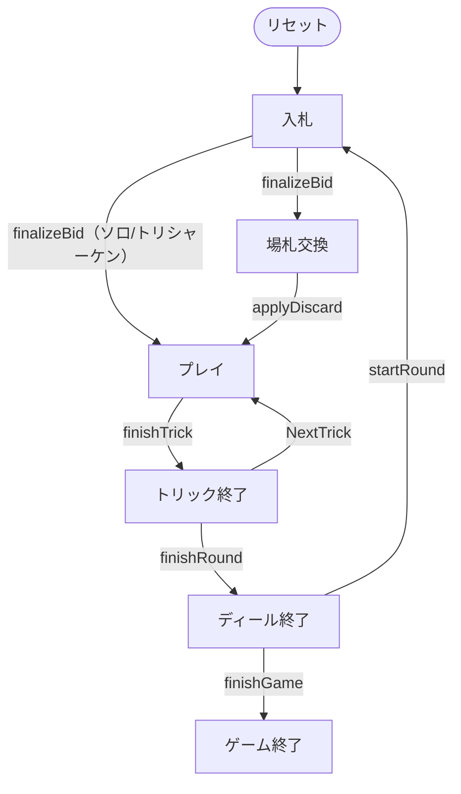

# ツヴァンツィガールーフェン（CUI版）遊び方

## ゲーム概要

ツヴァンツィガールーフェン（Zwanzigerrufen）はオーストリアの「呼びタロック」系トリックテイキングです（4人：あなた + CPU3人）。タロック54枚を使い、落札者が**切り札の20番**を呼んでパートナーを決めますが、**その札が場に出るまで誰が味方か分かりません**。誰も落札しなければ**トリシャーケン**になり、こんどは最も多く点を取った人が負けます。

## 起動方法

```sh
go run ./cmd/trumpcards zwanzigerrufen
go run ./cmd/trumpcards --lang en zwanzigerrufen  # 英語モード
```

## ルール

### デッキと配布

- **デッキ**: タロック54枚（スート札32枚 + 切り札21枚 + スキュース1枚）。
- **プレイヤー**: 4人（席0 = あなた、席1〜3 = CPU）。
- **配布**: 各席に **12枚**、残り **6枚**が場札（タロン）。

### 入札

- 打てる入札は **`bid rufer`（20番呼び）** と **`bid solo`（単独）** の2つだけです。高いほうが優先します。
- **`bid trischaken` は打てません。** トリシャーケンは全員がパスした結果としてのみ成立する契約だからです。

### 呼び札（20番呼び）

- デクレアラーは**切り札の20番**を呼び、それを持つ人が秘密のパートナーになります。
- **自分で20番を持っている場合は19番、それも持っていれば18番へ下げます。** 18番まで全部自分の手にあるときは単独で戦います。
- パートナーの正体は、**呼ばれた切り札が場に出た瞬間**に判明します。

### 場札交換

- 20番呼びのデクレアラーは場札6枚を手札に加え、6枚を伏せます（伏せた札はデクレアラー側の得点になります）。
- **キングとトゥルルは伏せられません。** 5点札を黙って自分の得点へ移せてしまうためです。
- ソロでは場札交換をせず、場札は防御側の得点になります。

### プレイ

1. リードスートに従います。持っていなければ**切り札を出す義務**があります。どちらも無ければ自由です。
2. 切り札はスキュース（最強）> 21 > … > 1 の順です。
3. 12トリックを戦います。

### 精算

- **20番呼び／ソロ**: デクレアラー側のカードポイントが総点の半分を超えれば成功。ソロは1人で3人ぶんを受け取り、失敗すれば3人ぶんを払います（倍率2倍）。
- **トリシャーケン**: 最も多くカードポイントを取った席が **-3**、他の3席が **+1**。取らないことが目的の契約です。
- 精算はゼロサムで、規定ディール（1〜12、既定4）後に通算最多の席が勝ちです。

## ゲームの流れ

ゲームの進行は `internal/domain/Zwanzigerrufen.go` のフェーズ機械そのものです。各ノードは同ファイルの `ZwanzigerrufenPhase` 定数、矢印ラベルはその遷移を行うメソッド名です。



## コマンド一覧

| コマンド | 短縮形 | 説明 |
|----------|--------|------|
| `bid rufer` | - | 20番呼びを宣言する |
| `bid solo` | - | ソロを宣言する |
| `pass` | - | 入札でパスする（全員パスでトリシャーケン） |
| `discard <i0> ... <i5>` | - | 場札交換で6枚を伏せる |
| `play <idx>` | - | カードを出す |
| `next` | `n` | 次のトリックへ |
| `nextround` | `nr` | 次のディールへ |
| `setdifficulty <0-2>` | `sd` | CPU難易度設定 |
| `setdeals <1-12>` | `st` | ディール数設定 |
| `hint` | `h` | ヒントを表示 |
| `log` | `l` | 棋譜を表示 |
| `reset` | `r` | ゲームをリセット |
| `quit` | `q` | 終了 |
| `help` | `?` | コマンド一覧を表示 |

## 画面の見方

```
==========
ツヴァンツィガールーフェン
==========
ディール: 1/4  トリック: 3  契約: 20番呼び
呼び札: 切り札 20 番（持ち主が秘密のパートナー）
あなた (デクレアラー): 手札10枚  トリック1  今局12点  通算0
[0]♠K  [1]T21  [2]Sküs  [3]♥5  ...
CPU 1 (対戦側): 手札10枚  トリック0  今局0点  通算0
----------
手番: あなた  (リードスートに従う。ボイド時は切り札。スキュースが最強)
```

- `T21` は切り札の21番、`Sküs` はスキュース、`♠K` はスペードのキングです。
- 役割は「デクレアラー / パートナー / 対戦側」。**パートナーは判明するまで「対戦側」と表示されます。**
- `今局` はそのディールで取ったカードポイント、`通算` は精算の合計です。

## 遊び方のコツ

- **20番呼びは切り札が5枚以上あってから。** 呼んだ相手が誰か分からないまま12トリック戦うので、自分の切り札が細いと支えきれません。
- **呼ばれた切り札を持っていたら、出す時機が全て。** 出した瞬間に味方だと分かるので、相手に読ませたくない場面では抱えます。
- **トリシャーケンでは勝たない。** 取ったカードポイントが多い席が負けるので、高い札は早めに手放し、リードを取らされない打ち方をします。
