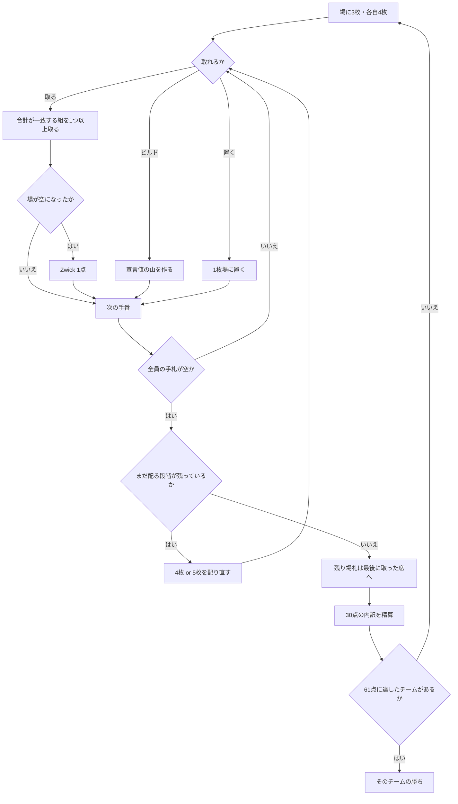

# ツヴィッカー（CUI版）遊び方

## ゲーム概要

ドイツ北部シュレースヴィヒのカシノ系フィッシングゲーム。**55 枚**（52 + ジョーカー 3 枚）を使い、**4 人 2 対 2**（向かい合わせが味方）で戦います。

出典: [pagat.com の Zwicker](https://www.pagat.com/fishing/zwicker.html)

## 起動方法

```sh
go run ./cmd/trumpcards zwicker
go run ./cmd/trumpcards --lang en zwicker   # 英語表示
```

## ルール

### 札のマッチ値

捕獲はランクではなく**マッチ値**で行います。**A と絵札は 2 つの値を持ち、どちらで扱うかは出す側／取る側が決めます。**

| 札 | マッチ値 |
|---|---|
| A | **1 または 11** |
| 2〜10 | 額面 |
| J | **2 または 12** |
| Q | **3 または 13** |
| K | **4 または 14** |
| 小ジョーカー | 15（固定） |
| 中ジョーカー | 20（固定） |
| 大ジョーカー | 25（固定） |

**ジョーカーはワイルドではありません。**値は固定で、選べません。

### 配り方

場に **3 枚**を表向きに置き、各自 **4 枚**。全員の手札が尽きたらまた **4 枚**、最後に **5 枚**。これで 55 枚をちょうど使い切ります（55 − 3 = 52 = 13 × 4）。

### 手番でできること

1. **取る** — 出した札のマッチ値と、場札のマッチ値の**合計が一致する組**を取ります。**複数の組を同時に取れます**（10 を出して 7+3 と 6+4 を同時に、など）。ビルドは宣言値ちょうどでのみ取れます
2. **ビルドを作る** — 手札 1 枚と場札を積み、宣言値の山にします。**その値で取れる札を手札に残していなければなりません**
3. **場に置く** — 取れないときは 1 枚置いて手番終了

### Zwick

**場を空にすると「Zwick」で 1 点。**複数組をまとめて取ることの名前ではありません。取ったあとに場札もビルドも残っていなければ Zwick です。

### 得点（合計ちょうど 30 点 + Zwick 各 1 点）

| 対象 | 点 |
|---|---|
| 大ジョーカー (25) | 7 |
| 中ジョーカー (20) | 6 |
| 小ジョーカー (15) | 5 |
| ♦10 | 3 |
| ♠10 | 1 |
| ♠2 | 1 |
| 各エース | 1（×4） |
| 枚数最多 | 3 |
| Zwick 1 回 | 1 |

**枚数が同数なら、枚数最多の 3 点は誰にも入りません。**

ディール終了時に場に残った札は、**最後に捕獲した席**が取ります（原典が明記していないため、カシノ系の慣習に合わせています。枚数最多の 3 点に効きます）。

先に **61 点**に達したチームの勝ちです。

## ゲームの流れ



## コマンド一覧

| コマンド | 短縮形 | 説明 |
|----------|--------|------|
| `take <i> <v> t:<a,b>` | `t` | 手札 `i` を値 `v` として使い、場札 `a,b` を取る |
| `take <i> <v> b:<c>` | `t` | 同じく、ビルド `c` を取る（`t:` と併用可） |
| `build <i> <a,b> <v>` | `b` | 手札 `i` と場札 `a,b` で宣言値 `v` のビルドを作る |
| `trail <i>` | `tr` | 手札 `i` を場に置く |
| `next` | `n` | 次のディールへ進む |
| `hint` | `h` | ヒントを表示する |
| `log` | `l` | 棋譜を表示する |
| `reset` | `r` | ゲームごとリセットする |
| `quit` | `q` | 終了する |
| `help` | `?` | コマンド一覧を表示 |

`t:` は省略できます（`t 0 7 1,2`）。`tr` が「置く」なのは、`l` が棋譜に割り当てられているためです。

## 画面の見方

```
山札20枚 · 味方12 相手12 (61点で勝ち)
A=1/11 J=2/12 Q=3/13 K=4/14 は取る側が値を選ぶ／ジョーカーは15・20・25で固定／場を空にするとZwickで1点
場: [0]HEART 9(9) [1]SPADE 1(1/11)
ビルド[0] 宣言9（席1）: SPADE 5(5) HEART 4(4)
あなた（チーム0）: 手札4枚 獲得6枚 Zwick1回
  [0]CLOVER 7(7) [1]HEART 13(4/14) ...
CPU 1（チーム1）: 手札4枚 獲得3枚 Zwick0回
```

- **札の後ろの括弧がマッチ値です。**`HEART 13(4/14)` は K で、4 としても 14 としても使えます
- **獲得枚数と Zwick 回数は全員ぶん公開**されます。枚数最多の 3 点と Zwick 1 点はそこから直に読めるので、隠す意味がありません
- 場札とビルドには番号が振られ、`t:` / `b:` の引数に使います
- CPU の**手札**は枚数のみ表示されます

## 遊び方のコツ

- **絵札は 2 通りに使えます。**K は 4 としても 14 としても取れるので、場が育っているときほど強く働きます
- **ジョーカーは最大の得点札**（7 / 6 / 5 点）です。取られないうちに回収したいところですが、15・20・25 は合計を作りにくく、抱えると腐ります
- **Zwick は場が薄いときに狙います。**残り 1 組しかない場面で取り切れば 1 点です
- **枚数最多の 3 点は無視できません。**点にならない札でも、枚数として積み上がります
- ビルドは宣言値で取れる札を残す必要があります。取れない値を宣言しようとすると弾かれます
